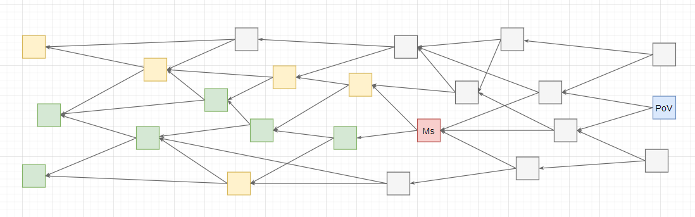
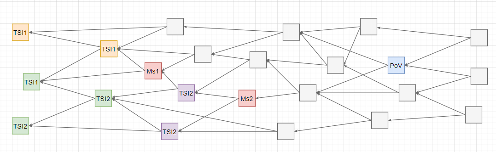

+ Feature name: `urts-tip-sel`
+ Start date: 2020-03-09
+ RFC PR: [iotaledger/protocol-rfcs#0006](https://github.com/iotaledger/protocol-rfcs/pull/0006)

# Summary

(almost) Uniform Random Tip Selection on a subset enables a node to perform fast tip-selection to increase transaction throughput.
The algorithm selects tips which are non-lazy in order to maximize confirmation rate.

# Motivation

Because of the `white-flag` confirmation algorithm, it is no longer necessary to perform complex
tip-selection which evaluates ledger mutations while walking, therefore, a simpler and better 
performing algorithm can be used to select tips, which in turn increases overall transaction throughput.

In order to maximize confirmation rate however, the algorithm needs to return tips which are `non-lazy`.
Non-lazy in this context means, that a tip does not attach to a cone of transactions which is too far
in the past, as such cone is likely to be already confirmed and therefore doesn't contribute to the
rate of newly confirmed transactions when a milestone is issued.

# Detailed design

Definitions:
* `Direct Approvers` are the set of transactions which directly approve a given transaction.
* `Approvee` is the directly approved transaction of a given transaction.
Example: the trunk/branch transactions are the approvees of a given transaction.
* A `tip` is a tail transaction of a bundle without any approvers.
* A `score` is a scoring  determining the likeliness to select a given `tip`.
* `Confirmed Root Transactions` defines the set of first seen transactions which are confirmed by a previous milestone 
when we walk the past cone of a given transaction. The walk stops on confirmed transactions.  
Yellow = `Confirmed Root Transactions` for PoV transaction, Red = Milestone, Blue = PoV transaction.

* `Transaction Snapshot Index (TSI)` defines the index of the milestone which confirmed a given transaction.
* `Oldest Transaction Root Snapshot Index (OTRSI)` defines the lowest milestone index of a set of
`Confirmed Root Transactions` of a given transaction.
* `Youngest Transaction Root Snapshot Index (YTRSI)` defines the highest milestone index of a set of
`Confirmed Root Transactions` of a given transaction.
* `Latest Solid Milestone Index (LSMI)` the index of the latest solid milestone.
* `Below Max Depth (BDM)` defines a threshold value up on which it is decided on whether a transaction is not
relevant in relation to the recent parts of the Tangle. The current `BDM` for mainnet nodes is 15 milestones, 
which means that transactions of which their `OTRSI` is more than 15, are "below max depth".

### OTRSI / YTRSI example
Given the blue PoV transaction, the `OTRSI` of it is milestone 1 and `YTRSI` milestone 2. The orange
and purple transactions are the `Confirmed Root Transactions`.


### Milestone based tip scoring

The milestone based scoring defines a tip's score by investigating the tip's relation to
the cone it approves and previous issued  milestones.

A tip can have one of 3 score states:
* `0`: The tip is lazy and should not be selected.
* `1`: The tip is somewhat lazy.
* `2`: The tip is a non-lazy tip.

Definitions:
* `C1`: Max allowed delta value for the `YTRSI` of a given transaction in relation to the current `LSMI`.
* `C2`: Max allowed delta value between `OTRSI` of the approvees of a given transaction in relation to the current `LSMI`. 
* `M`: Max allowed delta value between `OTRSI` of the given transaction in relation to the current `LSMI`.
`M` is the `below max depth (BMD)` parameter.

Recommended defaults:
* `C1` = 2 milestones
* `C2` = 7 milestones
* `M` = 15 milestones

Scoring Algorithm (pseudo code):
```

enum Score (
    LAZY = 0
    SEMI_LAZY = 1
    NON_LAZY = 2
)

const (
    C1 = 2
    C2 = 7
    M = 15
)

func score(tip Tip) Score {
    
    // if the LSMI to YTRSI delta is over C1, then the tip is lazy
    if (LSMI - YTRSI(tip) > C1) {
        return Score.LAZY
    }
    
    // if the OTRSI to LSMI delta is over M/below-max-depth, then the tip is lazy
    if (LSMI - OTRSI(tip) > M) {
        return Score.LAZY
    }
    
    // the approvees (trunk and branch) are the tail transactions this tip approves
    approvees := tip.Approvees()
    approveesOTRSICheck := 2
    for (i := 0; i < 2; i++) {
        approvee := approvees[i]
    
        // direct approvee is already lazy, therefore so is this tip
        if (approvee.Score == 0) {
            return Score.LAZY
        }
        
        // if the OTRSI to LSMI delta of the approvee is C2, we mark it as such
        if (LSMI - OTRSI(approvee) > C2) {
            approveesOTRSICheck--
        }
    }

    // if both approvees' OTRSI violates the LSMI delta in relation to C2 the tip is lazy too
    if (approveesOTRSICheck == 0) {
        return Score.LAZY
    }
    
    // if only one of the approvees violated the OTRSI to LMSI delta, the tip is considered semi-lazy
    if (approveesOTRSICheck == 1) {
        return Score.SEMI_LAZY
    }

    return Score.NON_LAZY
}
```

### Weighted Random Tip-Selection

Given the scoring, a node should keep a set of tips with their associated score.

Tip-Selection (pseudo code):
```

var tips = Set(tips_and_score)

func select() Tip {
    // compute the sum of the score of all tips
    scoreSum := tips.ScoreSum()
    
    // get a random number between 1 and the score sum
    r := rand.Int(1, scoreSum)
    
    // iterate over the tips set and subtract each tip's score from r
    for (i := 0; i < tips.length; i++){
        // subtract the tip's score from r
        r -= tips[i].Score
        // if r reaches zero or below, we return the given tip
        if (r <= 0) {
            return tips[i] 
        }
    }
    
    // no tips
    return null
}
```

# Drawbacks

Depending on when and how often `YTRSI`/`OTRSI` values are computed, this tip-selection could still
have a slow runtime, as one would need to constantly walk down the Tangle in order to compute those
values. However, smart caching might resolve this issue. 

# Rationale and alternatives

The previous tip-selection was written in accordance to the original IOTA whitepaper, as it also
functioned as the consensus mechanism to determine a transaction's confirmation rate.
However, relatively soon it became apparent that the cumulative weight computation was too heavy
for an actual high throughput scenario and as such, the CW calculation is currently not used within
node implementations at all.

Because confirmations with the `white-flag` approach no longer only approve cones with state mutations
which are consistent with a previous ledger state, it makes sense to alter the tip-selection to provide 
a fast way to get tips to approve with one's own transaction.
The only important thing is to disincentive lazy behaviour in order to be able to maximize confirmation rate.

# Unresolved questions

#### When to compute the `YTRSI`/`OTRSI` of a transaction?
It is not yet clear when or how often the `YTRSI`/`OTRSI` values of a transaction should be updated.
If the values are only computed once after a transaction became solid, the `YTRSI`/`OTRSI` might not
resemble the true values, as subsequent milestones might confirm transactions within the same cone the
given transaction approved.

However, one can argue that the `YTRSI`/`OTRSI` don't shift by that much in
such case, so that it is fine to compute them only up on solidification of a given transaction.
This assumption builds up on the fact, that the Coordinator wouldn't confirm transactions
in such depth that it would cause the origin values to differ by much from the newly computed values.