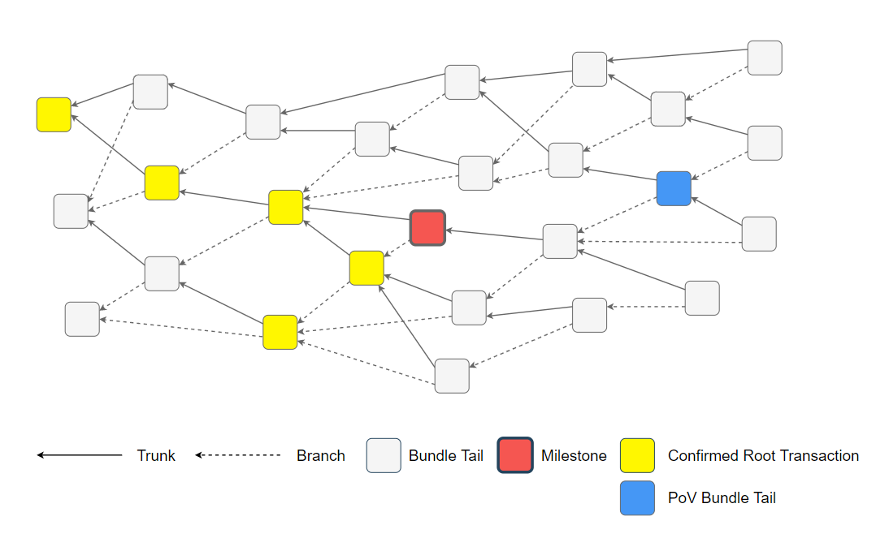
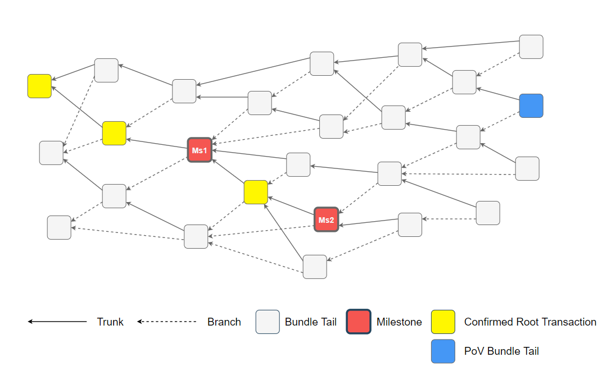

+ Feature name: `uniform-random-tip-selection`
+ Start date: 2020-03-09
+ RFC PR: [iotaledger/protocol-rfcs#0008](https://github.com/iotaledger/protocol-rfcs/pull/0008)

# Summary

Weighted Uniform Random Tip Selection on a subset enables a node to perform fast tip-selection to increase transaction throughput.
The algorithm selects tips which are non-lazy in order to maximize confirmation rate.

# Motivation

Because of the `white-flag` confirmation algorithm, it is no longer necessary to perform complex
tip-selection which evaluates ledger mutations while walking, therefore, a simpler and better 
performing algorithm can be used to select tips, which in turn increases overall transaction throughput.

In order to maximize confirmation rate however, the algorithm needs to return tips which are `non-lazy`.
Non-lazy in this context means, that a tip does not attach to a cone of transactions which is too far
in the past, as such cone is likely to be already confirmed and therefore does not contribute to the
rate of newly confirmed transactions when a milestone is issued.

# Detailed design

Definitions:
* `Direct Approvers` are the set of transactions which directly approve a given transaction.
* `Approvee` is the directly approved transaction of a given transaction.
Example: the trunk/branch transactions are the approvees of a given transaction.
* `Solid` means that the past cone of a given transaction exists in the database.
* A `tail transaction` is the transaction at index zero of a bundle. Only a tail transaction can be a `tip`.
* A `valid bundle` is a bundle which is structurally correct and has valid signatures (in case it moves funds).
* A `tip` is a solid tail transaction of a valid bundle without any approvers. Its past cone contains only valid bundles.
* A `score` is a scoring  determining the likeliness to select a given `tip`.
* `Confirmed Root Transactions` defines the set of first seen transactions which are confirmed by a previous milestone 
when we walk the past cone of a given transaction. The walk stops on confirmed transactions.  
Note that the red marked milestone is also a `Confirmed Root Transaction`.

* `Transaction Snapshot Index (TSI)` defines the index of the milestone which confirmed a given transaction.
* `Oldest Transaction Root Snapshot Index (OTRSI)` defines the lowest milestone index of a set of
`Confirmed Root Transactions` of a given transaction.
* `Youngest Transaction Root Snapshot Index (YTRSI)` defines the highest milestone index of a set of
`Confirmed Root Transactions` of a given transaction.
* `Latest Solid Milestone Index (LSMI)` the index of the latest solid milestone.
* `Below Max Depth (BMD)` defines a threshold value up on which it is decided on whether a transaction is not
relevant in relation to the recent parts of the Tangle. The current `BMD` for mainnet nodes is 15 milestones, 
which means that transactions of which their `OTRSI` in relation to the `LSMI` is more than 15, are "below max depth".

### OTRSI / YTRSI example
Given the blue PoV transaction, the `OTRSI` of it is milestone 1 and `YTRSI` milestone 2.
Note that here again, the milestones are also `Confirmed Root Transactions`.


### Milestone based tip scoring

The milestone based scoring defines a tip's score by investigating the tip's relation to
the cone it approves and previous issued  milestones.

A tip can have one of 3 score states:
* `0`: The tip is lazy and should not be selected.
* `1`: The tip is somewhat lazy.
* `2`: The tip is a non-lazy tip.

Definitions:
* `C1`: Max allowed delta value for the `YTRSI` of a given transaction in relation to the current `LSMI`.
* `C2`: Max allowed delta value between `OTRSI` of a given transaction in relation to the current `LSMI`. 
* `M`: Max allowed delta value between `OTRSI` of the given transaction in relation to the current `LSMI`.
`M` is the `below max depth (BMD)` parameter.

Recommended defaults:
* `C1` = 8 milestones
* `C2` = 13 milestones
* `M` = 15 milestones

Scoring Algorithm (pseudo code):
```

enum Score (
    LAZY = 0
    SEMI_LAZY = 1
    NON_LAZY = 2
)

const (
    C1 = 8
    C2 = 13
    M = 15
)

func score(tip Tip) Score {
    
    // if the LSMI to YTRSI delta is over C1, then the tip is lazy
    if (LSMI - YTRSI(tip) > C1) {
        return Score.LAZY
    }
    
    // if the OTRSI to LSMI delta is over M/below-max-depth, then the tip is lazy
    if (LSMI - OTRSI(tip) > M) {
        return Score.LAZY
    }
    
    if (LSMI - ORTSI(tip) > C2) {
        return Score.SEMI_LAZY
    }

    return Score.NON_LAZY
}
```

### Random Tip-Selection

A node should keep a set of non-lazy tips (score 2).
Every time a node is asked to select to tips to be approved it will just pick randomly from the set. 
A node must not execute tip-selection if it is not synchronized.

A tip should not be removed from the tips set immediately after it was selected in `select()`, 
in order to make it possible for it to be re-selected, which in turn makes the Tangle wider
and improves synchronization speed. A tip is removed from the tips set if `X` amount of direct
approvers are reached or if a certain amount of time `T` passed. 
It is recommended to use `X` = 2 and `T` = 3  but the threshold should be configurable.

### Purpose Of Semi-Lazy Tips

Semi-Lazy tips are not eligible for tip-selection, but the coordinator node may implement a tip selection algorithm
that confirms semi-lazy tips. Semi-lazy tips will usually be left behind, but parties interested in having them confirmed
are incentivized to run spammers that will merge them into one thin subtangle. 
Given a coordinator that chooses semi-lazy tips, running such spammers may get those transactions confirmed before
they become lazy.


# Drawbacks

Depending on when and how often `YTRSI`/`OTRSI` values are computed, this tip-selection could still
have a slow runtime, as one would need to constantly walk down the Tangle in order to compute those
values. However, smart caching might resolve this issue. 

# Rationale and alternatives

The previous tip-selection was written in accordance to the original IOTA whitepaper, as it also
functioned as the consensus mechanism to determine a transaction's confirmation rate.
However, relatively soon it became apparent that the cumulative weight computation was too heavy
for an actual high throughput scenario and as such, the CW calculation is currently not used within
node implementations at all.

Because confirmations with the `white-flag` approach no longer only approve cones with state mutations
which are consistent with a previous ledger state, it makes sense to alter the tip-selection to provide 
a fast way to get tips to approve with one's own transaction.
The only important thing is to disincentive lazy behaviour in order to be able to maximize confirmation rate.

# Unresolved questions

#### When to compute the score and `YTRSI`/`OTRSI` of a transaction?
It is not yet clear when or how often the `YTRSI`/`OTRSI` values of a transaction should be updated.
If the values are only computed once after a transaction became solid, the `YTRSI`/`OTRSI` might not
resemble the true values, as subsequent milestones might confirm transactions within the same cone the
given transaction approved.

Currently, we suggest recomputing the values every time a new milestone solidifies. 
Since different tips indirectly reference the same transactions, this computation can be optimized.  
