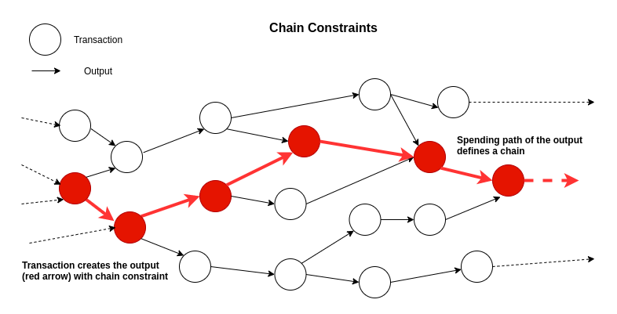
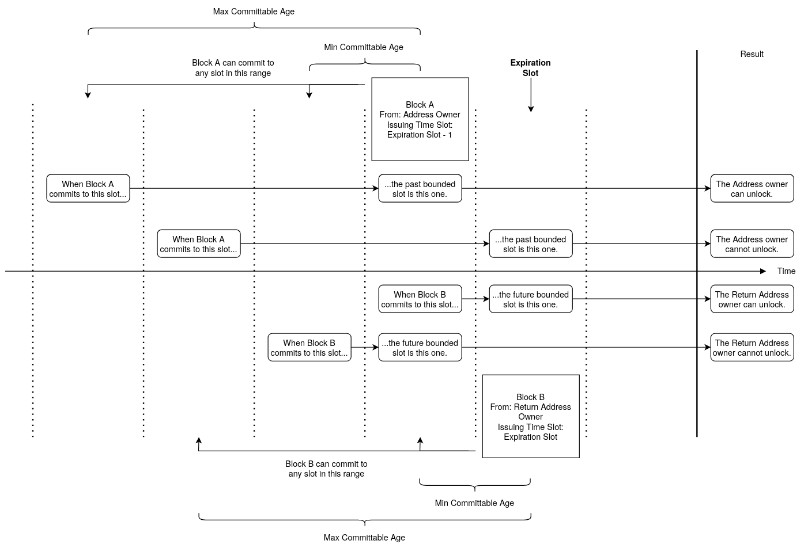
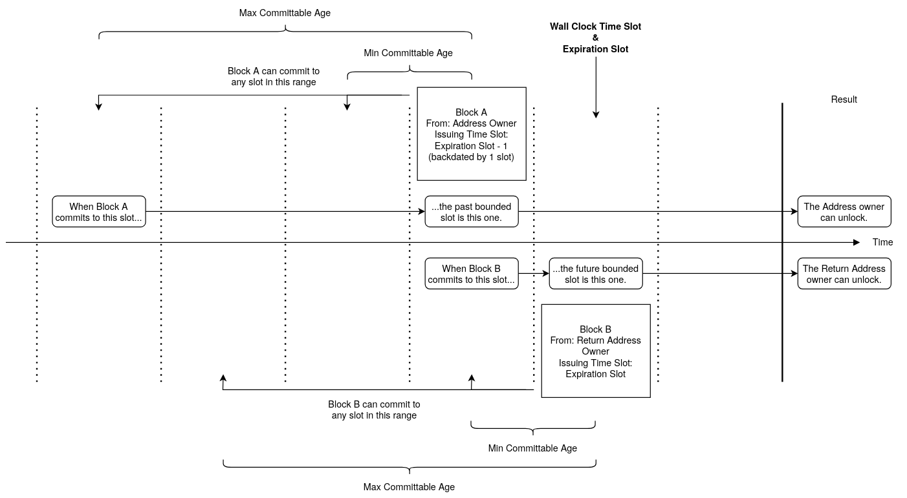

# Summary

This document defines the common building blocks used across multiple output types and transaction validation rules for
the IOTA protocol. Many of these were originally introduced in [TIP-18](../TIP-0018/tip-0018.md), and the functionality
defined in this document is an extension of the primitives defined in TIP-18.

## Summary of changes compared to TIP-18

- The `Unix Time` field of the Timelock Unlock Condition is replaced by `Slot Index`.
- The `Unix Time` field of the Expiration Unlock Condition is replaced by `Slot Index`.
- The list of _Native Tokens_ in Basic, Alias, NFT and Foundry Outputs is replaced by a _Native Token Feature_ that
  holds a single Native Token which can only be present in Basic and Foundry Outputs.

# Motivation

The aim of this TIP is to define the common building blocks for output types that support the use cases of the Native
Tokenization Framework and seamless interoperability between layer 1 and layer 2 tokenization concepts.

The UTXO model becomes even more powerful when unlocking criteria (validation) of outputs are extended, as demonstrated
by the [EUTXO model (Chakravarty et al., 2020)](https://fc20.ifca.ai/wtsc/WTSC2020/WTSC20_paper_25.pdf): instead of
requiring only a valid signature for the output's address to unlock it, additional unlock conditions can be programmed
into outputs. This programmability of outputs is the main idea behind the building blocks presented in this document.

In combination with the other layer 1 output types that build on top of the primitives defined here, users will be able
to interact with layer 2 smart contracts by posting requests through the Tangle. Requests can carry commands to smart
contracts and can additionally also transfer Native Tokens and NFTs.

With the Native Tokens defined in this TIP, users will be able to mint their own tokens directly in the base ledger,
which can then be transferred just like regular IOTA coins. Each native token has its own supply control policy enforced
by the protocol. These policies are transparent to all network participants. Issuers will be able to store metadata
about their tokens on-ledger, accessible to anyone.

# Building Blocks

## Data Types & Subschema Notation

Data types and subschemas used throughout this TIP are defined in [TIP-21](../TIP-0021/tip-0021.md).

## Protocol Parameters

Protocol parameters used throughout this TIP are defined in [TIP-49](../TIP-0049/tip-0049.md).

## Transaction Payload

[TIP-45](../TIP-0045/tip-0045.md) is the basis for output validation in this TIP.

# Output Design Primitives

New output types add new features to the protocol and hence new transaction validation rules. While some of these new
features are specifically tied to one output type, some are general, LEGO-like building blocks that may be put in
several types of outputs. The programmability of outputs opens the door for implementing new functionalities for the
base protocol. While some outputs were specifically designed for such new features, some are optional additions that may
be used with any outputs that support them.

These functionalities are grouped into two categories:

- **Unlock Conditions** and
- **Features**.

Each output type defines its list of supported <i>Unlock Conditions</i> and <i>Features</i>.

The following defines various primitives and the validation rules they introduce.

## Native Tokens

Outputs are records in the UTXO ledger that track ownership of funds. Thus, each output must be able to specify which
funds it holds. With the addition of the Native Tokenization Framework, some outputs may also carry user-defined native
tokens via a _Native Token Feature_, that is, tokens that are not IOTA coins but were minted by foundries and are
tracked in the very same ledger.

Dust protection applies to all outputs, therefore it is not possible for outputs to hold only native tokens. The storage
deposit requirements must be covered via IOTA coins.

User-defined tokens are called _Native Tokens_ on the protocol level. The maximum supply of a particular native token is
defined by the representation chosen on the protocol level for defining their amounts in outputs. Since native tokens
are also a vehicle to wrap layer 2 tokens into layer 1 tokens, the chosen representation must take into account the
maximum possible supply of layer 2 tokens. Solidity, the most popular smart contract language defines the maximum supply
of an ERC-20 token as `MaxUint256`, therefore it should be possible to represent such a huge amount of assets on
layer 1.

Outputs that can carry Native Tokens have a [_Native Token Feature_](#native-token-feature). Its transaction validation
rules are defined in that section.

## Chain Constraint in UTXO

Previously created transaction outputs are destroyed when they are consumed in a subsequent transaction as an input. The
chain constraint makes it possible to **carry the UTXO state machine state encoded in outputs across transactions.**
When an output with chain constraint is consumed, that transaction has to create a single subsequent output that carries
the state forward. The **state can be updated according to the transition rules defined for the given type of output and
its current state**. As a consequence, each such output has a unique successor, and together they form a path or _chain_
in the graph induced by the UTXO spends. Each chain is identified by its globally unique identifier.

Account outputs, foundry outputs, and NFT outputs all use this chain constraint concept and define their own unique
identifiers.

### Unlocking Chain Script Locked Outputs

Outputs with a chain constraint receive their unique identifiers upon creation, generated by the protocol, and carry it
forward with them through transactions until they are destroyed. These unique identifiers also function as global
addresses for the state machines, but unlike <i>Ed25519 Addresses</i>, they are not backed by private keys that could be
used for signing. The rightful owners who can unlock these addresses are defined in the outputs themselves.

Since such addresses are accounts in the ledger, it is possible to send funds to these addresses. The unlock mechanism
of such funds is designed in a way that **proving ownership of the address is reduced to the ability to unlock the
corresponding output that defines the address.**

## Addresses

The following section shows the basic supported Address Types and their serialization.

| Address | Type Byte as `uint8` | Bech32 Encoded |
| ------- | -------------------- | -------------- |
| Ed25519 | 0                    | iota1**q**...  |
| Account | 8                    | iota1**p**...  |
| NFT     | 16                   | iota1**z**...  |
| Anchor  | 24                   | iota1**r**...  |

The <i>Address Type</i> byte of a raw address has an effect on the starting character of the bech32 encoded address,
which is the recommended address format for user facing applications.

An IOTA mainnet address starts with `iota1`, and continues with the bech32 encoded bytes of the address. By choosing the
integer value of the _Address Type_ as a multiple of 8 for different address types, the first character after the `1`
separator in the bech32 address will always be different.

A user can identify by looking at the address whether it is a signature-backed address, an Account, or an NFT address.

### Ed25519 Address

  
Ed25519 Address

  <blockquote>An Address derived from an Ed25519 Public Key.</blockquote>

<table>
  <tr>
    <td>
      <b>Name</b>
    </td>
    <td>
      <b>Type</b>
    </td>
    <td>
      <b>Description</b>
    </td>
  </tr>
  <tr>
    <td>Address Type</td>
    <td>uint8</td>
    <td>Set to <strong>value 0</strong> to denote an <i>Ed25519 Address</i>.</td>
  </tr>
  <tr>
    <td>Pub Key Hash</td>
    <td>ByteArray[32]</td>
    <td>The raw bytes of the Ed25519 address which is the BLAKE2b-256 hash of the Ed25519 public key.</td>
  </tr>
</table>

#### Unlocking

The address is unlocked in a transaction if and only if:

- The _Unlock_ of the first output in the transaction that contains the address is a valid _Signature Unlock_ with
  respect to the address.

### Account Address

  
Account Address

  <blockquote>An Address derived from an Account ID which can be unlocked by unlocking the corresponding Account.</blockquote>

<table>
  <tr>
    <td>
      <b>Name</b>
    </td>
    <td>
      <b>Type</b>
    </td>
    <td>
      <b>Description</b>
    </td>
  </tr>
  <tr>
    <td>Address Type</td>
    <td>uint8</td>
    <td>Set to <strong>value 8</strong> to denote an <i>Account Address</i>.</td>
  </tr>
  <tr>
    <td>Account ID</td>
    <td>ByteArray[32]</td>
    <td>The raw bytes of the <i>Account ID</i> which is the BLAKE2b-256 hash of the Output ID that created it.</td>
  </tr>
</table>

#### Unlocking

The address is unlocked in a transaction if and only if:

- The _Account Output_ from whose _Account ID_ the address is derived from, is consumed as an input in the transaction.

### NFT Address

  
NFT Address

  <blockquote>An Address derived from an NFT ID which can be unlocked by unlocking the corresponding NFT.</blockquote>

<table>
  <tr>
    <td>
      <b>Name</b>
    </td>
    <td>
      <b>Type</b>
    </td>
    <td>
      <b>Description</b>
    </td>
  </tr>
  <tr>
    <td>Address Type</td>
    <td>uint8</td>
    <td>Set to <strong>value 16</strong> to denote an <i>NFT Address</i>.</td>
  </tr>
  <tr>
    <td>NFT ID</td>
    <td>ByteArray[32]</td>
    <td>The raw bytes of the <i>NFT ID</i> which is the BLAKE2b-256 hash of the Output ID that created it.</td>
  </tr>
</table>

#### Unlocking

The address is unlocked in a transaction if and only if:

- The _NFT Output_ from whose _NFT ID_ the address is derived from, is consumed as an input in the transaction.

### Anchor Address

  
Anchor Address

  <blockquote>An Address derived from an Anchor ID which can be unlocked by unlocking the corresponding Anchor.</blockquote>

<table>
  <tr>
    <td>
      <b>Name</b>
    </td>
    <td>
      <b>Type</b>
    </td>
    <td>
      <b>Description</b>
    </td>
  </tr>
  <tr>
    <td>Address Type</td>
    <td>uint8</td>
    <td>Set to <strong>value 24</strong> to denote an <i>Anchor Address</i>.</td>
  </tr>
  <tr>
    <td>Anchor ID</td>
    <td>ByteArray[32]</td>
    <td>The raw bytes of the <i>Anchor ID</i> which is the BLAKE2b-256 hash of the Output ID that created it.</td>
  </tr>
</table>

#### Unlocking

The address is unlocked in a transaction if and only if:

- The _Anchor Output_ from whose _Anchor ID_ the address is derived from, is **state transitioned** in the transaction.
  A governance transition does not unlock the address.

## Signatures

### Ed25519 Signature

The _Ed25519 Signature_ is supported and it is serialized as follows:

  
Ed25519 Signature

  <blockquote>An Ed25519 Signature with the public key that verifies it.</blockquote>

<table>
  <tr>
    <td>
      <b>Name</b>
    </td>
    <td>
      <b>Type</b>
    </td>
    <td>
      <b>Description</b>
    </td>
  </tr>
  <tr>
    <td>Signature Type</td>
    <td>uint8</td>
    <td>Set to <strong>value 0</strong> to denote an <i>Ed25519 Signature</i>.</td>
  </tr>
  <tr>
    <td>Public Key</td>
    <td>ByteArray[32]</td>
    <td>The Ed25519 public key that verifies the signature.</td>
  </tr>
  <tr>
    <td>Signature</td>
    <td>ByteArray[64]</td>
    <td>The Ed25519 signature that must be verified according to <a href='../TIP-0014/tip-0014.md'>TIP-14</a>.</td>
  </tr>
</table>

#### Work Score

The Work Score of an _Ed25519 Signature_ is `Work Score Parameters::Signature Ed25519`.

## Unlock Conditions

New output features that introduce unlocking conditions, that is, they define constraints on how the output can be
unlocked and spent, are grouped under the field <i>Unlock Conditions</i>.

Each output **must not contain more than one unlock condition of each type** and not all unlock condition types are
supported for each output type.

### Address Unlock Condition

It is merely a layout change that the previously defined `Address` field of outputs ([TIP-7](../TIP-0007/tip-0007.md))
is represented as an <i>Address Unlock Condition</i>. Unlocking an <i>Ed25519 Address</i> doesn't change, it has to be
performed via a <i>Signature Unlock</i> in a transaction by signing the hash of the transaction essence. Transaction
validation rules are detailed in [TIP-20](../TIP-0020/tip-0020.md).

New additions are the <i>Account Address</i> and <i>NFT Address</i> types, which have to be unlocked with their
corresponding unlocks, as defined in [Unlocking Chain Script Locked Outputs](#unlocking-chain-script-locked-outputs),
and the [Account Output](../TIP-0042/tip-0042.md) and [NFT Output](../TIP-0043/tip-0043.md) TIPs.

  
Address Unlock Condition

  <blockquote>Defines the Address that owns this output. It can unlock the output with the proper <i>Unlock</i> in a transaction.</blockquote>

<table>
  <tr>
    <td>
      <b>Name</b>
    </td>
    <td>
      <b>Type</b>
    </td>
    <td>
      <b>Description</b>
    </td>
  </tr>
  <tr>
    <td>Unlock Condition Type</td>
    <td>uint8</td>
    <td>Set to <strong>value 0</strong> to denote an <i>Address Unlock Condition</i>.</td>
  </tr>
  <tr>
    <td valign="top">Address <code>oneOf</code></td>
    <td colspan="2">
      

        
Ed25519 Address

        <blockquote>An Address derived from an Ed25519 Public Key. Defined in <a href='../TIP-0038/tip-0038.md#ed25519-address'>TIP-38 (Ed25519 Address)</a>.</blockquote>
      

      

        
Account Address

        <blockquote>An Address derived from an Account ID which can be unlocked by unlocking the corresponding Account. Defined in <a href='../TIP-0038/tip-0038.md#account-address'>TIP-38 (Account Address)</a>.</blockquote>
      

      

        
NFT Address

        <blockquote>An Address derived from an NFT ID which can be unlocked by unlocking the corresponding NFT. Defined in <a href='../TIP-0038/tip-0038.md#nft-address'>TIP-38 (NFT Address)</a>.</blockquote>
      

      

        
Anchor Address

        <blockquote>An Address derived from an Anchor ID which can be unlocked by unlocking the corresponding Anchor. Defined in <a href='../TIP-0038/tip-0038.md#anchor-address'>TIP-38 (Anchor Address)</a>.</blockquote>
      

      

        
Multi Address

        <blockquote>Defines a Multi Address that consists of addresses with weights and a threshold value. The Multi Address can be unlocked if the cumulative weight of all unlocked addresses is equal to or exceeds the threshold. Defined in <a href='../TIP-0052/tip-0052.md#multi-address'>TIP-52 (Multi Address)</a>.</blockquote>
      

      

        
Restricted Address

        <blockquote>An address that contains another address and allows for configuring its capabilities. Defined in <a href='../TIP-0050/tip-0050.md#restricted-address'>TIP-50 (Restricted Address)</a>.</blockquote>
      

    </td>
  </tr>
</table>

### Storage Deposit Return Unlock Condition

This unlock condition is employed to achieve conditional sending. An output that has <i>Storage Deposit Return Unlock
Condition</i> specified can only be consumed in a transaction that deposits `Return Amount` IOTA coins into
`Return Address`.

#### Additional Transaction Syntactic Validation Rules

- `Minimum Storage Deposit` is the storage deposit in the base currency required for a
  [<i>Basic Output</i>](../TIP-0041/tip-0041.md) that only has an <i>Address Unlock Condition</i>, no additional unlock
  conditions, no Mana and no features.
- It must hold true, that `Minimum Storage Deposit` ≤ `Return Amount` ≤ `Amount`.

#### Additional Transaction Semantic Validation Rules

- An output that has <i>Storage Deposit Return Unlock Condition</i> specified must only be consumed and unlocked in a
  transaction that deposits `Return Amount` IOTA coins to `Return Address` via one or more outputs that:
  - are of type <i>Basic Output</i>,
  - have only an [<i>Address Unlock Condition</i>](#address-unlock-condition) defined,
  - have no <i>Mana</i>, and
  - have no [<i>Features</i>](#features).
- When several outputs with <i>Storage Deposit Return Unlock Condition</i> and the same `Return Address` are consumed,
  their return amounts per `Return Addresses` are summed up, and the output side of the transaction must deposit _at
  least_ this total sum per `Return Address` via output(s) that satisfy the previous condition.

  
Storage Deposit Return Unlock Condition

  <blockquote>Defines the amount of IOTAs used as storage deposit that have to be returned to <i>Return Address</i>.</blockquote>

<table>
  <tr>
    <td>
      <b>Name</b>
    </td>
    <td>
      <b>Type</b>
    </td>
    <td>
      <b>Description</b>
    </td>
  </tr>
  <tr>
    <td>Unlock Condition Type</td>
    <td>uint8</td>
    <td>Set to <strong>value 1</strong> to denote a <i>Storage Deposit Return Unlock Condition</i>.</td>
  </tr>
  <tr>
    <td valign="top">Return Address <code>oneOf</code></td>
    <td colspan="2">
      

        
Ed25519 Address

        <blockquote>An Address derived from an Ed25519 Public Key. Defined in <a href='../TIP-0038/tip-0038.md#ed25519-address'>TIP-38 (Ed25519 Address)</a>.</blockquote>
      

      

        
Account Address

        <blockquote>An Address derived from an Account ID which can be unlocked by unlocking the corresponding Account. Defined in <a href='../TIP-0038/tip-0038.md#account-address'>TIP-38 (Account Address)</a>.</blockquote>
      

      

        
NFT Address

        <blockquote>An Address derived from an NFT ID which can be unlocked by unlocking the corresponding NFT. Defined in <a href='../TIP-0038/tip-0038.md#nft-address'>TIP-38 (NFT Address)</a>.</blockquote>
      

      

        
Anchor Address

        <blockquote>An Address derived from an Anchor ID which can be unlocked by unlocking the corresponding Anchor. Defined in <a href='../TIP-0038/tip-0038.md#anchor-address'>TIP-38 (Anchor Address)</a>.</blockquote>
      

      

        
Multi Address

        <blockquote>Defines a Multi Address that consists of addresses with weights and a threshold value. The Multi Address can be unlocked if the cumulative weight of all unlocked addresses is equal to or exceeds the threshold. Defined in <a href='../TIP-0052/tip-0052.md#multi-address'>TIP-52 (Multi Address)</a>.</blockquote>
      

      

        
Restricted Address

        <blockquote>An address that contains another address and allows for configuring its capabilities. Defined in <a href='../TIP-0050/tip-0050.md#restricted-address'>TIP-50 (Restricted Address)</a>.</blockquote>
      

    </td>
  </tr>
  <tr>
    <td>Return Amount</td>
    <td>uint64</td>
    <td>Amount of IOTA coins the consuming transaction should deposit to the address defined in <i>Return Address</i>.</td>
  </tr>
</table>

This unlock condition makes it possible to send small amounts of IOTA coins or native tokens to addresses without having
to lose control of the required storage deposit. It is also a vehicle to send on-chain requests to ISCP chains that do
not require fees. To prevent the receiving party from blocking access to the storage deposit, it is advised to be used
together with the [Expiration Unlock Conditions](#expiration-unlock-condition). The receiving party then has a
sender-defined time window to agree to the transfer by consuming the output, or the sender regains total control after
expiration.

### Timelock Unlock Condition

Slot indices in the Tangle are introduced via slot commitments and represent a notion of time. Each such commitment
carries an index. When using any feature related to time, a
[_Commitment Input_](../TIP-0045/tip-0045.md#commitment-input) is needed as a reference of time.

An output that contains a <i>Timelock Unlock Condition</i> can not be unlocked before the specified lock has expired.
The lock is expired when the index of the slot to which the transaction belongs is equal to or past the slot index
defined in the <i>Timelock Unlock Condition</i>.

#### Additional Transaction Syntactic Validation Rules

- `Slot Index` field of a <i>Timelock Unlock Condition</i> must be > `0`.

#### Additional Transaction Semantic Validation Rules

- A _Commitment Input_ must be present.
- Let `Future Bounded Slot Index` be given by `Commitment Index + Min Committable Age` where `Commitment Index` is the
  slot index of the commitment input.
- An output that has a <i>Timelock Unlock Condition</i> specified must only be consumed and unlocked in a transaction if
  the `Future Bounded Slot Index` is equal to or past the `Slot Index` specified in the unlock condition.

  
Timelock Unlock Condition

  <blockquote>Defines a slot index until which the output can not be unlocked.</blockquote>

<table>
  <tr>
    <td>
      <b>Name</b>
    </td>
    <td>
      <b>Type</b>
    </td>
    <td>
      <b>Description</b>
    </td>
  </tr>
  <tr>
    <td>Unlock Condition Type</td>
    <td>uint8</td>
    <td>Set to <strong>value 2</strong> to denote a <i>Timelock Unlock Condition</i>.</td>
  </tr>
  <tr>
    <td>Slot Index</td>
    <td>uint32</td>
    <td>Slot index starting from which the output can be consumed.</td>
  </tr>
</table>

### Expiration Unlock Condition

The expiration feature of outputs makes it possible for the return address to reclaim an output after a given expiration
slot index has passed.

The expiration feature can be viewed as an opt-in receive feature, because the recipient loses access to the received
funds after the output expires, while the return address specified by the sender regains control over them. This feature
is a big help for on-chain smart contract requests. Those that have expiration set and are sent to dormant smart
contract chains can be recovered by their senders, not to mention the possibility of time requests by specifying both a
timelock and an expiration unlock condition.

For the rationale behind the index choices for the slot index conditions in this Unlock Condition, refer to
[Expiration Unlock Condition Index Bounds](#expiration-unlock-condition-index-bounds).

#### Additional Transaction Syntactic Validation Rules

- `Slot Index` field of an <i>Expiration Unlock Condition</i> must be > `0`.

#### Additional Transaction Semantic Validation Rules

- A _Commitment Input_ must be present.
- Let `Future Bounded Slot Index` be given by `Commitment Index + Min Committable Age`, where `Commitment Index` is the
  slot index of the commitment input.
- Let `Past Bounded Slot Index` be given by `Commitment Index + Max Committable Age`, where `Commitment Index` is the
  slot index of the commitment input.
- An output that has an <i>Expiration Unlock Condition</i> set must only be consumed and unlocked by the target
  `Address` (defined in <i>Address Unlock Condition</i>) in a transaction if `Past Bounded Slot Index` is less than the
  `Slot Index` defined in the unlock condition.
- An output that has an <i>Expiration Unlock Condition</i> set must only be consumed and unlocked by the
  `Return Address` in a transaction if `Future Bounded Slot Index` is greater or equal to the `Slot Index` defined in
  the unlock condition.
- Semantic validation of an output that has an <i>Expiration Unlock Condition</i> set and is unlocked by the
  `Return Address` must ignore:
  - [Semantic validation of <i>Storage Deposit Return Unlock Condition</i>](#storage-deposit-return-unlock-condition) if
    present.

The following table summarizes the outcome of the syntactic and semantic validation rules with respect to which address
is allowed to unlock the output containing the <i>Expiration Unlock Condition</i>:

| Slot Index Condition                                                             | Outcome                                       |
| -------------------------------------------------------------------------------- | --------------------------------------------- |
| `Slot Index = 0`                                                                 | Output and containing transaction is invalid. |
| `Slot Index > Past Bounded Slot Index`                                           | Unlockable by `Address`.                      |
| `Slot Index ≤ Future Bounded Slot Index`                                         | Unlockable by `Return Address`.               |
| `Slot Index ≤ Past Bounded Slot Index && Slot Index > Future Bounded Slot Index` | Not unlockable.                               |

  
Expiration Unlock Condition

  <blockquote>Defines a slot index until which only the <i>Address</i> defined in the <i>Address Unlock Condition</i> is allowed to unlock the output. After the slot index is reached/passed, only the <i>Return Address</i> can unlock it.</blockquote>

<table>
  <tr>
    <td>
      <b>Name</b>
    </td>
    <td>
      <b>Type</b>
    </td>
    <td>
      <b>Description</b>
    </td>
  </tr>
  <tr>
    <td>Unlock Condition Type</td>
    <td>uint8</td>
    <td>Set to <strong>value 3</strong> to denote an <i>Expiration Unlock Condition</i>.</td>
  </tr>
  <tr>
    <td valign="top">Return Address <code>oneOf</code></td>
    <td colspan="2">
      

        
Ed25519 Address

        <blockquote>An Address derived from an Ed25519 Public Key. Defined in <a href='../TIP-0038/tip-0038.md#ed25519-address'>TIP-38 (Ed25519 Address)</a>.</blockquote>
      

      

        
Account Address

        <blockquote>An Address derived from an Account ID which can be unlocked by unlocking the corresponding Account. Defined in <a href='../TIP-0038/tip-0038.md#account-address'>TIP-38 (Account Address)</a>.</blockquote>
      

      

        
NFT Address

        <blockquote>An Address derived from an NFT ID which can be unlocked by unlocking the corresponding NFT. Defined in <a href='../TIP-0038/tip-0038.md#nft-address'>TIP-38 (NFT Address)</a>.</blockquote>
      

      

        
Anchor Address

        <blockquote>An Address derived from an Anchor ID which can be unlocked by unlocking the corresponding Anchor. Defined in <a href='../TIP-0038/tip-0038.md#anchor-address'>TIP-38 (Anchor Address)</a>.</blockquote>
      

      

        
Multi Address

        <blockquote>Defines a Multi Address that consists of addresses with weights and a threshold value. The Multi Address can be unlocked if the cumulative weight of all unlocked addresses is equal to or exceeds the threshold. Defined in <a href='../TIP-0052/tip-0052.md#multi-address'>TIP-52 (Multi Address)</a>.</blockquote>
      

      

        
Restricted Address

        <blockquote>An address that contains another address and allows for configuring its capabilities. Defined in <a href='../TIP-0050/tip-0050.md#restricted-address'>TIP-50 (Restricted Address)</a>.</blockquote>
      

    </td>
  </tr>
  <tr>
    <td>Slot Index</td>
    <td>uint32</td>
    <td>Before this slot index, <i>Address Unlock Condition</i> is allowed to unlock the output, after that only the address defined in <i>Return Address</i>.</td>
  </tr>
</table>

## Features

New output features that do not introduce unlocking conditions, but rather add new functionality and add constraints on
output creation are grouped under <i>Features</i>.

Each output **must not contain more than one feature of each type** and not all feature types are supported for each
output type.

### Sender Feature

Every transaction consumes several elements from the UTXO set and creates new outputs. However, certain applications
(smart contracts) require associating each output with exactly one sender address. Here, the sender feature is used to
specify the validated sender of an output.

Outputs that support the <i>Sender Feature</i> may specify a `Sender` address which is validated by the protocol during
transaction validation.

#### Additional Transaction Semantic Validation Rules

- The <i>Sender Feature</i>, and hence the output and transaction that contain it, is valid, if and only if the `Sender`
  address is unlocked in the transaction. Every Address Type specifies under which conditions it is considered unlocked.

  
Sender Feature

  <blockquote>Identifies the validated sender of the output.</blockquote>

<table>
  <tr>
    <td>
      <b>Name</b>
    </td>
    <td>
      <b>Type</b>
    </td>
    <td>
      <b>Description</b>
    </td>
  </tr>
  <tr>
    <td>Feature Type</td>
    <td>uint8</td>
    <td>Set to <strong>value 0</strong> to denote a <i>Sender Feature</i>.</td>
  </tr>
  <tr>
    <td valign="top">Sender <code>oneOf</code></td>
    <td colspan="2">
      

        
Ed25519 Address

        <blockquote>An Address derived from an Ed25519 Public Key. Defined in <a href='../TIP-0038/tip-0038.md#ed25519-address'>TIP-38 (Ed25519 Address)</a>.</blockquote>
      

      

        
Account Address

        <blockquote>An Address derived from an Account ID which can be unlocked by unlocking the corresponding Account. Defined in <a href='../TIP-0038/tip-0038.md#account-address'>TIP-38 (Account Address)</a>.</blockquote>
      

      

        
NFT Address

        <blockquote>An Address derived from an NFT ID which can be unlocked by unlocking the corresponding NFT. Defined in <a href='../TIP-0038/tip-0038.md#nft-address'>TIP-38 (NFT Address)</a>.</blockquote>
      

      

        
Anchor Address

        <blockquote>An Address derived from an Anchor ID which can be unlocked by unlocking the corresponding Anchor. Defined in <a href='../TIP-0038/tip-0038.md#anchor-address'>TIP-38 (Anchor Address)</a>.</blockquote>
      

      

        
Multi Address

        <blockquote>Defines a Multi Address that consists of addresses with weights and a threshold value. The Multi Address can be unlocked if the cumulative weight of all unlocked addresses is equal to or exceeds the threshold. Defined in <a href='../TIP-0052/tip-0052.md#multi-address'>TIP-52 (Multi Address)</a>.</blockquote>
      

      

        
Restricted Address

        <blockquote>An address that contains another address and allows for configuring its capabilities. Defined in <a href='../TIP-0050/tip-0050.md#restricted-address'>TIP-50 (Restricted Address)</a>.</blockquote>
      

    </td>
  </tr>
</table>

### Issuer Feature

The issuer feature is a special case of the sender feature that is only supported by outputs that implement a UTXO state
machine with [chain constraint](#chain-constraint-in-utxo) (account, NFT). Only when the state machine is created (e.g.
minted) it is checked during transaction validation that an output corresponding to the `Issuer` address is consumed. In
every future transition of the state machine, it is instead checked that the issuer feature is still present and
unchanged.

#### Additional Transaction Semantic Validation Rules

- The _Issuer Feature_, and hence the output and transaction that contain it, is valid, if and only if the `Issuer`
  address is unlocked in the transaction. Every Address Type specifies under which conditions it is considered unlocked.

The main use case is proving the authenticity of NFTs. Whenever an NFT is minted as an NFT output, the creator (issuer)
can fill the _Issuer Feature_ with their address that they have to unlock in the transaction. Issuers then can publicly
disclose their addresses to prove the authenticity of the NFT once it is in circulation.

  
Issuer Feature

  <blockquote>Identifies the validated issuer of the UTXO state machine.</blockquote>

<table>
  <tr>
    <td>
      <b>Name</b>
    </td>
    <td>
      <b>Type</b>
    </td>
    <td>
      <b>Description</b>
    </td>
  </tr>
  <tr>
    <td>Feature Type</td>
    <td>uint8</td>
    <td>Set to <strong>value 1</strong> to denote a <i>Issuer Feature</i>.</td>
  </tr>
  <tr>
    <td valign="top">Issuer <code>oneOf</code></td>
    <td colspan="2">
      

        
Ed25519 Address

        <blockquote>An Address derived from an Ed25519 Public Key. Defined in <a href='../TIP-0038/tip-0038.md#ed25519-address'>TIP-38 (Ed25519 Address)</a>.</blockquote>
      

      

        
Account Address

        <blockquote>An Address derived from an Account ID which can be unlocked by unlocking the corresponding Account. Defined in <a href='../TIP-0038/tip-0038.md#account-address'>TIP-38 (Account Address)</a>.</blockquote>
      

      

        
NFT Address

        <blockquote>An Address derived from an NFT ID which can be unlocked by unlocking the corresponding NFT. Defined in <a href='../TIP-0038/tip-0038.md#nft-address'>TIP-38 (NFT Address)</a>.</blockquote>
      

      

        
Anchor Address

        <blockquote>An Address derived from an Anchor ID which can be unlocked by unlocking the corresponding Anchor. Defined in <a href='../TIP-0038/tip-0038.md#anchor-address'>TIP-38 (Anchor Address)</a>.</blockquote>
      

      

        
Multi Address

        <blockquote>Defines a Multi Address that consists of addresses with weights and a threshold value. The Multi Address can be unlocked if the cumulative weight of all unlocked addresses is equal to or exceeds the threshold. Defined in <a href='../TIP-0052/tip-0052.md#multi-address'>TIP-52 (Multi Address)</a>.</blockquote>
      

      

        
Restricted Address

        <blockquote>An address that contains another address and allows for configuring its capabilities. Defined in <a href='../TIP-0050/tip-0050.md#restricted-address'>TIP-50 (Restricted Address)</a>.</blockquote>
      

    </td>
  </tr>
</table>

Whenever a chain account mints an NFT on layer 1 on behalf of some user, the `Issuer` field can only contain the chain's
address, since the user does not sign the layer 1 transaction. As a consequence, artists would have to mint NFTs
themselves on layer 1 and then deposit it to chains if they want to place their own address in the `Issuer` field.

### Metadata Feature

Outputs may carry additional data with them that is interpreted by higher-layer applications built on the Tangle. The
protocol treats this metadata as pure binary data, it has no effect on the validity of an output except that it
increases the required storage deposit. ISC is a great example of a higher-layer protocol that makes use of <i>Metadata
Feature</i>: smart contract request parameters are encoded in the metadata field of outputs.

  
Metadata Feature

  <blockquote>Defines a map of key-value pairs that is stored in the output.</blockquote>

<table>
  <tr>
    <td>
      <b>Name</b>
    </td>
    <td>
      <b>Type</b>
    </td>
    <td>
      <b>Description</b>
    </td>
  </tr>
  <tr>
    <td>Feature Type</td>
    <td>uint8</td>
    <td>Set to <strong>value 2</strong> to denote a <i>Metadata Feature</i>.</td>
  </tr>
  <tr>
    <td>Entries Count</td>
    <td>uint8</td>
    <td>The number of entries in the map.</td>
  </tr>
  <tr>
    <td valign="top">Entries <code>anyOf</code></td>
    <td colspan="2">
      

        
Metadata Entry

        <blockquote>A map entry consisting of a string key and an arbitrary byte value.</blockquote>
        <table>
          <tr>
            <td>
              <b>Name</b>
            </td>
            <td>
              <b>Type</b>
            </td>
            <td>
              <b>Description</b>
            </td>
          </tr>
          <tr>
            <td>Key</td>
            <td>(uint8)ByteArray</td>
            <td>A string which may only consist of printable ASCII characters. A leading uint8 denotes its length.</td>
          </tr>
          <tr>
            <td>Value</td>
            <td>(uint16)ByteArray</td>
            <td>An array of arbitrary binary data. A leading uint16 denotes its length.</td>
          </tr>
        </table>
      

    </td>
  </tr>
</table>

#### Additional Transaction Syntactic Validation Rules

- Each `Key` in the `Entries` must consist only of bytes that are printable ASCII characters, that is, for each
  character `char` (interpreted as a byte) in the `Key` it must hold: `33 <= char <= 126`.
- Each `Key` in the `Entries` must be unique.
- The `Entries` must be lexicographically ordered based on `Key`.
  - Note: This requirement only applies to the binary serialization. See also the note on [map ordering](#map-ordering).
- `Entries Count` must be at least `1`.
- The serialized size of the map, consisting of the serialized size of `Entries Count` plus the serialized size of all
  `Entries`, must not exceed `8192` bytes.

### Tag Feature

A <i>Tag Feature</i> makes it possible to tag outputs with an index, so they can be retrieved through an indexer API not
only by their address but also based on the `Tag`. **The combination of a <i>Tag Feature</i>, a <i>Metadata Feature</i>,
and a <i>Sender Feature</i> makes it possible to retrieve data associated with an address and stored in outputs that
were created by a specific party (`Sender`) for a specific purpose (`Tag`).**

An example use case is voting on the Tangle via the
[participation](https://github.com/iota-community/treasury/blob/main/specifications/hornet-participation-plugin.md)
plugin.

#### Additional Transaction Syntactic Validation Rules

- An output with <i>Tag Feature</i> is valid, if and only if 0 < `length(Tag)` ≤ `Max Tag Length`.

  
Tag Feature

  <blockquote>Defines an indexation tag to which the output can be indexed by additional node plugins.</blockquote>

<table>
  <tr>
    <td>
      <b>Name</b>
    </td>
    <td>
      <b>Type</b>
    </td>
    <td>
      <b>Description</b>
    </td>
  </tr>
  <tr>
    <td>Feature Type</td>
    <td>uint8</td>
    <td>Set to <strong>value 4</strong> to denote a <i>Tag Feature</i>.</td>
  </tr>
  <tr>
    <td>Tag</td>
    <td>(uint8)ByteArray</td>
    <td>Binary indexation data. A leading uint8 denotes its length.</td>
  </tr>
</table>

### Native Token Feature

  
Native Token Feature

  <blockquote>A feature that carries a user-defined Native Token minted by a Foundry Output.</blockquote>

<table>
  <tr>
    <td>
      <b>Name</b>
    </td>
    <td>
      <b>Type</b>
    </td>
    <td>
      <b>Description</b>
    </td>
  </tr>
  <tr>
    <td>Feature Type</td>
    <td>uint8</td>
    <td>Set to <strong>value 5</strong> to denote a <i>Native Token Feature</i>.</td>
  </tr>
  <tr>
    <td>Token ID</td>
    <td>ByteArray[38]</td>
    <td>Identifier of the native token. Its derivation is defined in <a href='../TIP-0044/tip-0044.md#foundry-output'>TIP-44 (Foundry Output)</a>.</td>
  </tr>
  <tr>
    <td>Amount</td>
    <td>uint256</td>
    <td>Amount of native tokens of the given <i>Token ID</i>.</td>
  </tr>
</table>

#### Additional Transaction Syntactic Validation Rules

- `Amount` must not be `0`.

#### Additional Transaction Semantic Validation Rules

Whenever any Native Token Feature is present on the input or output side of a transaction, the following rule applies to
the transaction:

- The transaction is balanced in terms of native tokens, that is, the sum of native token balances in consumed outputs
  equals that of the created outputs.
- When the transaction is **imbalanced** and there is a surplus of native tokens on the:
  - **output side of the transaction:** the foundry outputs controlling outstanding native token balances must be
    present in the transaction. The validation of the foundry output(s) determines if the minting operations are valid.
  - **input side of the transaction:** the transaction destroys tokens. The presence and validation of the foundry
    outputs of the native tokens determines whether the tokens are burned (removed from the ledger) or melted in the
    foundry.
    - The transaction is invalid if Native Tokens are burned and the _Can Burn Native Tokens_ flag in the _Transaction
      Capabilities_ is **unset**. Melting is unaffected by the flag.

# Migration

## Native Token Migration

The capability to hold Native Tokens is removed from Alias and NFT Outputs. In Basic and Foundry Outputs the capability
is moved from a field to the _Native Token Feature_. Moreover, each output can only hold one Native Token instead of up
to 64. This section specifies the migration.

Let `Owner Address` be:

- the _Alias Address_ if the Output is an _Alias Output_.
- the _NFT Address_ if the Output is an _NFT Output_.
- the _Address_ in the _Address Unlock Condition_ in the output if the Output is a _Basic Output_.
- the _Alias Address_ in the _Immutable Alias Address Unlock Condition_ in the output if the Output is a _Foundry
  Output_.

For each Native Token `Token` in an output with `Native Tokens Count >= 1`, a Basic Output `Output` is created as
follows:

- The `Amount` is set to `0`.
  - TODO: (Discuss) It would be possible to set this at least to `1` or even higher so as to not violate the
    `Amount != 0` assumption of outputs, by moving some tokens from the output that originally contained it to the newly
    created output.
- The `Output` has one Feature of type _Native Token Feature_ which holds the `Token`.
- The `Output` has one Unlock Condition of type _Address Unlock Condition_ with the `Address` set to `Owner Address`.

# Rationale & Design

## Expiration Unlock Condition Index Bounds

In theory, the conditions for a successful unlock on the _Expiration Unlock Condition_ are ideal when the `Address` and
`Return Address` pick the commitment most suitable to them, i.e. the oldest (`Maximum Committable Age` old) and newest
(`Min Committable Age` old) one, respectively. In practice, however, it is likely that a node will provide a commitment
within the range of maximum and minimum committable age. If both pick the same commitment this causes a period of time
("deadzone") where neither `Address` nor `Return Address` can unlock the output with the expiration unlock condition.
However, this deadzone is more desirable than the alternative, where for some overlapping period of time, both `Address`
and `Return Address` would be able to unlock the output, potentially allowing a double spend.

_In this figure, Block A and B are issued in the slot corresponding to the current Wall Clock Time respectively (which
is not globally the same in this example). It shows how the choice of the commitment affects the unlocking outcome._

**Example with optimal Commitment Input choices**

Suppose that `Minimum Committable Age` is 3 and `Maximum Committable Age` is 10, and there is an Expiration Unlock
Condition with `Slot Index` set to 20. Note the restrictions on the Commitment Input within a transaction relative to a
[Block's `Issuing Time`](../TIP-0046/tip-0046.md#syntactic-validation). If the current slot is 19, the oldest Commitment
the Address owner can pick as the Commitment Input is the one with index = 19-10 = 9 and can therefore unlock the
output, because 20 > 9+10. The newest Commitment the Return Address owner can pick is the one with index 19-3 = 16, and
because 20 <= 16+3 is not true, they cannot unlock. If the current slot is 20, the oldest Commitment the Address owner
can pick is the one with index = 20-10 = 10, but since 20 > 10+10 is not true, they cannot unlock. Now the newest
Commitment the Return Address owner can pick is 20-3 = 17, and because 20 <= 17+3 is true, they can unlock.

If however, the current slot is 18, and both owners would use the same Commitment Input with index 13, within the range
of 8 and 15 of possible commitments, then neither one of them can unlock the output, as neither 20 > 13+10 nor 20 <=
13+3 is true.

**Backdating blocks**

One variable that was not mentioned yet is how a client can set a block's `Issuing Time`, relative to which the chosen
commitment is validated, which allows for _backdating_ blocks. Backdating blocks by a significant amount is only
possible when there is liveness. The most that someone can backdate a block is to
`Accepted Tangle Time - Liveness Threshold Upper Bound`, so if there is liveness (`ATT ~= Wall Clock Time`), then the
most someone could backdate their block is by `Liveness Threshold Upper Bound`.

_This figure shows an example of backdating a block by one slot (which is less than `Liveness Threshold Upper Bound`).
The global Wall Clock Time is the same for both blocks and yet both transactions in their respective blocks could unlock
the output._

The only time that backdating has any consequence is if there is liveness. Assume some application (for example, a layer
2 chain) relies on an expired output being consumed. The application should only consider the expired output as consumed
and act on that if the output is at least accepted, but ideally until it is committed, confirmed or finalized. The
higher the level of finality the application waits for, the more difficult it is for the `Address` owner (the receiver
of the output with an _Expiration Unlock Condition_) to backdate a block and revert the consumption of the expired
output. For example, if the application waits for commitment of the expired output being consumed, then it is impossible
for the receiver address to subsequently consume it, unless it forces a chain switch, because the receiver address can
only consume the output in an earlier slot than the return address can consume it, and all such earlier slots are
already committed. If the application only waits for acceptance of the expired output consumption, a malicious owner of
the receiver address could technically issue a backdated block shortly after `ATT - Liveness Threshold Upper Bound`, but
this block would be less likely to be selected as a tip, and because the majority of online validators already accepted
the expired output consumption, they should not accept the backdated receiver consumption because it is a conflict. The
only way the receiver address could revert the other conflict is by having support of a majority of other validators to
revert it. In conclusion, it is very difficult to backdate even with just acceptance, and becomes more difficult when
waiting for higher levels of finality. This attack relates to the fundamental fact that the best approximation of time
is the block's `Issuing Time` timestamp, which is is meant to be very difficult to falsify.

## Metadata Feature Map

In Stardust, the Metadata Feature was defined as an arbitrary byte array to allow applications to be built on top of the
data stored in the ledger. However, only one such feature was allowed in a given output making it practically impossible
for two independent applications to both store data in the same output. Moreover, it was hard to identify what
application has written data into the metadata, making it tough for other applications, such as wallets, that read these
values, to interpret the data correctly. To address this, the feature was changed to a map of key-value pairs, where the
keys are human-readable identifiers and the keys are arbitrary byte values. This additional level of abstraction allows
multiple applications to write data into the same output, as long as they use different keys. The keys are limited to
printable ASCII characters (excluding space) such that it's easy for a human to read which keys are in a given feature
(for example in explorers or when looking at the JSON response from an API). In order for applications to avoid naming
collisions in the key, another registry TIP could be considered where applications can reserve their keys. Although not
enforced by the protocol, this would help avoid collisions and, as a side-effect, means that the data writers can define
their encoding, compression or other relevant information for the correct interpretation of the data. That allows
wallets and other data readers to detect content based on the keys, which is much more resilient than attempting to
inspect the raw bytes for magic bytes, encoding or compression markers.

### Map Ordering

The map's `Entries` are required to be lexicographically ordered, in order to produce a deterministic binary
serialization, on which identifiers like the Transaction ID or the signing message of a transaction depend on. Map
implementations often don't retain an order like lists/arrays do, which requires this sorting. However, this requirement
only applies to the binary serialization, since it must be deterministic. Other data exchange formats, like JSON used in
REST APIs are not signed or hashed. JSON in particular also does not require or guarantee a map order. Hence, the
ordering is not strictly required for any other format than the binary one.

# Copyright

Copyright and related rights waived via [CC0](https://creativecommons.org/publicdomain/zero/1.0/).
