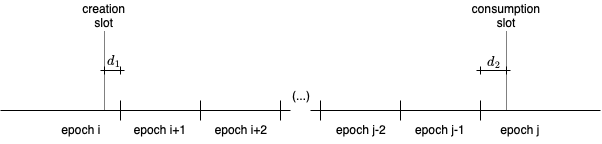
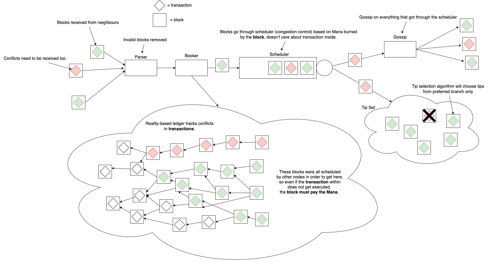

# Summary

This document defines the Mana-related concepts and the Mana dynamics in the IOTA 2.0 protocol. The TIP defines the two
types of Mana, namely **Potential Mana** and **Stored Mana**, as well as the **Block Issuance Credit (BIC)** that Mana
can be allotted to.

# Motivation

Mana is a resource used to determine the allowed throughput of a user and as a payment form for block issuance. Mana can
be obtained by constructive and profitable actions for the network, like token holding or engagement in securing the
network. Additionally, owning Mana is necessary to use the network by issuing blocks, so it plays a core role in the
IOTA Tokenomics. The following document gives a high-level overview of Mana types and its dynamics. Mana is a crucial
change introduced in the IOTA 2.0 protocol, next to staking, delegation and congestion control changes. This document
works with the Congestion Control Algorithm with Mana, in which block issuers must allot Mana to their account to
increase their Block Issuance Credit balance. In order to issue a block a certain amount of BIC is deducted from the
issuer account balance and burned. In order to issue blocks and use all functionality related to Mana, the user is
required to have an account, which is introduced in [TIP-42](../TIP-0042/tip-0042.md).

# Building Blocks

## Data Types & Subschema Notation

Data types and subschemas used throughout this TIP are defined in [TIP-21](../TIP-0021/tip-0021.md).

## Protocol Parameters

Protocol parameters used throughout this TIP are defined in [TIP-49](../TIP-0049/tip-0049.md).

# Mana Design

Mana is a core element of the IOTA incentive scheme. It is a resource that can be obtained through:

- generation by holding IOTA coins;
- as a reward for staking IOTA coins;
- as a reward for delegating IOTA coins;
- or simply received or bought from other IOTA users.

It is an essential element of the IOTA protocol, as it is used:

- to determine the allowed throughput of an account in the congestion control;
- as a payment for block issuance;
- as a core part of the IOTA Tokenomics and incentivization scheme.

**Mana** can have different forms, each of which is described in the following sections.

- [**Stored Mana**](#stored-mana) is Mana that is stored in UTXOs and can consequently be moved on the UTXO ledger,
  which allows for Mana Market development.
- [**Potential Mana**](#potential-mana) is generated by holding IOTA coins.\
  The longer the IOTA coins were unspent, the more Potential Mana is generated. When an output is spent, its Potential
  Mana is released and can be transitioned to one of its more explicit forms, i.e. Stored Mana or Block Issuance
  Credits. Note that the Potential Mana is a quatity not explicitly tracked in the ledger state, but easily derived from
  it.
- [**Block Issuance Credit**](#block-issuance-credit) (BIC) is the form of Mana used as an anti-spam mechanism to the
  block issuance process. During a transaction, Stored or Potential Mana can be _allotted as BIC_, which moves the Mana
  off the UTXO ledger and converts it to Block Issuance Credits. Only this form of Mana can be burnt to issue blocks.
- [**Mana Rewards**](#mana-rewards) reward participation in staking for validation and delegating IOTA coins. The Mana
  rewarded from these activities is not registered automatically in the UTXO ledger; thus, rewards must be claimed, as
  described in [TIP-40](../TIP-0040/tip-0040.md##mana-rewards).

The **Mana holdings** of a user are the sum of all the Potential Mana and Stored Mana in their Account Output that they
use to issue blocks.

## Mana Burn

According to the congestion control mechanism, during each block issuance, the block issuer needs to burn a certain
amount of Mana dictated by the work score of the block and the Reference Mana Cost (RMC). The Mana burned by the block
is subtracted from the block issuer's BIC balance. Users who overspend Mana (i.e., try to issue more blocks than their
Mana Holdings allow) will have their account locked until their debt is paid.

### Reference Mana Cost

The _Reference Mana Cost (RMC)_ of a slot is used to decide how much Mana should be burned from the user's BIC each time
a block is issued in that slot. The RMC is computed according to an algorithm based on the recent traffic activity. Note
that the algorithm takes as in input the number of blocks in certain slots older than _Maximum Committable Age (MCA)_,
meaning that all nodes know and agree on the RMC of a slot in advance (even before issuing the block).

From a high-level perspective, the RMC algorithm works as follows:

- If the number of blocks in slot `i - MCA` is larger than a given threshold, then the RMC increases.
- Otherwise (i.e., if the activity is low), the RMC decreases.
- The rate at which the RMC decreases is higher than its increase to tackle situations where the price suddenly becomes
  too large for the majority of users, and activity drops. (TO DO: update with the final price dynamic design)

To limit fluctuations in the RMC, it is recommended to update its value at least every MCA slots.

The RMC update only takes into account the blocks issued by accounts having non-negative BIC balances to avoid price
manipulations by malicious actors. Note that even though blocks from issuers with negative BIC balances are excluded
with respect to the RMC calculation, they do make part of the slot commitment.

## Mana Decay

Mana Decay is introduced as a control mechanism of the Mana dynamics, altogether with the rate for the Mana generation
both from IOTA coins and the staking mechanism, which will be discussed in detail in the next sections. To guarantee
non-gameability (e.g., splitting accounts or other behaviors that are not helpful for the system well-functioning) and
the fairness of Mana, the same global decay factor needs to be applied to all the above-mentioned forms of Mana.

As the exact formulas in which the decay factor will be applied might differ among the Mana types, it is essential to
point out that all of them are based on the same exponential decay with the same parameter `β`. The
[Incentives Whitepaper](https://files.iota.org/papers/IOTA_2.0_Incentives_And_Tokenomics_Whitepaper.pdf) provides the
specific formula for the decay function in Appendix A. To make the formulas and code more intuitive, we define in this
TIP an `Annual Decay` multiplicative factor that is mathematically equivalent to the decay mechanism introduced in the
Whitepaper. This new parameter is defined such that `Annual Decay = exp(-β)`.

Applying decay for the generation of new Mana and staking rewards is conceptually straightforward since it is done at
the time of storing this Mana. Similarly, applying the decay on the already stored Mana happens during the UTXO
spending. In any of those cases, the node must calculate the decay based on epoch indices, not local times. Every
<code>2<sup>Slots Per Epoch Exponent</sup></code> slots, the epoch changes, meaning that every set of consecutive
<code>2<sup>Slots Per Epoch Exponent</sup></code> slots will be in the same epoch.

The decay parameter `Annual Decay` (together with the Mana generation parameter `Mana Structure::Generation Rate`) was
set so the maximum theoretical Mana in the system is smaller than <code>2<sup>Bits Count</sup> - 1</code>, where
`Bits Count` refers to the `Mana Structure::Bits Count` protocol parameter. This means that, even though Mana is stored
as a uint64, it effectively uses less than 64 bits (in the case of BIC, it uses at most `Bits Count + 1` bits,
`Bits Count` for the value and one for the sign). Note that the system will almost certainly never use all the
`Bits Count` to store Mana since, for the Mana supply to get to this value, nobody can spend their Mana for years. In
practice, we expect to work with Mana values way smaller than <code>2<sup>Bits Count</sup> - 1</code>; however, we must
count on what would be an unreasonably large value in practice to avoid overflowing of the variables even if with a
minimal probability.

### Mana Decay Parameters

The tables below describe the key parameters used for the Mana decay calculations in the next sections of this TIP.
Notice that the parameters in the first table are only used in the explanations in this TIP, but not explicitly in the
code.

<table>
    <tr>
        <td><b>Name</b></td>
        <td><b>Description</b></td>
    </tr>
    <tr>
        <td><code>Annual Decay</code></td>
        <td>
            Global annual decay parameter.
        </td>
    </tr>
    <tr>
        <td><code>γ</code></td>
        <td>
            Defines fixed potential Mana generation per slot.
        </td>
    </tr>
	<tr>
	    <td><code>Δ</code></td>
        <td>
            The duration of an epoch in years.
        </td>
	</tr>
</table>

Additionally, we use the protocol parameters, as defined in [TIP-49], and `Decay Factors Length`, defined as the length
of the lookup table `Decay Factors`. We also use an auxiliary `Decay per Epoch` factor, derived from `Annual Decay` and
other protocol parameters using the following relation:

<code>Decay per Epoch = Annual Decay<sup>(Seconds per Epoch/Seconds per Year)</sup></code>

where

- `Seconds per Year = 60*60*24*365`
- <code>Seconds per Epoch = Slot Duration In Seconds * 2<sup>Slots Per Epoch Exponent</sup></code>

## Mana and fixed point arithmetics

Floating point operations might lead to inconsistencies among results in different nodes due to the different rounding
behaviors in different architectures. The results of the operations involving floating point variables might differ by
amounts that are considered negligible for the modules that deal with local decisions (as the congestion control module,
for example); however, differences that would be considered negligible by those modules can be fatal for the transaction
validation and slot commitments, leading to forks and other undesirable behaviors in the system. For that reason, fixed
point arithmetics (which do not expose the nodes to these rounding divergencies) must be used in all the modules that
require exact consensus over values. In particular, all the Mana and rewards calculations have to be done with fixed
point arithmetics.

In the [lookup table](#lookup-table) section of this TIP, a lookup table is introduced that will be used in the rest of
this TIP, as a tool to perform calculations that would otherwise be done with floating point operations.

### Decay Function

In this section, we define a function `Decay(value, epochIndexDiff)`, that decays an amount of Mana `value` by the
factor relative to `epochIndexDiff` epochs. Note that the table `Decay Factors` defined above only gives the values of
decays factors for up to `Decay Factors Length` epochs. To calculate the decay for larger periods of time, we combine
values defined in the [lookup table](#lookup-table) for other numbers smaller than `Decay Factors Length`, using an
algorithm that will be defined below. First, we define three auxiliary functions:

- Let `Upper Bits(value, n)` be: given a uint64 integer `value`, returns its upper `n` bits
- Let `Lower Bits(value, n)` be: given a uint64 integer `value`, returns its lower `n` bits
- `Multiplication And Shift(valueHi, valueLo, multFactor, shiftFactor)`: the goal of this function is to return the
  result
- of a multiplication of a uint64 by a uint32, shifted `shiftFactor` times to the right, whenever this result is smaller
- than <code>2<sup>64</sup></code>. To do so, it uses the following algorithm:
  - Let `valueHi` and `valueLo` be the upper and lower 32 bits of an integer smaller than <code>2<sup>64</sup></code>,
    `multFactor` be an integer smaller than <code>2<sup>32</sup></code>, and `shiftFactor` be an integer between 0
    and 32.
  - Let `>>` be a right shift (thus, `>>n` means shifting to the right `n` times). Analogously, let `<<` be a left
    shift.
  - Then compute `valueHi = valueHi * multFactor`.
  - Then compute
    `valueLo = Lower Bits(valueHi, shiftFactor) << (32 - shiftFactor) + (valueLo * multFactor) >> shiftFactor`.
  - Then compute `valueHi = (valueHi >> shiftFactor) + Upper Bits(valueLo, 32)`.
  - Then compute `valueLo = Lower Bits(valueLo, 32)`.
  - Return `valueHi, valueLo`, representing the upper 32 and the lower 32 bits, respectively, of the result.

With the functions above defined, we proceed to define the `Decay` function that takes as input a uint64 value `value`
and decays it by the correct decay factor relative to `epochIndexDiff` epochs. OBS: note that here,
`Decay Factors(epochIndexDiff)` denotes the value of the table relative to `epochIndexDiff` epochs, which not
necessarily corresponds to the `epochIndexDiff`<sup>th</sup> entry of the table.

- Let `Decay(value, epochIndexDiff)` be:
  - If `value == 0` or `epochIndexDiff == 0`, return `value`.
  - Else:
    - Let `valueHi = Upper Bits(value, 32)` and `valueLo = Lower Bits(value, 32)`.
    - Let `m` and `n` be natural numbers such that `m + n * Decay Factors Length = epochIndexDiff`, and
      `m < Decay Factors Length`.
    - Apply
      `valueHi, valueLo = Multiplication And Shift(valueHi, valueLo, Decay Factors(Decay Factors Length), Decay Factors Exponent)`
      `n` times.
    - Apply `valueHi, valueLo = Multiplication And Shift(valueHi, valueLo, Decay Factors(m), Decay Factors Exponent)`
      once.
    - The function should return `valueHi, valueLo` combined into a single `uint64`, i.e., it returns
      `valueHi << 32 + valueLo`.

Other implementations of the functions above are possible; however, one must be careful with the order of operations,
which must be done as defined above. Having a well-defined order is crucial since sequences of divisions and
multiplications with integers variables might lead to different results when the order is altered.

## Potential Mana

_Potential Mana_ is form of Mana generated from IOTA coins over time. Every IOTA coin (besides storage deposits)
generates potential Mana. The view on the potential Mana value can be deterministically derived from the UTXO ledger,
based on the UTXO IOTA coin value and the time it was created, which corresponds to the `Creation Slot` of the
transaction that created the UTXO.

### Rationale behind the Potential Mana formulas

We model the potential Mana generated by an output holding `S` IOTA coins as the combination of a fixed generation per
slot `γS` and a decay equivalent to a multiplication by <code>Decay per Epoch</code> every time an epoch ends.



Let `i` be the epoch of the creation slot and `j` be the epoch of the consumption slot. Let `n=j-i`, and for the sake of
the explanation, assume `n`>1. All the Mana generated in epoch `i` "crosses" n decay boundaries; thus, it must be
decayed `n` times. The Mana generated in epoch `i+1` "crosses" n-1 decay boundaries, so it must be decayed n-1 times,
and so on, until the Mana generated in epoch `j`, which is not decayed at all. Adding these values, we find the
following formulas (where d is the number of slots in an epoch):

<code>Potential Mana = γSd<sub>1</sub> Decay per Epoch<sup>n</sup> + ΣγSd Decay per Epoch<sup>i</sup> +
γSd<sub>2</sub></code>, where the summation is over
<code>i = 1,...,n-1</code>.

Solving the sum, this results:

<code>Potential Mana = γSd<sub>1</sub> Decay per Epoch<sup>n</sup> + γSd<sub>2</sub> + γSd Decay per Epoch (1 - Decay
per Epoch<sup>n-1</sup>) / (1-Decay per Epoch)</code>,

Analogously, if `n=1`, <code>Potential Mana = γSd<sub>1</sub> Decay per Epoch + γSd<sub>2</sub></code>; if `n=0`,
<code>Potential Mana = γSδ</code>, where <code>δ</code> is the difference between the creation and consumption slots.

### Potential Mana formulas with fixed point arithmetics

The formulas found in the last section are the exact formulas for the model proposed. However, we must not use floating
point arithmetics, so these formulas must be adapted for the implementation. We begin by rearranging the formula for
n>1, noticing that we already approximated <code>2<sup> `Decay Factors Exponent`</sup> Decay per
Epoch<sup>i</sup></code> by `Decay Factors(i)`, where `Decay Factors Exponent` is the precision of the
[lookup table](#lookup-table) used. The parameter `γ` is then represented as <code>
`Generation Rate`*2<sup>-`Generation Rate Exponent`</sup></code>, and
<code>Decay per Epoch/(1 - Decay per Epoch)</code> is approximated by
<code> `Decay Factor Epochs Sum`*2<sup>-`Decay Factor Epochs Sum Exponent`</sup></code>. For additional explanations
about these approximations, see the
[Incentives Whitepaper](https://files.iota.org/papers/IOTA_2.0_Incentives_And_Tokenomics_Whitepaper.pdf).

We begin by defining an auxiliary procedure `Generate Mana` that (intuitively) generates Mana without applying any type
of decay (note that we use some of the procedures and constants defined in the last sections):

- `Generate Mana(value,slotIndexDiff)` returns the generated mana from holding `value` tokens for `slotIndexDiff` slots,
  without applying any decay:
  - if `slotIndexDiff` == 0 or `Generation Rate` == 0, the procedure returns `0`
  - otherwise, it returns `Multiplication And Shift(value, slotIndexDiff * Generation Rate, Generation Rate Exponent)`.

Now we define the procedure `Potential Mana` that actually calculates the Potential Mana using the formulas defined in
the last section (including the decays):

Let `Potential Mana(Amount, Output Creation Slot, Transaction Creation Slot)` be the procedure that calculates the
Potential Mana generated by holding `Amount` IOTA coins from `Output Creation Slot` to `Transaction Creation Slot` and
applies the decay to the result, where:

- `Amount` is the amount of IOTA coins held in the output.
- `Output Creation Slot` is the slot index in which the output was created.
- `Transaction Creation Slot` is the slot index in which the output is consumed.
- If `Output Creation Slot ≥ Transaction Creation Slot` return `0`.
- Otherwise:
  - Let `Output Creation Epoch` be the epoch to which `Output Creation Slot` belongs.
  - Let `Transaction Creation Epoch` be the epoch to which `Transaction Creation Slot` belongs.
    - See [TIP-46 (Time)](TIP-0046/tip-0046.md#time) for the conversion procedure.
  - If `Output Creation Epoch == Transaction Creation Epoch`:
    - Return `Generate Mana(Amount, Transaction Creation Slot - Output Creation Slot)`.
  - Let `Slots Before Next Epoch` be the difference between `Output Creation Slot` and the first slot of epoch
    `Output Creation Epoch + 1`.
  - Let `Slots Since Epoch Start` be the difference between `Transaction Creation Slot` and the last slot of epoch
    `Transaction Creation Epoch - 1`.
  - If `Output Creation Epoch == Transaction Creation Epoch - 1`:
    - Return `Mana Decayed + Mana Generated`, where
      - `Mana Decayed = Decay(Generate Mana(Amount, Slots Before Next Epoch), 1)`
      - `Mana Generated = Generate Mana(Amount, Slots Since Epoch Start)`
  - If `Output Creation Epoch < Transaction Creation Epoch - 1`:
    - Let `Epoch Index Diff` be `Transaction Creation Epoch - Output Creation Epoch`.
    - Return `Potential Mana_0 - Potential Mana_n_1 + Potential Mana_n`, where
      - `Potential Mana_n = Decay(Generate Mana(Amount, Slots Before Next Epoch), Epoch Index Diff)`
      - `Potential Mana_n_1 = Decay(c, Epoch Index Diff - 1)`
      - `Potential Mana_0 = c + Generate Mana(Amount, Slots Since Epoch Start) - (c >> Decay Factors Exponent)`
      - `c = Multiplication And Shift(Upper Bits(Amount, 32), Lower Bits(Amount, 32), Decay Factor Epochs Sum * Generation Rate , Decay Factor Epochs Sum Exponent+generationRateExponent-slotsPerEpochExponent)`.

## Stored Mana

_Stored Mana_ is the main form of Mana. It is a UTXO-based form (i.e., it is contained in outputs, just like IOTA coins)
of Mana that can be transferred within certain rules between different users, which allows for the development of a Mana
market.

All output types, except Foundry and Delegation Outputs, can hold Stored Mana in the _Mana_ field. This field represents
the amount of stored Mana at the output's creation time until the time when the output is consumed without decay applied
to it.

Decay must, therefore, be applied whenever an output containing Stored Mana is consumed.

Let `Stored Mana(Mana Amount, Output Creation Slot, Transaction Creation Slot)` be the procedure that calculates the
decay whenever Stored Mana is consumed, where:

- `Mana Amount` is the amount of Stored Mana held in an output.
- `Output Creation Slot` is the slot index in which the output was created.
- `Transaction Creation Slot` is the slot index in which the output is consumed.
- Let `Output Creation Epoch` be the epoch to which `Output Creation Slot` belongs.
- Let `Transaction Creation Epoch` be the epoch to which `Transaction Creation Slot` belongs.
  - See [TIP-46 (Time)](TIP-0046/tip-0046.md#time) for the conversion procedure.
- If `Output Creation Epoch == Transaction Creation Epoch` return `Mana Amount`.
- Otherwise return `Decay(Mana Amount, Transaction Creation Epoch - Output Creation Epoch)`.

## Block Issuance Credit

_Block Issuance Credit (BIC)_ Mana is used for congestion control, i.e., to pay for blocks to be scheduled and gossiped
around the network and seen by everyone. Congestion control manages which blocks should be gossiped to neighbors based
on Mana burned from the block issuance credits by the block. It is important to distinguish between **blocks** and
**transactions**: congestion control only deals with blocks, which are the containers that carry transactions around the
network. It does not care about the transactions inside the blocks.

The example below shows a ledger with a conflicting branch (perhaps due to a double spend), so only one branch (either
the set of red or the set of green transactions) can ultimately modify the ledger, not both. However, all these blocks
must be gossiped, whether they contain red or green transactions. Thus, they must pay for the BIC used to get through
schedulers regardless of whether the transaction within modifies the ledger. This is why BIC cannot be burned by a
transaction - it can only be burned by a block.



Because a block cannot modify the UTXO ledger but the Mana the block burns must be deducted from the account's BIC
balance, the BIC is stored in an accounts ledger. This ledger is a map from an Account ID to block issuer data, which
includes the BIC balance, the block issuer keys and when the Block Issuer Feature expires among other data. This
separate ledger is partly derived from the Block Issuer Feature in an account in the UTXO ledger. The BIC balance of an
account can only be modified in two ways:

- BIC is subtracted from the ledger when the corresponding account issues a block signed by one of its Block Issuer
  Keys.
- BIC is increased in the ledger when a transaction allots Mana to that account.

Updates to the BIC balance happen upon slot commitments. Mana Decay is applied to the BIC for the accounts whose BIC was
changed in that slot.

### Block Issuance Credit Semantic Validation

- When applying Mana Decay to BIC at the end of a slot, it must be applied as follows:
  - Let `BIC_i` be the amount of BIC held by the account at the end of slot `i`. Since all additions of allotted BIC
    were already decayed in that slot, only the previous value of BIC must be decayed, relative to the last slot it was
    decayed in, by applying:

TODO: This function doesn't take into account the last time the BIC was decayed and the current time.

```go
if BIC > 0:
    new_BIC = Decay(BIC, 1)
else:
    new_BIC = BIC
```

## Mana Transaction Validation Rules

- Let `Total Mana In` be the total amount of Mana on the input side of a transaction, consisting of
  `Total Potential Mana + Total Stored Mana + Total Mana Rewards`, where:
  - `Transaction Creation Slot` is the `Creation Slot` of the transaction,
  - `Output Creation Slot` is the `Creation Slot` of the transaction that created the output.
  - `Total Potential Mana` is the sum of Potential Mana for each input `i`:
    - where its Potential Mana is calculated as
      `Potential Mana(Generation Amount, Output Creation Slot, Transaction Creation Slot)` according to
      [Potential Mana](#potential-mana) where:
      - `Generation Amount` is defined as `Amount_i - Min Deposit`, if `Min Deposit > Amount_i`, otherwise `0`, where:
        - `Amount_i` is the `Amount` of `i`,
        - `Min Deposit` is the minimum necessary storage deposit of `i`.
  - `Total Stored Mana` is the sum of Stored Mana for each input `i`:
    - where its Stored Mana is calculated as
      `Stored Mana(Stored Mana_i, Output Creation Slot, Transaction Creation Slot)`, where:
      - `Stored Mana_i` is the `Mana` of `i`.
  - `Total Mana Rewards` is the sum of total claimable rewards from each input referenced by a _Reward Input_ in the
    transaction, each of which is calculated as follows:
    - If the pointee of the _Reward Input_ is an _Account Output_ with its `Account ID`, the rewards are calculated with
      [`Validator Rewards(Account ID)`](../TIP-0040/tip-0040.md#validator-rewards).
    - If the pointee of the _Reward Input_ is a _Delegation Output_ with its `Delegation ID`, the rewards are calculated
      with [`Delegation Rewards(Delegation ID)`](../TIP-0040/tip-0040.md#delegator-rewards).
- Let `Total Mana Out` be the total amount of Mana on the output side of a transaction, consisting of
  `Total Stored Mana + Total Allotted Mana`, where:
  - `Total Stored Mana` is the sum of `Mana` fields for each output.
  - `Total Allotted Mana` is the sum of `Mana` fields for each _Allotment_.

A transaction is only valid if either of the following conditions holds:

- `Total Mana In == Total Mana Out`.
- `Total Mana In > Total Mana Out` and the _Can Burn Mana_ Flag in the _Transaction Capabilities_ is **set**.

| :warning: Potential Overflows |
| ----------------------------- |

It is highly recommended to use overflow checks for arithmetic operations when calculating Mana balances to avoid over-
and underflows.

## Lookup Table

The derivation of the `Mana Parameters::Decay Factors` protocol parameter, also referred to as the _lookup table_ is
described in the following section. This parameter must be calculated exactly once for a network's protocol parameters
to avoid differences in floating point operations on different machines.

This lookup table is an integer approximation of <code>2<sup>Decay Factors Exponent</sup>Decay per
Epoch<sup>n</sup></code>, for different values of `n` ranging from 1 to `Decay Factors Length`.

# Copyright

Copyright and related rights waived via [CC0](https://creativecommons.org/publicdomain/zero/1.0/).
