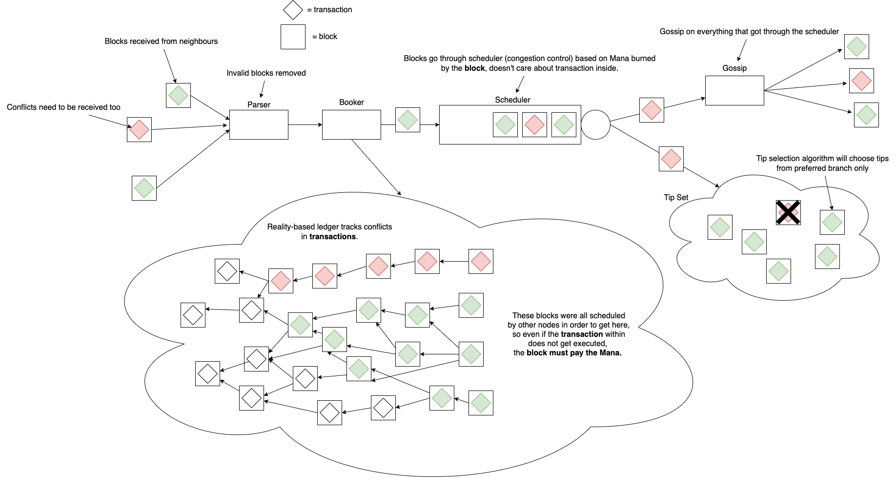

# Table of Contents

1. [Summary](#summary)
2. [Motivation](#motivation)
3. [Building Blocks](#building-blocks)
    - [Mana design](#mana-design)
    - [Mana burn](#mana-burn)
        - [Reference Mana Cost](#reference-mana-cost)
    - [Mana decay](#mana-decay)
        - [Mana decay parameters](#mana-decay-parameters)
    - [Mana and fixed point arithmetics](#mana-and-fixed-point-arithmetics)
        - [How to use the lookup table](#how-to-use-the-lookup-table)
    - [Potential Mana](#potential-mana)
        - [Potential Mana Semantic Validation](#potential-mana-semantic-validation)
    - [Stored Mana](#stored-mana)
        - [Stored Mana Semantic Validation](#stored-mana-semantic-validation)
    - [Block Issuance Credit](#block-issuance-credit)
        - [Block Issuance Credit Semantic Validation](#block-issuance-credit-semantic-validation)
    - [Mana rewards](#mana-rewards)
        - [Mana Rewards Semantic Validation](#mana-rewards-semantic-validation)
    - [Data Types \& Subschema Notation](#data-types--subschema-notation)
    - [Global Protocol Parameters](#global-protocol-parameters)
    - [Transaction Payload](#transaction-payload)
    - [Lookup Table](#lookup-table)
4. [Copyright](#copyright)

# Summary

This document defines the Mana-related concepts and the Mana dynamics in the IOTA 2.0 protocol.
The TIP defines the two types of Mana, namely **Potential Mana** and **Stored Mana,** as well as the
**Block Issuance Credit (BIC)** that Mana can be allotted to.

# Motivation

Mana is a resource used to determine the allowed throughput of a user and as a payment form for block issuance 
in the Mana burn mechanism. Mana can be obtained by helpful and profitable actions for the network, like token 
holding or engagement in securing the network. Additionally, owning Mana is necessary to use the network by issuing 
blocks, so it plays the core role in the IOTA tokenomics. The following document gives a high-level overview of 
Mana types and dynamics. Mana is a key point of all changes introduced in the IOTA 2.0 protocol, such as staking, 
delegation, and congestion control changes. This document works with the Congestion Control Algorithm with Mana 
Credits (IOTA 2.0 version of the Congestion Control mechanism), in which a certain amount of Mana is burned in each 
block and is deducted from the issuing account's Block Issuance Credit (BIC). A block issuer must allot Mana to 
their account to increase their BIC and ensure it does not go negative. In order to issue blocks and 
fully use all the Mana functionalities, the user is required to have an account, which is introduced in 
[TIP-42](../TIP-0042/tip-0042.md).

# Building Blocks

## Mana design

Mana is a core element of the IOTA incentive scheme. It is a resource that can be obtained through:
- generation by holding IOTA coins;
- as a reward for staking IOTA coins;
- as a reward for delegating IOTA coins;
- or simply received from other IOTA users.

It is an essential element of the IOTA protocol, as it is used:
- to determine the allowed throughput of an account;
- as a payment for block issuance.

The following solutions are designed around the IOTA Congestion Control Algorithm (ICCA) with Mana Credits.
Additionally, Mana implementation is strictly connected to the accounts introduced in 
[TIP-42](../TIP-0042/tip-0042.md) and is the core point of the IOTA incentivization scheme.

**Mana** can have different forms, each of which is described in the following sections.
- [**Stored Mana**](#stored-mana) is the main form of Mana. It is the UTXO-based form of Mana that can be moved 
within certain rules between the different owners, which allows for Mana market development.
- [**Potential Mana**](#potential-mana) is the second form of Mana, which is generated by holding IOTA coins. 
It represents the newly generated Mana amounts from the IOTA holdings and is implicitly connected to the UTXO 
that holds the IOTA coins.
When the user spends the IOTA coins, he is obliged to transition accumulated potential Mana to its more explicit 
form (the aforementioned stored Mana), and store the resource directly in the UTXO ledger. If a user does not store 
the potential Mana when consuming the output, she will forfeit this Mana. Alternatively, the user can convert Mana 
to [**Block Issuance Credit**](#block-issuance-credit) (BIC).
- [**Mana rewards**](#mana-rewards) reward participation in staking for validation and delegating IOTA tokens.
- The Mana rewarded from staking and validation can be technically considered as potential Mana, since it's a
form of Mana not directly registered in the ledger. However, we usually refer to potential Mana when discussing the Mana
generated by holding IOTA tokens and to Mana Rewards when discussing rewards. Mana Rewards must be always claimed and
stored as stored Mana.

The **Mana holdings** are the sum of all the potential Mana and stored Mana that the user owns (but not the Mana rewards). 

## Mana burn

According to the congestion control mechanism, during each block issuance, the block issuer needs to burn a 
certain amount of Mana dictated by the work score of the block and the Reference Mana Cost (RMC). The Mana burned by the 
block is subtracted from the block issuer's BIC balance. Users who overspend Mana (i.e., try to issue more blocks
than their Mana Holdings allow) will have their account locked until their debt is paid.

### Reference Mana Cost

*Reference Mana Cost (RMC)* is used to decide how much Mana should be burned from BIC by each block in that slot.
RMC is computed according to an algorithm based on recent traffic activity: the algorithm counts the number of 
blocks in slots that are *Maximum Committable Age (MCA)* slots in the past so that all nodes agree on that value of 
RMC and know this value in advance (before issuing the block).

From a high-level perspective, the RMC algorithm works as follows:
- If the number of blocks in slot `i - MCA` is larger than a given threshold, then the RMC increases.
- Otherwise, if the activity is low, the RMC decreases.
- The rate at which the RMC decreases is higher than its increase to tackle situations where the price suddenly 
becomes too large for the majority of users, and activity drops.

The RMC update only takes into account the blocks issued by accounts having non-negative BIC balances to avoid 
price manipulations by malicious actors. Note that blocks from issuers with negative BIC balances are excluded with 
respect to the RMC calculation, but they do make part of the slot commitment. To limit fluctuations in the RMC, 
it is proposed to update its value every MCA slot at least.

## Mana decay

Mana decay is introduced as a control mechanism of the Mana dynamics, altogether with the rate for the Mana 
generation both from IOTA coins and the staking mechanism, which will be discussed in detail in the next sections. 
To guarantee non-gameability (e.g., splitting accounts or other behaviors that are not helpful for the system 
well-functioning cannot be profitable for the user) and the fairness of Mana, the same global decay factor needs 
to be applied to all forms of Mana:
- newly generated Mana ([Potential Mana](#potential-mana));
- Mana stored in UTXOs ([Stored Mana](#stored-mana));
- Mana bound to accounts for block issuance ([Block Issuance Credit](#block-issuance-credit));
- Mana rewarded for staking and delegation ([Mana rewards](#mana-rewards)).

As the exact formulas in which the decay factor will be applied might differ among the Mana types, it is essential to point 
out that all of them are based on the same exponential decay with the same parameter `β`. The Incentives Whitepaper 
provides the specific formula for the decay function in Appendix A.

Applying decay for the generation of new Mana and staking rewards is conceptually straightforward since it is done at the time of 
storing this Mana. Similarly, applying the decay on the already stored Mana happens during the UTXO spending. In 
any of those cases, the node must calculate the decay based on epoch indices, not local times. Every 
`2^slotsPerEpochExponent` slots, the epoch changes, meaning that every set of consecutive `2^slotsPerEpochExponent` 
slots will be in the same epoch. We set `slotsPerEpochExponent = 13`.

The decay parameter `β` (together with the Mana generation parameter) was set so the maximum theoretical Mana in 
the system is smaller than `2^manaBitsCount - 1`. This means that, even though Mana is stored as a `uint64`, it effectively uses 
`manaBitsCount < 64` bits (in the case of BIC, it uses at most `manaBitsCount + 1` bits, `manaBitsCount` for the value and one 
for the sign). Note that the system will almost certainly never use all the `manaBitsCount` to store Mana, since, for the Mana 
supply to get to this value, nobody can spend their Mana for years. In practice, we expect to work with Mana values 
way smaller than `2^manaBitsCount - 1`; however, we must count on what would be an unreasonably large value in practice 
to avoid overflowing of the variables, even if with a really small probability.

### Mana decay parameters

The tables below describe the key parameters used for the Mana decay calculations in the next sections of this TIP. Notice that the parameters in the first table are only used in the explanations in this TIP, but not in the code.  

<table>
    <tr>
        <td><b>Name</b></td>
        <td><b>Description</b></td>
    </tr>
    <tr>
        <td>β</td>
        <td>
            Global exponential decay parameter.
        </td>
    </tr>
    <tr>
        <td>γ</td>
        <td>
            Defines fixed potential Mana generation per slot.
        </td>
    </tr>
	<tr>
	    <td>Epoch Duration</td>
        <td>
            The duration of an epoch in seconds.
        </td>
</table>

The second table describes the key parameters used for the Mana decay calculations in the next sections of this TIP, as they are used in the code.


<table>
	<tr>
	<td>Mana Bits Count</td>
	<td>uint8</td>
	<td>
		Mana Bits is the number of bits used to represent Mana.
	</td>
	</tr>
	<tr>
    <td>Slot Duration In Seconds</td>
    <td>uint8</td>
    <td>
      Slot Duration In Seconds defines the duration of each slot in seconds.
    </td>
  </tr>
  <tr>
    <td>Slots Per Epoch Exponent</td>
    <td>uint8</td>
    <td>
      Slots Per Epoch Exponent is the number of slots in an epoch expressed as an exponent of 2. (2**SlotsPerEpochExponent) == slots in an epoch.
    </td>
  </tr>
   <tr>
	<td>Mana Generation Rate</td>
	<td>uint8</td>
	<td>
		Mana Generation Rate is the amount of potential Mana generated by 1 IOTA in 1 slot.
	</td>
	</tr>
	<tr>
	<td>Mana Generation Rate Exponent</td>
	<td>uint8</td>
	<td>
		Mana Generation Rate Exponent is the scaling of Mana Generation Rate expressed as an exponent of 2.
	</td>
	</tr>
	<tr>
	<td>Mana Decay Factors Length</td>
	<td>uint16</td>
	<td>
		The length of Mana Decay Factors.
	</td>
	</tr>
	<tr>
	<td>Mana Decay Factors</td>
	<td>uint32Array</td>
	<td>
		Mana Decay Factors is a lookup table of epoch index diff to mana decay factor (slice index 0 = 1 epoch).
	</td>
	</tr>
	<tr>
	<td>Mana Decay Factors Exponent</td>
	<td>uint8</td>
	<td>
		Mana Decay Factors Exponent is the scaling of ManaDecayFactors expressed as an exponent of 2.
	</td>
	</tr>
	<tr>
	<td>Mana Decay Factor Epochs Sum</td>
	<td>uint32</td>
	<td>
		Mana Decay Factor Epochs Sum is an integer approximation of the sum of decay over epochs.
	</td>
	</tr>
	<tr>
	<td>Mana Decay Factor Epochs Sum Exponent</td>
	<td>uint8</td>
	<td>
		Mana Decay Factor Epochs Sum Exponent is the scaling of Mana Decay Factor Epochs Sum expressed as an exponent of 2.
	</td>
	</tr>
</table>


## Mana and fixed point arithmetics

Floating point operations might lead to inconsistencies among results in different nodes due to the different 
rounding behavior in different architectures. The results of the operations involving floating point variables might 
differ by amounts that are considered negligible for the modules that deal with local decisions (as the congestion 
control module, for example); however, differences that would be considered negligible by those modules can be 
fatal for the transaction validation and slot commitments, leading to forks and other undesirable behaviors in the 
system. For that reason, fixed point arithmetics (which does not expose the nodes to these rounding divergencies) 
must be used in all the modules that require exact consensus over values. In particular, all the Mana and rewards 
calculations have to be done with fixed point arithmetics.  

In the last section of this TIP, we introduce a lookup table that will be used in the rest of this TIP (and possibly 
other TIPs), as a tool to perform calculations that would otherwise be done with floating point operations. 
Specifically, the [lookup table](#lookup-table) introduced is an integer approximation of 
`2^manaDecayFactorsLength * exp(-β * epochDuration * n)`, where `β` and `epochDuration` are protocol parameters, 
for different values of `n`. We set `manaDecayFactorsLength = 32`, 
`epochDuration = 10 * 2^slotsPerEpochExponent = 10 * 2^13` seconds (which means that the duration of an epoch in 
years is around `0.002597666159`), and `β = 1/3` per year. 

### How to use the lookup table

In this section, we define a function `decay(value, n)`, that decays an amount of Mana `value` by the factor 
relative to `n` epochs. Note that the table defined above only gives the values of `lookupTable(n)` for some i
values of `n` up to `365`. To calculate `decay(value, n)` for larger values of `n`, we combine 
values defined in the [lookup table](#lookup-table) for other numbers smaller than `365`, using an algorithm that will be defined 
below. First, we define three auxiliary functions:

```go
// Returns the upper n bits of a uint64 value
func upperBits(value, n){
	value = value >> n 
	return value
}
```

```go
// Returns the lower n bits of a uint64 value
func lowerBits(value, n){
	value = value << (64 - n)
	value = value >> (64 - n)
	return value
}
```

```go
// Returns the result of the multiplication ((valueHi << 32 + valueLo) * multFactor) >> shiftFactor 
// (where multFactor is a uint32, valueHi and valueLo are uint64 smaller than 2^32, and 0 <= shiftFactor <= 32), 
// using only uint64 multiplication functions, without overflowing. The returned result is split in 2 factors:
// valueHi and valueLo, one containing the upper 32 bits of the result and the other containing the lower 32 bits.
func MultiplicationAndShift(valueHi, valueLo, multFactor, shiftFactor) (uint64, uint64) {
	// multiply the integer part of valueHi by multFactor
	valueHi = valueHi * multFactor

	// the lower shiftFactor bits of the result are extracted and shifted left to form the remainder.
	// valueLo is multiplied by multFactor and right-shifted by shiftFactor bits.
	// the sum of these two values forms the new lower part (valueLo) of the result.
	valueLo = lowerBits(valueHi, shiftFactor) << (32 - shiftFactor) + (valueLo * multFactor) >> shiftFactor

	// the right-shifted valueHi and the upper 32 bits of valueLo form the new higher part (valueHi) of the result.
	valueHi = (valueHi >> shiftFactor) + upperBits(valueLo, 32)

	// the lower 32 bits of valueLo form the new lower part of the result.
	valueLo = lowerBits(valueLo, 32)

	// return the result as a fixed-point number composed of two 64-bit integers
	return valueHi, valueLo
}
```

With the functions above defined, we proceed to define the `decay` function that takes as input a `uint64` 
value `value` and decays it by the correct decay factor relative to `n` epochs.

```go
func decay(value, n) {
	if value == 0 or n == 0 {
		return value
	}

	// split the value into two uint64 variables to prevent overflowing
	valueHi = upperBits(value, 32)
	valueLo = lowerBits(value, 32)  

	// we keep applying the lookup table factors as long as n epochs are left
	remainingEpochs = n
	while remainingEpochs > 0 {
		EpochsToDecay = remainingEpochs
		if EpochsToDecay > 365 {
			EpochsToDecay = 365
		}
		remainingEpochs -= EpochsToDecay

		decayFactor = lookupTable(EpochsToDecay)

		// apply the decay using fixed-point arithmetics. 
		valueHi, valueLo = MultiplicationAndShift(valueHi, valueLo, decayFactor, manaDecayFactorsLength)
	}

	// combine both uint64 variables to get the actual value
	return valueHi << 32 + valueLo
}
```

Other implementations of the functions above are possible; however, one must be careful with the order of 
operations, which must be done as defined above. Having a well-defined order is crucial since sequences of 
divisions and multiplications with integers might lead to different results when the order is altered. 
Example: suppose one needs to calculate `1002 * 99 / 100 *21 / 100`. Following the left-to-right order, this 
would result in `1002 * 99 / 100 * 21 / 100 = 99198 / 100 * 21 / 100 = 991 * 21 / 100 = 20811 / 100 = 208`. 
If someone did this operation in a different order, let's say `1002 * 21 / 100 * 99 / 100`, the result would be 
`1002 * 21 / 100 * 99 / 100 = 21042 / 100 * 99 / 100 = 210 * 99 / 100 = 20790 / 100 = 207`.

## Potential Mana

*Potential Mana* is a raw form of Mana that is generated over time from the IOTA coins. Every IOTA coin (besides storage deposits) generates potential Mana. The view on the potential Mana value can be deterministically 
derived from the UTXO ledger, based on the UTXO IOTA coin value and the time it was created in the UTXO metadata 
(we consider the creation time as the slot index of the transaction).

### Rationale behind the Potential Mana formulas

We model the potential Mana generated by an output holding `S` IOTA coins as the combination of a fixed generation 
per slot `γ * S` and a decay equivalent to a multiplication by `exp(-β * Δ)` every time an epoch ends, where `Δ` i
is the epoch duration.
    


Let `i` be the epoch of the creation slot and `j` be the epoch of the consumption slot. Let `n = j - i`, and for 
the sake of the explanation, assume `n > 1`. All the Mana generated in epoch `i` "crosses" `n` decay boundaries; 
thus, it must be decayed `n` times. The Mana generated in epoch `i + 1` "crosses" `n - 1` decay boundaries, so it 
must be decayed `n - 1` times, and so on, until the Mana generated in epoch `j`, which is not decayed at all. 
Adding these values, we find the following formulas (where `d` is the number of slots in an epoch):

`Potential Mana = γ * S * [d1 * exp(-β * Δ * n) + d * exp(-β * Δ * (n - 1)) + d * exp(-β * Δ * (n - 2)) + ... + 
d * exp(-β * Δ) + d2] = γ * S * d1 * exp(-β * Δ * n) + γ * S * d2 + sum(γ * S * d * exp(-β * Δ * i)) = 
γ * S * [d1 * exp(-β * Δ * n) + d2 + d * exp(-β * Δ) * (1 - exp(-β * Δ * (n - 1))) / (1 - exp(-β * Δ))]`, 
where the summation is over `i = 1, ..., n - 1`.

Analogously, if `n ≤ 1`, we find the following results (here `δ` is the difference between the creation and 
consumption slots):
- If `n = 1`: `Potential Mana = γ * S * d1 * exp(-β * Δ) + γ * S * d2`.
- If `n = 0`: `Potential Mana = γ * S * δ`.

### Potential Mana formulas with fixed point arithmetics

The formulas found in the last section are the exact formulas for the model proposed. However, we must not use 
floating point arithmetics, so these formulas must be adapted for the implementation. We begin by rearranging the 
formula for `n > 1`, noticing that we already approximated `2^manaDecayFactorsLength * exp(-β * Δ * i)` by 
`lookupTable(i)`, where `manaDecayFactorsLength` is the precision of the [lookup table](#lookup-table) used.

If `n > 1`: Let `c` be an integer approximation of `(exp(-β * Δ)) / (1 - exp(-β * Δ))` in the form 
`c = manaDecayFactorEpochsSum * 2^(-manaDecayFactorEpochsSumExponent)`. Given the values defined in the last section, 
we set `manaDecayFactorEpochsSum = TODO` and `manaDecayFactorEpochsSumExponent= TODO`. Then, 
`Potential_Mana = aux + aux1 + aux2`, where: 
- `aux = amount * generationPerSlot * d2  + c * amount * generationPerSlot * slotPerEpoch`;
- `aux1 = amount * generationPerSlot * d1 * lookupTable(n) * 2^(-manaDecayFactorsLength) `;
- `aux2 = -c * amount * generationPerSlot * slotPerEpoch * (lookupTable(n - 1) + 1) * 2^(-manaDecayFactorsLength)`;

and
- `slotPerEpoch = 2^slotsPerEpochExponent` is the number of slots in an epoch. Initially, we use 
`slotsPerEpochExponent = 13`;
- `d1 = slotAfterEpochi - creationSlot`;   
- `slotAfterEpochi` is the first slot of the epoch `i + 1`; 
- `d2 = consumptionSlot - firstSlotEpochJ` 
- `firstSlotEpochJ` is the first slot of epoch `j` ;  
- `generationPerSlot = manaGenerationRate * 2^(-manaGenerationRateExponent)` is the Mana generated by holding 1 IOTA for 
1 slot. Initially, we use `manaGenerationRate = 1` and `manaGenerationRateExponent = 80 - manaBitsCount`. This generation rate 
per slot guarantees that the maximum theoretical mana in the system uses the `manaBitsCount` available bits;
- `manaBitsCount = 63`.
  
Note that the term `aux2` has a factor `lookupTable(n - 1) + 1` instead of `lookupTable(n - 1)` since the values 
in the [lookup table](#lookup-table) are rounded by below, and the term `aux2` is being subtracted by the formula. Then, by doing 
this, we avoid potential gameability scenarios, since all the terms added will be rounded down in the formula.

Rearranging the formulas above, we have that `Potential_Mana = potentialMana0 + potentialManan + potentialManan1`, 
where
- `potentialMana0 = amount * d2 * manaGenerationRate * 2^(-manaGenerationRateExponent) + c * amount * manaGenerationRate * 
2^(slotsPerEpochExponent - manaGenerationRateExponent) - c * amount * manaGenerationRate * 
2^(slotsPerEpochExponent - manaDecayFactorsLength - manaGenerationRateExponent)`;
- `potentialManan = amount * d1 * lookupTable(n) * manaGenerationRate * 2^(-manaDecayFactorsLength-manaGenerationRateExponent)`;
- `potentialManan1 = -c * amount * manaGenerationRate * lookupTable(n - 1) * 
2^(slotsPerEpochExponent - manaDecayFactorsLength - manaGenerationRateExponent)`.

Analogously, we find formulas for `n < 2`:
- If `n = 1`: `Potential_Mana = amount * d1 * lookupTable(1) * manaGenerationRate * 
2^(-manaDecayFactorsLength - manaGenerationRateExponent) + amount * d2 * manaGenerationRate * 2^(-manaGenerationRateExponent)`.
- If `n = 0`: `Potential_Mana = amount * (consumptionSlot - creationSlot) *  manaGenerationRate * 
2^(-manaGenerationRateExponent)`.

In the next section, we introduce the default implementation for the formulas presented above.

### Potential Mana Semantic Validation

- Potential Mana must and can only be consumed when the corresponding output is consumed.
- When the UTXO is spent, the potential Mana is lost; therefore, the user must specify what should happen to the 
accumulated potential Mana value. There are three options:
    - transition to stored Mana: the amount of potential Mana transitioned to the stored Mana form needs to be 
placed in the newly created output on the output side of the transaction;
    - transition to BIC: the amount of potential Mana that should be allotted to the account's Block Issuance 
Credit (BIC) should be specified in the `Allotment` field of the transaction;
    - ignored: generated Mana can be ignored so that it will be destroyed during the transaction.
- The exact algorithm to calculate the Potential Mana generated by an output created at slot `creationSlot` i
(which has an epoch `creationEpoch`) and consumed at slot `consumptionSlot` (which has an epoch `consumptionEpoch`), 
holding `Amount` IOTA coins, is given by (again, in the pseudocode below, `slotAfterCreationEpoch` is the first 
slot of the epoch after the creation epoch  and `firstSlotConsumptionEpoch` is the first slot of the consumption 
epoch) the algorithms define below.
	
<table>
    <tr>
        <td><b>Name</b></td>
        <td><b>Type</b></td>
        <td><b>Description</b></td>
    </tr>
    <tr>
        <td>Value</td>
        <td>uint64</td>
        <td>
            The amount of IOTA coins held in the output.
        </td>
    </tr>
    <tr>
        <td>creationSlot</td>
        <td>uint64</td>
        <td>
            The index of slot in which the output was created.
        </td>
    </tr>
    <tr>
        <td>consumptionSlot</td>
        <td>uint64</td>
        <td>
            The index of slot in which the output is consumed.
        </td>
    </tr>
</table>

==TODO: talk about the missing remainder==

We begin by defining an auxiliary function that (intuitively) generates Mana without applying any type of decay 
(note that we use some of the functions and constants defined in the last sections):

```go
// generateMana calculates the generated mana from holding `value` tokens for `m` slots, without applying any decay.
func generateMana(value, m) {
	if m == 0 or manaGenerationRate == 0 {
		return 0
	}
	return MultiplicationAndShift(value, m * manaGenerationRate, manaGenerationRateExponent)
}
```

Now we define the function that actually calculates the Potential Mana using the formulas defined in the last i
section (including the decays). Let `n = consumptionSlot - creationSlot`, `d1 = slotAfterCreationEpoch - creationSlot`,
and `d2 = consumptionSlot - firstSlotConsumptionEpoch`. Then, we have:

```go
// PotentialManaWithDecay calculates the generated potential mana and applies the decay to the result.
func  PotentialManaWithDecay(value, n, d1, d2) {
	if n == 0:
		return generateMana(value, d1 + d2 - 2^slotsPerEpochExponent)
	else if n == 1:
		return decay(generateMana(value, d1), 1) + generateMana(value, d2)
	else:
		aux = MultiplicationAndShift(value * manaGenerationRate, manaDecayFactorEpochsSum, manaDecayFactorEpochsSumExponent + 
manaGenerationRateExponent - slotsPerEpochExponent)

		potentialMana_n := decay(generateMana(value, d1), n) 
		potentialMana_n_1 := decay(aux, n - 1) 
		potentialMana_0 := generateMana(value, d2) + aux - aux >> manaDecayFactorsLength

		return potentialMana_n - potentialMana_n_1 + potentialMana_0
	}
```

==TODO: talk with max about the manaGenerationRate in aux and generateMana==

## Stored Mana

*Stored Mana* is the main form of Mana. It is a UTXO-based form (i.e., it is contained in outputs, just like IOTA 
tokens) of Mana that can be transferred within certain rules between different users, which allows for Mana 
market development.

All output types, except Foundry Outputs, can hold stored Mana in the *Mana Amount* field. This field represents the 
amount of stored Mana at the output's creation time until the time when the output is consumed without decay 
being applied to it.

### Stored Mana Semantic Validation

- Each output that contains stored Mana must also contain IOTA coins due to storage deposit requirements.
- Stored Mana must be soulbound to an account.
- Because stored Mana lives on UTXOs and is consumed by transactions, it cannot be spent within a block. It must 
be allotted to an account's BIC in order to pay for Mana burned by blocks.
- *Mana Sales Outputs* must be used for transferring stored or potential Mana freely from one account to another.
- It is possible to transfer stored Mana without transferring IOTA coins or the potential Mana generated from 
those tokens.
- The decay must be applied to stored Mana whenever the output containing that stored Mana is consumed.
- To calculate the decay of stored Mana, the creation time of each output with stored Mana must be contained in 
transactions.
- The amount of stored Mana must be decayed before stored Mana is transferred into a new output as follows: 
    - Let `manaAmount`, `consumptionSlot`, and `creationSlot`, be
  
    <table>
    <tr>
        <td><b>Name</b></td>
        <td><b>Type</b></td>
        <td><b>Description</b></td>
    </tr>
    <tr>
        <td>manaAmount</td>
        <td>uint64</td>
        <td>
            The amount of stored Mana held by the output.
        </td>
    </tr>
    <tr>
        <td>creationSlot</td>
        <td>uint64</td>
        <td>
            The index of slot in which the output was created.
        </td>
    </tr>
    <tr>
        <td>consumptionSlot</td>
        <td>uint64</td>
        <td>
            The index of slot in which the output is consumed.
        </td>
    </tr>
    </table> 
   
The algorithm to decay the stored Mana is as follows:

```go 
creationEpoch = epoch(creationSlot)
consumptionEpoch = epoch(consumptionSlot)
if creationEpoch == consumptionEpoch:
    newManaAmount = manaAmount
else:    
    newManaAmount = decay(manaAmount, consumptionEpoch - creationEpoch)
```
 
## Block Issuance Credit

*Block Issuance Credit (BIC)* Mana is used for congestion control, i.e., to pay for blocks to be scheduled and 
gossiped around the network and seen by everyone. Congestion control manages which blocks should be gossiped to 
neighbors based on Mana burned from the block issuance credits by the block. It is important to distinguish 
between **blocks** and **transactions**: congestion control only deals with blocks, which are the containers that carry transactions around the network. It does not care about the transactions inside the blocks.

The example below shows a ledger with a conflicting branch (perhaps due to a double spend), so only one branch 
(either the set of red or the set of green transactions) can ultimately modify the ledger (UTXOs consumed), not both.
However, all these blocks must be gossiped, whether they contain red or green transactions. Thus, they must pay for 
the BIC used to get through schedulers regardless of whether the transaction within modifies the ledger. This is 
why Mana cannot be burned from BIC by a transaction; it can only be burned by a block.



### Block Issuance Credit Semantic Validation

- Block issuance credits must be stored on a per-account basis.
- Accounts must be represented by _Account Outputs_ on the UTXO ledger. The cost of permanently storing any outputs 
(until destruction) in the ledger is covered by the _storage deposit_. Because of that, the number of accounts is 
capped at a number proportional to the max supply of tokens, contrary to the number of plain addresses. Because 
BIC must be tracked in slot commitments, keeping the number of entries (even though the user can create multiple 
accounts) in that data structure as small as possible is desirable. Using account IDs for that purpose is thus a 
good fit.
- It is not possible to store BIC without an Account Output because Mana burned by blocks must also be deducted 
from BIC, and the block cannot modify the Account Output. Consequently, the ledger state is not bloated by having 
to keep track of block issuance credits because there is a corresponding account output in the UTXO ledger that 
requires a storage deposit in IOTA coins. Thus, the dust protection mechanism used for the UTXO ledger also 
indirectly prevents dust from accumulating in tracking the block issuance credits.
- A commitment and time division mechanism is required for BIC dynamics: current slot commitments present in IOTA 2.0.
    - The end time of an epoch is used for the decay calculations.
    - Definition of slots based on the time of the genesis slot and slot duration.
    - A commitment mechanism per slot is needed to ensure the unified perception of the BIC in the longer run.
- A global agreement on the BIC balances among all the nodes is required.
    - It can be achieved by including the BIC vector in the slot commitments. This guarantees that all nodes have 
the same perception of the BIC balances from a certain point in time.
- If a block is orphaned, the block will not be included in a commitment, and hence, the balance of BIC of the 
account that issued the block must be unaffected by that block.
- The time of the slot commitment must be used to align the local version of the BIC vector with the objective,
committed version. It allows for the global control of the BIC dynamic with a Mana decay function.
    - This decrease is also applied to the potential and stored Mana (that can be allotted to the account as BIC) 
so users cannot gain by delaying or advancing the allotting.
- The balance of the BIC vector at the slot commitment must be the sum of:
    - The balances of the previously committed BIC vector.
    - All Mana allotted as BIC in accepted transactions of the committed slot. Note that, in theory, in the case of 
only decaying the BIC vector at the end of each epoch, this Mana would have to be decayed by a factor proportional 
to the difference between the transaction slot index and the index of the last slot of the epoch. However, since the 
decay rate is small, this difference will always be smaller than half a percent. We understand that this difference 
(since it is not composable and can only be "taken profit of" once) does not justify the user experience-related 
issues (like having to allot more than 1 Mana to being able to burn 1 Mana in the same transaction) and 
implementation complications of applying this small decay. Thus, we allot as a BIC the total value of Mana being 
allotted in a transaction.
    - Subtract from BIC all Mana burned by accepted blocks of the committed slots.
- BIC updates (increase and or deduction/Mana burning) must happen upon slot commitments. BIC decays happen at the 
end of each epoch. 
- Mana decay must be applied at the end of the epoch according to the algorithm:
    - Let `BIC_i` be the amount of BIC held by the account at the end of slot `i`, which is the last slot of an epoch. 
This means that all additions of allotted BIC and Mana burnt relative to slot `i` were already done. We must now 
decay the remaining value of BIC by applying:

```go 
if BIC > 0:
    new_BIC = decay(BIC, 1)
else: 
    new_BIC = BIC 
```
    
If `i` is not the last slot of the epoch, this decay should not be applied.
- A block must include the permission of an account from which Mana will be burned from BIC to pay for the block.
    - A block must contain an account's permission (i.e., a digital signature) that nodes can use to verify that 
the account has authorized the block and that Mana can be burned from the BIC of that account.
- The issuer must specify the maximum amount of Mana they will allow to be burned from BIC.
    - In the above-mentioned permission, the account owner must commit to a certain maximum amount of Mana that 
will be burned from BIC.
- The declared burning amount must be at least the required burning for the current slot.
    - The required burning amount for a block is calculated with the Reference Mana Cost (RMC), which depends on 
the past network activity and gets updated every slot.

## Mana rewards

*Mana rewards* are used to reward for participation in staking for validation and delegating IOTA coins. Rewarding 
validators and delegators with Mana is reasonable as it does not extract value from other IOTA coin holders.

### Mana Rewards Semantic Validation

- Mana rewards must be calculated on a per-epoch basis.
- Mana rewards must become available for claiming when the last slot of the epoch is committed to.
- Mana rewards must be claimed by creating a transaction that consumes the original outputs that were staked or 
delegated.
- Mana rewards must be put on outputs as stored Mana on the output side of the transaction.
- The decay must be applied to Mana rewards before they are put on outputs according to the following algorithm:
    - Let `reward`, `rewardEpoch`, and `claimingSlotEpoch` be as follows:
    <table>
    <tr>
        <td><b>Name</b></td>
        <td><b>Type</b></td>
        <td><b>Description</b></td>
    </tr>
    <tr>
        <td>reward</td>
        <td>uint64</td>
        <td>
            The amount of Mana rewards available to be claimed for staking or delegation for a specific epoch.
        </td>
    </tr>
    <tr>
        <td>rewardEpoch</td>
        <td>uint64</td>
        <td>
            The index of the epoch for which Mana rewards are claimed.
        </td>
    </tr>   
    <tr>
        <td>claimingSlotEpoch</td>
        <td>uint64</td>
        <td>
            The epoch of the slot in which the Mana rewards are claimed.
        </td>
    </tr>
    </table> 
    
    - Let `n = claimingSlotEpoch - rewardEpoch`. If `n > 0`, with the aid of the [lookup table](#lookup-table) and the algorithm 
defined in section [Mana and fixed point arithmetics](#mana-and-fixed-point-arithmetics), we must now decay the 
rewards by applying `reward = decay(reward, n)`.
    - If `n = 0`, the amount to be put on outputs is the entire `reward`. 

## Data Types & Subschema Notation

Data types and subschemas used throughout this TIP are defined in [TIP-21](../TIP-0021/tip-0021.md).

## Global Protocol Parameters

Global protocol parameters used throughout this TIP are defined in [TIP-22 (IOTA)](../TIP-0022/tip-0022.md) and 
[TIP-32 (Shimmer)](../TIP-0032/tip-0032.md).

## Transaction Payload

[TIP-20](../TIP-0020/tip-0020.md) is the basis for output validation in this TIP.

## Lookup Table 

== TODO: If this `32` here (and above in pseudo codes) comes from `manaDecayFactorsLength`, 
let's use the `manaDecayFactorsLength`?==

<table>
<caption>Lookup Table: Decays for Mana in decay index granularity scaled to 2^32</caption>
<tr>
  <td><b>n</b></td>
  <td><b>Type</b></td>
  <td><b>decay(n)</b></td>
</tr>
<tr>
	<td> 1
	<td> <code>uint32</code> </td>
	<td> 4291249941 </td>
</tr>
<tr>
	<td> 2
	<td> <code>uint32</code> </td>
	<td> 4287535805 </td>
</tr>
<tr>
	<td> 3
	<td> <code>uint32</code> </td>
	<td> 4283824883 </td>
</tr>
<tr>
	<td> 4
	<td> <code>uint32</code> </td>
	<td> 4280117173 </td>
</tr>
<tr>
	<td> 5
	<td> <code>uint32</code> </td>
	<td> 4276412671 </td>
</tr>
<tr>
	<td> 6
	<td> <code>uint32</code> </td>
	<td> 4272711377 </td>
</tr>
<tr>
	<td> 7
	<td> <code>uint32</code> </td>
	<td> 4269013285 </td>
</tr>
<tr>
	<td> 8
	<td> <code>uint32</code> </td>
	<td> 4265318395 </td>
</tr>
<tr>
	<td> 9
	<td> <code>uint32</code> </td>
	<td> 4261626702 </td>
</tr>
<tr>
	<td> 10
	<td> <code>uint32</code> </td>
	<td> 4257938205 </td>
</tr>
<tr>
	<td> 11
	<td> <code>uint32</code> </td>
	<td> 4254252900 </td>
</tr>
<tr>
	<td> 12
	<td> <code>uint32</code> </td>
	<td> 4250570785 </td>
</tr>
<tr>
	<td> 13
	<td> <code>uint32</code> </td>
	<td> 4246891856 </td>
</tr>
<tr>
	<td> 14
	<td> <code>uint32</code> </td>
	<td> 4243216112 </td>
</tr>
<tr>
	<td> 15
	<td> <code>uint32</code> </td>
	<td> 4239543550 </td>
</tr>
<tr>
	<td> 16
	<td> <code>uint32</code> </td>
	<td> 4235874166 </td>
</tr>
<tr>
	<td> 17
	<td> <code>uint32</code> </td>
	<td> 4232207957 </td>
</tr>
<tr>
	<td> 18
	<td> <code>uint32</code> </td>
	<td> 4228544922 </td>
</tr>
<tr>
	<td> 19
	<td> <code>uint32</code> </td>
	<td> 4224885058 </td>
</tr>
<tr>
	<td> 20
	<td> <code>uint32</code> </td>
	<td> 4221228361 </td>
</tr>
<tr>
	<td> 21
	<td> <code>uint32</code> </td>
	<td> 4217574829 </td>
</tr>
<tr>
	<td> 22
	<td> <code>uint32</code> </td>
	<td> 4213924459 </td>
</tr>
<tr>
	<td> 23
	<td> <code>uint32</code> </td>
	<td> 4210277249 </td>
</tr>
<tr>
	<td> 24
	<td> <code>uint32</code> </td>
	<td> 4206633195 </td>
</tr>
<tr>
	<td> 25
	<td> <code>uint32</code> </td>
	<td> 4202992295 </td>
</tr>
<tr>
	<td> 26
	<td> <code>uint32</code> </td>
	<td> 4199354547 </td>
</tr>
<tr>
	<td> 27
	<td> <code>uint32</code> </td>
	<td> 4195719947 </td>
</tr>
<tr>
	<td> 28
	<td> <code>uint32</code> </td>
	<td> 4192088493 </td>
</tr>
<tr>
	<td> 29
	<td> <code>uint32</code> </td>
	<td> 4188460182 </td>
</tr>
<tr>
	<td> 30
	<td> <code>uint32</code> </td>
	<td> 4184835011 </td>
</tr>
<tr>
	<td> 31
	<td> <code>uint32</code> </td>
	<td> 4181212978 </td>
</tr>
<tr>
	<td> 32
	<td> <code>uint32</code> </td>
	<td> 4177594080 </td>
</tr>
<tr>
	<td> 33
	<td> <code>uint32</code> </td>
	<td> 4173978314 </td>
</tr>
<tr>
	<td> 34
	<td> <code>uint32</code> </td>
	<td> 4170365677 </td>
</tr>
<tr>
	<td> 35
	<td> <code>uint32</code> </td>
	<td> 4166756168 </td>
</tr>
<tr>
	<td> 36
	<td> <code>uint32</code> </td>
	<td> 4163149782 </td>
</tr>
<tr>
	<td> 37
	<td> <code>uint32</code> </td>
	<td> 4159546518 </td>
</tr>
<tr>
	<td> 38
	<td> <code>uint32</code> </td>
	<td> 4155946372 </td>
</tr>
<tr>
	<td> 39
	<td> <code>uint32</code> </td>
	<td> 4152349343 </td>
</tr>
<tr>
	<td> 40
	<td> <code>uint32</code> </td>
	<td> 4148755427 </td>
</tr>
<tr>
	<td> 41
	<td> <code>uint32</code> </td>
	<td> 4145164621 </td>
</tr>
<tr>
	<td> 42
	<td> <code>uint32</code> </td>
	<td> 4141576923 </td>
</tr>
<tr>
	<td> 43
	<td> <code>uint32</code> </td>
	<td> 4137992331 </td>
</tr>
<tr>
	<td> 44
	<td> <code>uint32</code> </td>
	<td> 4134410840 </td>
</tr>
<tr>
	<td> 45
	<td> <code>uint32</code> </td>
	<td> 4130832450 </td>
</tr>
<tr>
	<td> 46
	<td> <code>uint32</code> </td>
	<td> 4127257157 </td>
</tr>
<tr>
	<td> 47
	<td> <code>uint32</code> </td>
	<td> 4123684959 </td>
</tr>
<tr>
	<td> 48
	<td> <code>uint32</code> </td>
	<td> 4120115852 </td>
</tr>
<tr>
	<td> 49
	<td> <code>uint32</code> </td>
	<td> 4116549834 </td>
</tr>
<tr>
	<td> 50
	<td> <code>uint32</code> </td>
	<td> 4112986903 </td>
</tr>
<tr>
	<td> 51
	<td> <code>uint32</code> </td>
	<td> 4109427055 </td>
</tr>
<tr>
	<td> 52
	<td> <code>uint32</code> </td>
	<td> 4105870289 </td>
</tr>
<tr>
	<td> 53
	<td> <code>uint32</code> </td>
	<td> 4102316601 </td>
</tr>
<tr>
	<td> 54
	<td> <code>uint32</code> </td>
	<td> 4098765988 </td>
</tr>
<tr>
	<td> 55
	<td> <code>uint32</code> </td>
	<td> 4095218449 </td>
</tr>
<tr>
	<td> 56
	<td> <code>uint32</code> </td>
	<td> 4091673981 </td>
</tr>
<tr>
	<td> 57
	<td> <code>uint32</code> </td>
	<td> 4088132580 </td>
</tr>
<tr>
	<td> 58
	<td> <code>uint32</code> </td>
	<td> 4084594244 </td>
</tr>
<tr>
	<td> 59
	<td> <code>uint32</code> </td>
	<td> 4081058971 </td>
</tr>
<tr>
	<td> 60
	<td> <code>uint32</code> </td>
	<td> 4077526757 </td>
</tr>
<tr>
	<td> 61
	<td> <code>uint32</code> </td>
	<td> 4073997601 </td>
</tr>
<tr>
	<td> 62
	<td> <code>uint32</code> </td>
	<td> 4070471499 </td>
</tr>
<tr>
	<td> 63
	<td> <code>uint32</code> </td>
	<td> 4066948449 </td>
</tr>
<tr>
	<td> 64
	<td> <code>uint32</code> </td>
	<td> 4063428449 </td>
</tr>
<tr>
	<td> 65
	<td> <code>uint32</code> </td>
	<td> 4059911495 </td>
</tr>
<tr>
	<td> 66
	<td> <code>uint32</code> </td>
	<td> 4056397585 </td>
</tr>
<tr>
	<td> 67
	<td> <code>uint32</code> </td>
	<td> 4052886716 </td>
</tr>
<tr>
	<td> 68
	<td> <code>uint32</code> </td>
	<td> 4049378886 </td>
</tr>
<tr>
	<td> 69
	<td> <code>uint32</code> </td>
	<td> 4045874092 </td>
</tr>
<tr>
	<td> 70
	<td> <code>uint32</code> </td>
	<td> 4042372332 </td>
</tr>
<tr>
	<td> 71
	<td> <code>uint32</code> </td>
	<td> 4038873602 </td>
</tr>
<tr>
	<td> 72
	<td> <code>uint32</code> </td>
	<td> 4035377901 </td>
</tr>
<tr>
	<td> 73
	<td> <code>uint32</code> </td>
	<td> 4031885225 </td>
</tr>
<tr>
	<td> 74
	<td> <code>uint32</code> </td>
	<td> 4028395572 </td>
</tr>
<tr>
	<td> 75
	<td> <code>uint32</code> </td>
	<td> 4024908939 </td>
</tr>
<tr>
	<td> 76
	<td> <code>uint32</code> </td>
	<td> 4021425325 </td>
</tr>
<tr>
	<td> 77
	<td> <code>uint32</code> </td>
	<td> 4017944725 </td>
</tr>
<tr>
	<td> 78
	<td> <code>uint32</code> </td>
	<td> 4014467138 </td>
</tr>
<tr>
	<td> 79
	<td> <code>uint32</code> </td>
	<td> 4010992560 </td>
</tr>
<tr>
	<td> 80
	<td> <code>uint32</code> </td>
	<td> 4007520990 </td>
</tr>
<tr>
	<td> 81
	<td> <code>uint32</code> </td>
	<td> 4004052425 </td>
</tr>
<tr>
	<td> 82
	<td> <code>uint32</code> </td>
	<td> 4000586862 </td>
</tr>
<tr>
	<td> 83
	<td> <code>uint32</code> </td>
	<td> 3997124298 </td>
</tr>
<tr>
	<td> 84
	<td> <code>uint32</code> </td>
	<td> 3993664731 </td>
</tr>
<tr>
	<td> 85
	<td> <code>uint32</code> </td>
	<td> 3990208159 </td>
</tr>
<tr>
	<td> 86
	<td> <code>uint32</code> </td>
	<td> 3986754578 </td>
</tr>
<tr>
	<td> 87
	<td> <code>uint32</code> </td>
	<td> 3983303986 </td>
</tr>
<tr>
	<td> 88
	<td> <code>uint32</code> </td>
	<td> 3979856381 </td>
</tr>
<tr>
	<td> 89
	<td> <code>uint32</code> </td>
	<td> 3976411760 </td>
</tr>
<tr>
	<td> 90
	<td> <code>uint32</code> </td>
	<td> 3972970120 </td>
</tr>
<tr>
	<td> 91
	<td> <code>uint32</code> </td>
	<td> 3969531459 </td>
</tr>
<tr>
	<td> 92
	<td> <code>uint32</code> </td>
	<td> 3966095774 </td>
</tr>
<tr>
	<td> 93
	<td> <code>uint32</code> </td>
	<td> 3962663063 </td>
</tr>
<tr>
	<td> 94
	<td> <code>uint32</code> </td>
	<td> 3959233323 </td>
</tr>
<tr>
	<td> 95
	<td> <code>uint32</code> </td>
	<td> 3955806551 </td>
</tr>
<tr>
	<td> 96
	<td> <code>uint32</code> </td>
	<td> 3952382745 </td>
</tr>
<tr>
	<td> 97
	<td> <code>uint32</code> </td>
	<td> 3948961903 </td>
</tr>
<tr>
	<td> 98
	<td> <code>uint32</code> </td>
	<td> 3945544021 </td>
</tr>
<tr>
	<td> 99
	<td> <code>uint32</code> </td>
	<td> 3942129098 </td>
</tr>
<tr>
	<td> 100
	<td> <code>uint32</code> </td>
	<td> 3938717130 </td>
</tr>
<tr>
	<td> 101
	<td> <code>uint32</code> </td>
	<td> 3935308116 </td>
</tr>
<tr>
	<td> 102
	<td> <code>uint32</code> </td>
	<td> 3931902052 </td>
</tr>
<tr>
	<td> 103
	<td> <code>uint32</code> </td>
	<td> 3928498936 </td>
</tr>
<tr>
	<td> 104
	<td> <code>uint32</code> </td>
	<td> 3925098765 </td>
</tr>
<tr>
	<td> 105
	<td> <code>uint32</code> </td>
	<td> 3921701537 </td>
</tr>
<tr>
	<td> 106
	<td> <code>uint32</code> </td>
	<td> 3918307250 </td>
</tr>
<tr>
	<td> 107
	<td> <code>uint32</code> </td>
	<td> 3914915900 </td>
</tr>
<tr>
	<td> 108
	<td> <code>uint32</code> </td>
	<td> 3911527486 </td>
</tr>
<tr>
	<td> 109
	<td> <code>uint32</code> </td>
	<td> 3908142004 </td>
</tr>
<tr>
	<td> 110
	<td> <code>uint32</code> </td>
	<td> 3904759453 </td>
</tr>
<tr>
	<td> 111
	<td> <code>uint32</code> </td>
	<td> 3901379829 </td>
</tr>
<tr>
	<td> 112
	<td> <code>uint32</code> </td>
	<td> 3898003131 </td>
</tr>
<tr>
	<td> 113
	<td> <code>uint32</code> </td>
	<td> 3894629355 </td>
</tr>
<tr>
	<td> 114
	<td> <code>uint32</code> </td>
	<td> 3891258499 </td>
</tr>
<tr>
	<td> 115
	<td> <code>uint32</code> </td>
	<td> 3887890560 </td>
</tr>
<tr>
	<td> 116
	<td> <code>uint32</code> </td>
	<td> 3884525537 </td>
</tr>
<tr>
	<td> 117
	<td> <code>uint32</code> </td>
	<td> 3881163426 </td>
</tr>
<tr>
	<td> 118
	<td> <code>uint32</code> </td>
	<td> 3877804224 </td>
</tr>
<tr>
	<td> 119
	<td> <code>uint32</code> </td>
	<td> 3874447931 </td>
</tr>
<tr>
	<td> 120
	<td> <code>uint32</code> </td>
	<td> 3871094542 </td>
</tr>
<tr>
	<td> 121
	<td> <code>uint32</code> </td>
	<td> 3867744056 </td>
</tr>
<tr>
	<td> 122
	<td> <code>uint32</code> </td>
	<td> 3864396469 </td>
</tr>
<tr>
	<td> 123
	<td> <code>uint32</code> </td>
	<td> 3861051780 </td>
</tr>
<tr>
	<td> 124
	<td> <code>uint32</code> </td>
	<td> 3857709986 </td>
</tr>
<tr>
	<td> 125
	<td> <code>uint32</code> </td>
	<td> 3854371084 </td>
</tr>
<tr>
	<td> 126
	<td> <code>uint32</code> </td>
	<td> 3851035072 </td>
</tr>
<tr>
	<td> 127
	<td> <code>uint32</code> </td>
	<td> 3847701948 </td>
</tr>
<tr>
	<td> 128
	<td> <code>uint32</code> </td>
	<td> 3844371708 </td>
</tr>
<tr>
	<td> 129
	<td> <code>uint32</code> </td>
	<td> 3841044351 </td>
</tr>
<tr>
	<td> 130
	<td> <code>uint32</code> </td>
	<td> 3837719873 </td>
</tr>
<tr>
	<td> 131
	<td> <code>uint32</code> </td>
	<td> 3834398273 </td>
</tr>
<tr>
	<td> 132
	<td> <code>uint32</code> </td>
	<td> 3831079548 </td>
</tr>
<tr>
	<td> 133
	<td> <code>uint32</code> </td>
	<td> 3827763695 </td>
</tr>
<tr>
	<td> 134
	<td> <code>uint32</code> </td>
	<td> 3824450713 </td>
</tr>
<tr>
	<td> 135
	<td> <code>uint32</code> </td>
	<td> 3821140597 </td>
</tr>
<tr>
	<td> 136
	<td> <code>uint32</code> </td>
	<td> 3817833347 </td>
</tr>
<tr>
	<td> 137
	<td> <code>uint32</code> </td>
	<td> 3814528959 </td>
</tr>
<tr>
	<td> 138
	<td> <code>uint32</code> </td>
	<td> 3811227431 </td>
</tr>
<tr>
	<td> 139
	<td> <code>uint32</code> </td>
	<td> 3807928760 </td>
</tr>
<tr>
	<td> 140
	<td> <code>uint32</code> </td>
	<td> 3804632945 </td>
</tr>
<tr>
	<td> 141
	<td> <code>uint32</code> </td>
	<td> 3801339982 </td>
</tr>
<tr>
	<td> 142
	<td> <code>uint32</code> </td>
	<td> 3798049869 </td>
</tr>
<tr>
	<td> 143
	<td> <code>uint32</code> </td>
	<td> 3794762604 </td>
</tr>
<tr>
	<td> 144
	<td> <code>uint32</code> </td>
	<td> 3791478184 </td>
</tr>
<tr>
	<td> 145
	<td> <code>uint32</code> </td>
	<td> 3788196607 </td>
</tr>
<tr>
	<td> 146
	<td> <code>uint32</code> </td>
	<td> 3784917870 </td>
</tr>
<tr>
	<td> 147
	<td> <code>uint32</code> </td>
	<td> 3781641970 </td>
</tr>
<tr>
	<td> 148
	<td> <code>uint32</code> </td>
	<td> 3778368907 </td>
</tr>
<tr>
	<td> 149
	<td> <code>uint32</code> </td>
	<td> 3775098676 </td>
</tr>
<tr>
	<td> 150
	<td> <code>uint32</code> </td>
	<td> 3771831275 </td>
</tr>
<tr>
	<td> 151
	<td> <code>uint32</code> </td>
	<td> 3768566702 </td>
</tr>
<tr>
	<td> 152
	<td> <code>uint32</code> </td>
	<td> 3765304955 </td>
</tr>
<tr>
	<td> 153
	<td> <code>uint32</code> </td>
	<td> 3762046031 </td>
</tr>
<tr>
	<td> 154
	<td> <code>uint32</code> </td>
	<td> 3758789928 </td>
</tr>
<tr>
	<td> 155
	<td> <code>uint32</code> </td>
	<td> 3755536643 </td>
</tr>
<tr>
	<td> 156
	<td> <code>uint32</code> </td>
	<td> 3752286174 </td>
</tr>
<tr>
	<td> 157
	<td> <code>uint32</code> </td>
	<td> 3749038518 </td>
</tr>
<tr>
	<td> 158
	<td> <code>uint32</code> </td>
	<td> 3745793673 </td>
</tr>
<tr>
	<td> 159
	<td> <code>uint32</code> </td>
	<td> 3742551636 </td>
</tr>
<tr>
	<td> 160
	<td> <code>uint32</code> </td>
	<td> 3739312405 </td>
</tr>
<tr>
	<td> 161
	<td> <code>uint32</code> </td>
	<td> 3736075978 </td>
</tr>
<tr>
	<td> 162
	<td> <code>uint32</code> </td>
	<td> 3732842352 </td>
</tr>
<tr>
	<td> 163
	<td> <code>uint32</code> </td>
	<td> 3729611525 </td>
</tr>
<tr>
	<td> 164
	<td> <code>uint32</code> </td>
	<td> 3726383494 </td>
</tr>
<tr>
	<td> 165
	<td> <code>uint32</code> </td>
	<td> 3723158258 </td>
</tr>
<tr>
	<td> 166
	<td> <code>uint32</code> </td>
	<td> 3719935812 </td>
</tr>
<tr>
	<td> 167
	<td> <code>uint32</code> </td>
	<td> 3716716156 </td>
</tr>
<tr>
	<td> 168
	<td> <code>uint32</code> </td>
	<td> 3713499286 </td>
</tr>
<tr>
	<td> 169
	<td> <code>uint32</code> </td>
	<td> 3710285201 </td>
</tr>
<tr>
	<td> 170
	<td> <code>uint32</code> </td>
	<td> 3707073897 </td>
</tr>
<tr>
	<td> 171
	<td> <code>uint32</code> </td>
	<td> 3703865373 </td>
</tr>
<tr>
	<td> 172
	<td> <code>uint32</code> </td>
	<td> 3700659626 </td>
</tr>
<tr>
	<td> 173
	<td> <code>uint32</code> </td>
	<td> 3697456653 </td>
</tr>
<tr>
	<td> 174
	<td> <code>uint32</code> </td>
	<td> 3694256453 </td>
</tr>
<tr>
	<td> 175
	<td> <code>uint32</code> </td>
	<td> 3691059023 </td>
</tr>
<tr>
	<td> 176
	<td> <code>uint32</code> </td>
	<td> 3687864360 </td>
</tr>
<tr>
	<td> 177
	<td> <code>uint32</code> </td>
	<td> 3684672462 </td>
</tr>
<tr>
	<td> 178
	<td> <code>uint32</code> </td>
	<td> 3681483326 </td>
</tr>
<tr>
	<td> 179
	<td> <code>uint32</code> </td>
	<td> 3678296951 </td>
</tr>
<tr>
	<td> 180
	<td> <code>uint32</code> </td>
	<td> 3675113334 </td>
</tr>
<tr>
	<td> 181
	<td> <code>uint32</code> </td>
	<td> 3671932472 </td>
</tr>
<tr>
	<td> 182
	<td> <code>uint32</code> </td>
	<td> 3668754363 </td>
</tr>
<tr>
	<td> 183
	<td> <code>uint32</code> </td>
	<td> 3665579005 </td>
</tr>
<tr>
	<td> 184
	<td> <code>uint32</code> </td>
	<td> 3662406395 </td>
</tr>
<tr>
	<td> 185
	<td> <code>uint32</code> </td>
	<td> 3659236531 </td>
</tr>
<tr>
	<td> 186
	<td> <code>uint32</code> </td>
	<td> 3656069411 </td>
</tr>
<tr>
	<td> 187
	<td> <code>uint32</code> </td>
	<td> 3652905032 </td>
</tr>
<tr>
	<td> 188
	<td> <code>uint32</code> </td>
	<td> 3649743392 </td>
</tr>
<tr>
	<td> 189
	<td> <code>uint32</code> </td>
	<td> 3646584488 </td>
</tr>
<tr>
	<td> 190
	<td> <code>uint32</code> </td>
	<td> 3643428318 </td>
</tr>
<tr>
	<td> 191
	<td> <code>uint32</code> </td>
	<td> 3640274880 </td>
</tr>
<tr>
	<td> 192
	<td> <code>uint32</code> </td>
	<td> 3637124172 </td>
</tr>
<tr>
	<td> 193
	<td> <code>uint32</code> </td>
	<td> 3633976190 </td>
</tr>
<tr>
	<td> 194
	<td> <code>uint32</code> </td>
	<td> 3630830933 </td>
</tr>
<tr>
	<td> 195
	<td> <code>uint32</code> </td>
	<td> 3627688398 </td>
</tr>
<tr>
	<td> 196
	<td> <code>uint32</code> </td>
	<td> 3624548583 </td>
</tr>
<tr>
	<td> 197
	<td> <code>uint32</code> </td>
	<td> 3621411486 </td>
</tr>
<tr>
	<td> 198
	<td> <code>uint32</code> </td>
	<td> 3618277104 </td>
</tr>
<tr>
	<td> 199
	<td> <code>uint32</code> </td>
	<td> 3615145434 </td>
</tr>
<tr>
	<td> 200
	<td> <code>uint32</code> </td>
	<td> 3612016476 </td>
</tr>
<tr>
	<td> 201
	<td> <code>uint32</code> </td>
	<td> 3608890225 </td>
</tr>
<tr>
	<td> 202
	<td> <code>uint32</code> </td>
	<td> 3605766680 </td>
</tr>
<tr>
	<td> 203
	<td> <code>uint32</code> </td>
	<td> 3602645839 </td>
</tr>
<tr>
	<td> 204
	<td> <code>uint32</code> </td>
	<td> 3599527699 </td>
</tr>
<tr>
	<td> 205
	<td> <code>uint32</code> </td>
	<td> 3596412257 </td>
</tr>
<tr>
	<td> 206
	<td> <code>uint32</code> </td>
	<td> 3593299512 </td>
</tr>
<tr>
	<td> 207
	<td> <code>uint32</code> </td>
	<td> 3590189461 </td>
</tr>
<tr>
	<td> 208
	<td> <code>uint32</code> </td>
	<td> 3587082102 </td>
</tr>
<tr>
	<td> 209
	<td> <code>uint32</code> </td>
	<td> 3583977433 </td>
</tr>
<tr>
	<td> 210
	<td> <code>uint32</code> </td>
	<td> 3580875450 </td>
</tr>
<tr>
	<td> 211
	<td> <code>uint32</code> </td>
	<td> 3577776153 </td>
</tr>
<tr>
	<td> 212
	<td> <code>uint32</code> </td>
	<td> 3574679537 </td>
</tr>
<tr>
	<td> 213
	<td> <code>uint32</code> </td>
	<td> 3571585602 </td>
</tr>
<tr>
	<td> 214
	<td> <code>uint32</code> </td>
	<td> 3568494345 </td>
</tr>
<tr>
	<td> 215
	<td> <code>uint32</code> </td>
	<td> 3565405764 </td>
</tr>
<tr>
	<td> 216
	<td> <code>uint32</code> </td>
	<td> 3562319855 </td>
</tr>
<tr>
	<td> 217
	<td> <code>uint32</code> </td>
	<td> 3559236618 </td>
</tr>
<tr>
	<td> 218
	<td> <code>uint32</code> </td>
	<td> 3556156049 </td>
</tr>
<tr>
	<td> 219
	<td> <code>uint32</code> </td>
	<td> 3553078146 </td>
</tr>
<tr>
	<td> 220
	<td> <code>uint32</code> </td>
	<td> 3550002907 </td>
</tr>
<tr>
	<td> 221
	<td> <code>uint32</code> </td>
	<td> 3546930330 </td>
</tr>
<tr>
	<td> 222
	<td> <code>uint32</code> </td>
	<td> 3543860413 </td>
</tr>
<tr>
	<td> 223
	<td> <code>uint32</code> </td>
	<td> 3540793152 </td>
</tr>
<tr>
	<td> 224
	<td> <code>uint32</code> </td>
	<td> 3537728546 </td>
</tr>
<tr>
	<td> 225
	<td> <code>uint32</code> </td>
	<td> 3534666593 </td>
</tr>
<tr>
	<td> 226
	<td> <code>uint32</code> </td>
	<td> 3531607290 </td>
</tr>
<tr>
	<td> 227
	<td> <code>uint32</code> </td>
	<td> 3528550634 </td>
</tr>
<tr>
	<td> 228
	<td> <code>uint32</code> </td>
	<td> 3525496624 </td>
</tr>
<tr>
	<td> 229
	<td> <code>uint32</code> </td>
	<td> 3522445258 </td>
</tr>
<tr>
	<td> 230
	<td> <code>uint32</code> </td>
	<td> 3519396533 </td>
</tr>
<tr>
	<td> 231
	<td> <code>uint32</code> </td>
	<td> 3516350446 </td>
</tr>
<tr>
	<td> 232
	<td> <code>uint32</code> </td>
	<td> 3513306995 </td>
</tr>
<tr>
	<td> 233
	<td> <code>uint32</code> </td>
	<td> 3510266179 </td>
</tr>
<tr>
	<td> 234
	<td> <code>uint32</code> </td>
	<td> 3507227995 </td>
</tr>
<tr>
	<td> 235
	<td> <code>uint32</code> </td>
	<td> 3504192440 </td>
</tr>
<tr>
	<td> 236
	<td> <code>uint32</code> </td>
	<td> 3501159513 </td>
</tr>
<tr>
	<td> 237
	<td> <code>uint32</code> </td>
	<td> 3498129210 </td>
</tr>
<tr>
	<td> 238
	<td> <code>uint32</code> </td>
	<td> 3495101531 </td>
</tr>
<tr>
	<td> 239
	<td> <code>uint32</code> </td>
	<td> 3492076472 </td>
</tr>
<tr>
	<td> 240
	<td> <code>uint32</code> </td>
	<td> 3489054031 </td>
</tr>
<tr>
	<td> 241
	<td> <code>uint32</code> </td>
	<td> 3486034206 </td>
</tr>
<tr>
	<td> 242
	<td> <code>uint32</code> </td>
	<td> 3483016995 </td>
</tr>
<tr>
	<td> 243
	<td> <code>uint32</code> </td>
	<td> 3480002395 </td>
</tr>
<tr>
	<td> 244
	<td> <code>uint32</code> </td>
	<td> 3476990404 </td>
</tr>
<tr>
	<td> 245
	<td> <code>uint32</code> </td>
	<td> 3473981020 </td>
</tr>
<tr>
	<td> 246
	<td> <code>uint32</code> </td>
	<td> 3470974241 </td>
</tr>
<tr>
	<td> 247
	<td> <code>uint32</code> </td>
	<td> 3467970065 </td>
</tr>
<tr>
	<td> 248
	<td> <code>uint32</code> </td>
	<td> 3464968488 </td>
</tr>
<tr>
	<td> 249
	<td> <code>uint32</code> </td>
	<td> 3461969510 </td>
</tr>
<tr>
	<td> 250
	<td> <code>uint32</code> </td>
	<td> 3458973127 </td>
</tr>
<tr>
	<td> 251
	<td> <code>uint32</code> </td>
	<td> 3455979337 </td>
</tr>
<tr>
	<td> 252
	<td> <code>uint32</code> </td>
	<td> 3452988139 </td>
</tr>
<tr>
	<td> 253
	<td> <code>uint32</code> </td>
	<td> 3449999530 </td>
</tr>
<tr>
	<td> 254
	<td> <code>uint32</code> </td>
	<td> 3447013507 </td>
</tr>
<tr>
	<td> 255
	<td> <code>uint32</code> </td>
	<td> 3444030069 </td>
</tr>
<tr>
	<td> 256
	<td> <code>uint32</code> </td>
	<td> 3441049213 </td>
</tr>
<tr>
	<td> 257
	<td> <code>uint32</code> </td>
	<td> 3438070937 </td>
</tr>
<tr>
	<td> 258
	<td> <code>uint32</code> </td>
	<td> 3435095238 </td>
</tr>
<tr>
	<td> 259
	<td> <code>uint32</code> </td>
	<td> 3432122115 </td>
</tr>
<tr>
	<td> 260
	<td> <code>uint32</code> </td>
	<td> 3429151566 </td>
</tr>
<tr>
	<td> 261
	<td> <code>uint32</code> </td>
	<td> 3426183587 </td>
</tr>
<tr>
	<td> 262
	<td> <code>uint32</code> </td>
	<td> 3423218178 </td>
</tr>
<tr>
	<td> 263
	<td> <code>uint32</code> </td>
	<td> 3420255335 </td>
</tr>
<tr>
	<td> 264
	<td> <code>uint32</code> </td>
	<td> 3417295056 </td>
</tr>
<tr>
	<td> 265
	<td> <code>uint32</code> </td>
	<td> 3414337339 </td>
</tr>
<tr>
	<td> 266
	<td> <code>uint32</code> </td>
	<td> 3411382183 </td>
</tr>
<tr>
	<td> 267
	<td> <code>uint32</code> </td>
	<td> 3408429584 </td>
</tr>
<tr>
	<td> 268
	<td> <code>uint32</code> </td>
	<td> 3405479541 </td>
</tr>
<tr>
	<td> 269
	<td> <code>uint32</code> </td>
	<td> 3402532051 </td>
</tr>
<tr>
	<td> 270
	<td> <code>uint32</code> </td>
	<td> 3399587112 </td>
</tr>
<tr>
	<td> 271
	<td> <code>uint32</code> </td>
	<td> 3396644722 </td>
</tr>
<tr>
	<td> 272
	<td> <code>uint32</code> </td>
	<td> 3393704878 </td>
</tr>
<tr>
	<td> 273
	<td> <code>uint32</code> </td>
	<td> 3390767579 </td>
</tr>
<tr>
	<td> 274
	<td> <code>uint32</code> </td>
	<td> 3387832823 </td>
</tr>
<tr>
	<td> 275
	<td> <code>uint32</code> </td>
	<td> 3384900606 </td>
</tr>
<tr>
	<td> 276
	<td> <code>uint32</code> </td>
	<td> 3381970927 </td>
</tr>
<tr>
	<td> 277
	<td> <code>uint32</code> </td>
	<td> 3379043784 </td>
</tr>
<tr>
	<td> 278
	<td> <code>uint32</code> </td>
	<td> 3376119175 </td>
</tr>
<tr>
	<td> 279
	<td> <code>uint32</code> </td>
	<td> 3373197097 </td>
</tr>
<tr>
	<td> 280
	<td> <code>uint32</code> </td>
	<td> 3370277548 </td>
</tr>
<tr>
	<td> 281
	<td> <code>uint32</code> </td>
	<td> 3367360525 </td>
</tr>
<tr>
	<td> 282
	<td> <code>uint32</code> </td>
	<td> 3364446028 </td>
</tr>
<tr>
	<td> 283
	<td> <code>uint32</code> </td>
	<td> 3361534053 </td>
</tr>
<tr>
	<td> 284
	<td> <code>uint32</code> </td>
	<td> 3358624598 </td>
</tr>
<tr>
	<td> 285
	<td> <code>uint32</code> </td>
	<td> 3355717662 </td>
</tr>
<tr>
	<td> 286
	<td> <code>uint32</code> </td>
	<td> 3352813241 </td>
</tr>
<tr>
	<td> 287
	<td> <code>uint32</code> </td>
	<td> 3349911335 </td>
</tr>
<tr>
	<td> 288
	<td> <code>uint32</code> </td>
	<td> 3347011940 </td>
</tr>
<tr>
	<td> 289
	<td> <code>uint32</code> </td>
	<td> 3344115054 </td>
</tr>
<tr>
	<td> 290
	<td> <code>uint32</code> </td>
	<td> 3341220676 </td>
</tr>
<tr>
	<td> 291
	<td> <code>uint32</code> </td>
	<td> 3338328803 </td>
</tr>
<tr>
	<td> 292
	<td> <code>uint32</code> </td>
	<td> 3335439433 </td>
</tr>
<tr>
	<td> 293
	<td> <code>uint32</code> </td>
	<td> 3332552563 </td>
</tr>
<tr>
	<td> 294
	<td> <code>uint32</code> </td>
	<td> 3329668193 </td>
</tr>
<tr>
	<td> 295
	<td> <code>uint32</code> </td>
	<td> 3326786318 </td>
</tr>
<tr>
	<td> 296
	<td> <code>uint32</code> </td>
	<td> 3323906939 </td>
</tr>
<tr>
	<td> 297
	<td> <code>uint32</code> </td>
	<td> 3321030051 </td>
</tr>
<tr>
	<td> 298
	<td> <code>uint32</code> </td>
	<td> 3318155653 </td>
</tr>
<tr>
	<td> 299
	<td> <code>uint32</code> </td>
	<td> 3315283743 </td>
</tr>
<tr>
	<td> 300
	<td> <code>uint32</code> </td>
	<td> 3312414319 </td>
</tr>
<tr>
	<td> 301
	<td> <code>uint32</code> </td>
	<td> 3309547378 </td>
</tr>
<tr>
	<td> 302
	<td> <code>uint32</code> </td>
	<td> 3306682918 </td>
</tr>
<tr>
	<td> 303
	<td> <code>uint32</code> </td>
	<td> 3303820938 </td>
</tr>
<tr>
	<td> 304
	<td> <code>uint32</code> </td>
	<td> 3300961435 </td>
</tr>
<tr>
	<td> 305
	<td> <code>uint32</code> </td>
	<td> 3298104407 </td>
</tr>
<tr>
	<td> 306
	<td> <code>uint32</code> </td>
	<td> 3295249852 </td>
</tr>
<tr>
	<td> 307
	<td> <code>uint32</code> </td>
	<td> 3292397767 </td>
</tr>
<tr>
	<td> 308
	<td> <code>uint32</code> </td>
	<td> 3289548151 </td>
</tr>
<tr>
	<td> 309
	<td> <code>uint32</code> </td>
	<td> 3286701001 </td>
</tr>
<tr>
	<td> 310
	<td> <code>uint32</code> </td>
	<td> 3283856315 </td>
</tr>
<tr>
	<td> 311
	<td> <code>uint32</code> </td>
	<td> 3281014092 </td>
</tr>
<tr>
	<td> 312
	<td> <code>uint32</code> </td>
	<td> 3278174328 </td>
</tr>
<tr>
	<td> 313
	<td> <code>uint32</code> </td>
	<td> 3275337023 </td>
</tr>
<tr>
	<td> 314
	<td> <code>uint32</code> </td>
	<td> 3272502173 </td>
</tr>
<tr>
	<td> 315
	<td> <code>uint32</code> </td>
	<td> 3269669777 </td>
</tr>
<tr>
	<td> 316
	<td> <code>uint32</code> </td>
	<td> 3266839832 </td>
</tr>
<tr>
	<td> 317
	<td> <code>uint32</code> </td>
	<td> 3264012336 </td>
</tr>
<tr>
	<td> 318
	<td> <code>uint32</code> </td>
	<td> 3261187288 </td>
</tr>
<tr>
	<td> 319
	<td> <code>uint32</code> </td>
	<td> 3258364685 </td>
</tr>
<tr>
	<td> 320
	<td> <code>uint32</code> </td>
	<td> 3255544525 </td>
</tr>
<tr>
	<td> 321
	<td> <code>uint32</code> </td>
	<td> 3252726806 </td>
</tr>
<tr>
	<td> 322
	<td> <code>uint32</code> </td>
	<td> 3249911526 </td>
</tr>
<tr>
	<td> 323
	<td> <code>uint32</code> </td>
	<td> 3247098682 </td>
</tr>
<tr>
	<td> 324
	<td> <code>uint32</code> </td>
	<td> 3244288273 </td>
</tr>
<tr>
	<td> 325
	<td> <code>uint32</code> </td>
	<td> 3241480296 </td>
</tr>
<tr>
	<td> 326
	<td> <code>uint32</code> </td>
	<td> 3238674749 </td>
</tr>
<tr>
	<td> 327
	<td> <code>uint32</code> </td>
	<td> 3235871631 </td>
</tr>
<tr>
	<td> 328
	<td> <code>uint32</code> </td>
	<td> 3233070939 </td>
</tr>
<tr>
	<td> 329
	<td> <code>uint32</code> </td>
	<td> 3230272671 </td>
</tr>
<tr>
	<td> 330
	<td> <code>uint32</code> </td>
	<td> 3227476825 </td>
</tr>
<tr>
	<td> 331
	<td> <code>uint32</code> </td>
	<td> 3224683399 </td>
</tr>
<tr>
	<td> 332
	<td> <code>uint32</code> </td>
	<td> 3221892391 </td>
</tr>
<tr>
	<td> 333
	<td> <code>uint32</code> </td>
	<td> 3219103798 </td>
</tr>
<tr>
	<td> 334
	<td> <code>uint32</code> </td>
	<td> 3216317619 </td>
</tr>
<tr>
	<td> 335
	<td> <code>uint32</code> </td>
	<td> 3213533851 </td>
</tr>
<tr>
	<td> 336
	<td> <code>uint32</code> </td>
	<td> 3210752492 </td>
</tr>
<tr>
	<td> 337
	<td> <code>uint32</code> </td>
	<td> 3207973541 </td>
</tr>
<tr>
	<td> 338
	<td> <code>uint32</code> </td>
	<td> 3205196995 </td>
</tr>
<tr>
	<td> 339
	<td> <code>uint32</code> </td>
	<td> 3202422853 </td>
</tr>
<tr>
	<td> 340
	<td> <code>uint32</code> </td>
	<td> 3199651111 </td>
</tr>
<tr>
	<td> 341
	<td> <code>uint32</code> </td>
	<td> 3196881768 </td>
</tr>
<tr>
	<td> 342
	<td> <code>uint32</code> </td>
	<td> 3194114823 </td>
</tr>
<tr>
	<td> 343
	<td> <code>uint32</code> </td>
	<td> 3191350272 </td>
</tr>
<tr>
	<td> 344
	<td> <code>uint32</code> </td>
	<td> 3188588114 </td>
</tr>
<tr>
	<td> 345
	<td> <code>uint32</code> </td>
	<td> 3185828346 </td>
</tr>
<tr>
	<td> 346
	<td> <code>uint32</code> </td>
	<td> 3183070967 </td>
</tr>
<tr>
	<td> 347
	<td> <code>uint32</code> </td>
	<td> 3180315975 </td>
</tr>
<tr>
	<td> 348
	<td> <code>uint32</code> </td>
	<td> 3177563367 </td>
</tr>
<tr>
	<td> 349
	<td> <code>uint32</code> </td>
	<td> 3174813142 </td>
</tr>
<tr>
	<td> 350
	<td> <code>uint32</code> </td>
	<td> 3172065297 </td>
</tr>
<tr>
	<td> 351
	<td> <code>uint32</code> </td>
	<td> 3169319830 </td>
</tr>
<tr>
	<td> 352
	<td> <code>uint32</code> </td>
	<td> 3166576739 </td>
</tr>
<tr>
	<td> 353
	<td> <code>uint32</code> </td>
	<td> 3163836023 </td>
</tr>
<tr>
	<td> 354
	<td> <code>uint32</code> </td>
	<td> 3161097679 </td>
</tr>
<tr>
	<td> 355
	<td> <code>uint32</code> </td>
	<td> 3158361705 </td>
</tr>
<tr>
	<td> 356
	<td> <code>uint32</code> </td>
	<td> 3155628099 </td>
</tr>
<tr>
	<td> 357
	<td> <code>uint32</code> </td>
	<td> 3152896859 </td>
</tr>
<tr>
	<td> 358
	<td> <code>uint32</code> </td>
	<td> 3150167982 </td>
</tr>
<tr>
	<td> 359
	<td> <code>uint32</code> </td>
	<td> 3147441468 </td>
</tr>
<tr>
	<td> 360
	<td> <code>uint32</code> </td>
	<td> 3144717314 </td>
</tr>
<tr>
	<td> 361
	<td> <code>uint32</code> </td>
	<td> 3141995517 </td>
</tr>
<tr>
	<td> 362
	<td> <code>uint32</code> </td>
	<td> 3139276076 </td>
</tr>
<tr>
	<td> 363
	<td> <code>uint32</code> </td>
	<td> 3136558989 </td>
</tr>
<tr>
	<td> 364
	<td> <code>uint32</code> </td>
	<td> 3133844253 </td>
</tr>
<tr>
	<td> 365
	<td> <code>uint32</code> </td>
	<td> 3131131867 </td>
</tr>
</table>

# Copyright

Copyright and related rights waived via [CC0](https://creativecommons.org/publicdomain/zero/1.0/).
