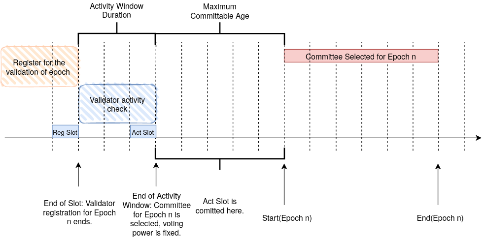
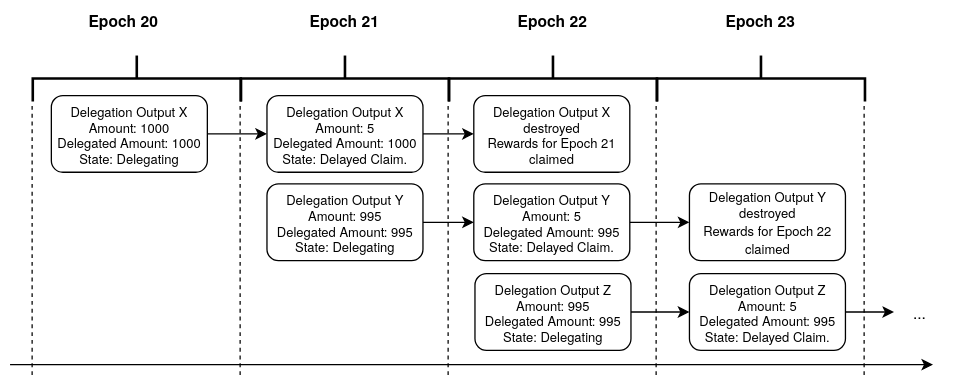
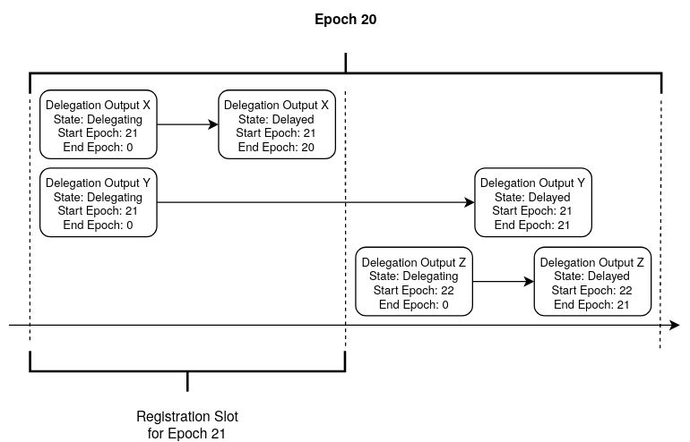

# Table of Contents

1. [Summary](#summary)
2. [Motivation](#motivation)
3. [Building Blocks](#building-blocks)
4. [Staking](#staking)
5. [Delegation](#delegation)
   - [Delegation Output](#delegation-output)
   - [Storage Deposit](#storage-deposit-calculation)
6. [Mana Rewards](#mana-rewards)
   - [Validator Rewards](#validator-rewards)
   - [Delegation Rewards](#delegation-rewards)
7. [Rationale & Design](#rationale--design)
   - [Delegation Output](#delegation-output-1)
8. [Copyright](#copyright)

# Summary

Staking and Delegation are a mechanism by which users contribute to the security of the network for which they are
rewarded. Stakers lock IOTA tokens in order to become eligible to be selected into the validator committee. Delegators
delegate IOTA tokens to a validator, forming a validator pool. Such a pool votes on conflicts and derives it total stake
from the locked tokens of the staker and the delegated tokens of all its delegators. If the validator of a pool performs
its task well, the pool is rewarded with Mana. Each participant of the pool can claim rewards roughly proportional to
the amount of staked or delegated tokens. This results in a mechanism that incentivizes users to contribute to the
security and well-functioning of the network while receiving rewards for their contribution.

This TIP specifies the details of staking, delegation, committee selection and Mana rewards.

# Motivation

In IOTA 1.5, nodes use the milestones issued by the Coordinator to reach a consensus on which transactions are
confirmed. The Coordinator was always intended as a temporary solution and is removed with the upgrade to IOTA 2.0
(a.k.a. _Coordicide_). In IOTA 2.0, the Coordinator is replaced by a weight-based voting scheme to resolve conflicts and
finalize transactions. Each such vote needs to have a weight associated to it, which is determined by the identity that
cast the vote. Determining the weight of an identity is done through a sybil protection mechanism.

In this TIP, Proof-of-Stake is used as the sybil protection mechanism. Proof-of-Stake assigns every participant weight
proportional to the amount of tokens they hold. Owning tokens serves as proof of owning a scarce resource. It is much
more efficient than relying on scarce resources external to the system, such as hardware or electricity, as it is used
in sybil protection mechanisms based on Proof-of-Work.

TODO: Additionall motivate using seat-based committees where every seat has the same weight rather than using the weight
proportional to the staked and delegated tokens.

Using Proof-of-Stake in IOTA 2.0 results in a system with low barriers to entry. The technical requirements for
participation are low and allow everyone to contribute to the security of the network. Those that can not or do not want
to vote (i.e. stake) themselves can delegate stake instead and still add to the security of the network. Proof-of-Stake
is moreover energy efficient and environmentally friendly.

In line with IOTA's goal for _Digital Autonomy_, these properties make Proof-of-Stake a good choice.

# Building Blocks

## Data Types & Subschema Notation

Data types and subschemas used throughout this TIP are defined in [TIP-21](../TIP-0021/tip-0021.md).

## Global Protocol Parameters

Global protocol parameters used throughout this TIP are defined in [TIP-22 (IOTA)](../TIP-0022/tip-0022.md) and
[TIP-32 (Shimmer)](../TIP-0032/tip-0032.md).

## Transaction Payload

[TIP-45](../TIP-0045/tip-0045.md) is the basis for output validation in this TIP.

## Common Parameters and Functions

- Let `decay(value, n)` be calculated with the algorithm and lookup table in [TIP-39](../TIP-0039/tip-0039.md).

# Staking

The IOTA protocol accepts blocks and transactions through voting. The voters are a selected validator committee. The
following gives a high-level idea of the selection process, with the details specified in the rest of the section.

Stakers, or interchangeably also called _registered validators_, lock their IOTA tokens to _stake_ them. By locking the
tokens, the stakers prove control over them so the protocol assigns them a proportional amount of stake in exchange.
Additionally, other users - so-called delegators - can _delegate_ their IOTA tokens to a staker to increase its stake
further. A staker and all its delegators are called a staking or validator pool. Such a pool is eligible to be selected
into a committee for a certain duration. Only the _Witness Weight_, used for the acceptance of blocks, and _Approval
Weight_, used for conflict resolution and transaction acceptance, of those selected into the committee is considered to
determine the ledger state. Stake is only used to determine who is selected into the committee. Once selected, every
validator in the committee occupies a _seat_ and every seat has the same voting weight.

The IOTA protocol slices time into slots and epochs. An epoch is simply a number of slots, and a slot has a
protocol-defined duration in seconds. A new validator committee is selected for each epoch. Shortly before an epoch
ends, the current activity of all registered validators as well as the pool's stake is determined. Through a selection
procedure, a committee is selected out of all the registered pools who have a large enough stake and enough block
issuance activity. Once selected, it is each pool's responsibility to issue _Validation Blocks_ across the epoch through
which they vote on conflicts. Depending on how many such blocks they issued for each slot in an epoch and how many they
were expected to issue, a _performance factor_ is calculated. This factor determines the amount of _Mana rewards_ the
validator's pool receives.

After an epoch ends, the delegators of the pool can claim their rewards. The validator may continue to stake or end its
stake by going through an unbonding period of its locked tokens. After this period ends, the validator can unlock their
IOTA tokens and claim their Mana rewards.

## Registration

Accounts are considered registered for validaton if they have a _Staking Feature_ in their _Features_. This feature and
its transaction validation rules are specified in [TIP-42](../TIP-0042/tip-0042.md).

## Committee Selection



_This figures gives an overview of the timing around committee selection in epochs. Note that the exact length of those
windows is not accurately depicted here and instead depends on the value of the corresponding Protocol Parameters._

To select a committee for an epoch with epoch index `n`, whose first slot index is denoted by `Epoch Start Slot(n)`, the
following steps must be taken.

- Let `Registration Slot(n)` be the registration slot with index
  `Epoch Start Slot(n) - Epoch Nearing Threshold - Activity Window Duration - 1`.
- Let `Activity Window Slot(n)` be the last slot of the activity window with index
  `Epoch Start Slot(n) - Epoch Nearing Threshold - 1`.
- Let `Cutoff Slot(n)` be the slot with index `Epoch Start Slot(n) - Maximum Committable Age - 1`.
- The set of _registered validators_ are all account outputs satisfying all of the following conditions:
  - The account has a _Staking Feature_ at the end of the `Registration Slot(n)`.
  - The account's Staking Feature's `End Epoch` is greater or equal to `n`.
- For any validator `i` in the set of _registered validators_ the activity is determined. The validator is active if the
  following condition holds, otherwise it is inactive:
  - The account with `Account ID` issues at least one block whose `Account ID` field is equal to that of the account,
    and the block's `Issuing Time` field converted to a slot index `Block Slot Index`, satisfies all of the following
    conditions:
    - `Block Slot Index > Registration Slot(n)`.
    - `Block Slot Index <= Activity Window Slot(n)`.
- For any validator `i` in the set of _registered validators_ the pool stake is equal to `Stake_i + DelegatedStake_i` at
  the end of the slot with index `Registration Slot(n)`, where:
  - `Stake_i` is the `Staked Amount` of IOTA tokens of the validator's _Staking Feature_.
  - `DelegatedStake_i` is the sum of all _Delegation Output's_ `Amount` field where the value of the `Validator ID`
    field is equal to `i`.
- The set of _registered validators_ who are active constitute the set of _eligible validators_, which is sorted by pool
  stake in descending order. The first `Committee Size` entries in the _eligible validators_ set is the preliminary
  committee for Epoch `n`.
- The preliminary committee becomes the selected committee if the `Activity Window Slot(n)` is finalized before the
  `Cutoff Slot(n)` is committed, otherwise the committee of the current epoch becomes the selected committee of the next
  epoch.

### Committee Tasks

The selected members of the committee are expected to issue _Validation Blocks_, defined in
[TIP-46](../TIP-0046/tip-0046.md). Only the _Witness Weight_, used for the acceptance of blocks, and _Approval Weight_,
used for conflict resolution and transaction acceptance, of those selected into the committee is considered to determine
the ledger state. The [performance](#performance-factor) of a validator is determined through the issuance of Validation
Blocks and affects the validator pool's Mana rewards.

# Delegation

By delegating IOTA tokens, a user adds to a validator's stake proportional to the amount of tokens they delegate,
without having to become a validator themself. In order to delegate, a _Delegation Output_ must be created. The
following section specifies how delegation is implemented.

## Delegation Output

Delegation is implemented with a special output type, the so-called Delegation Output.

Each Delegation output gets assigned a unique identifier `Delegation ID` upon creation by the protocol. `Delegation ID`
is the BLAKE2b-256 hash of the `Output ID` that created the Delegation Output.

<table>
    <details>
        <summary>Delegation Output</summary>
        <blockquote>
            Describes a Delegation Output, which delegates its contained IOTA tokens to a validator.
        </blockquote>
        <table>
            <tr>
                <td><b>Name</b></td>
                <td><b>Type</b></td>
                <td><b>Description</b></td>
            </tr>
            <tr>
                <td>Output Type</td>
                <td>uint8</td>
                <td>
                    Set to <strong>value 7</strong> to denote a <i>Delegation Output</i>.
                </td>
            </tr>
            <tr>
                <td>Amount</td>
                <td>uint64</td>
                <td>The amount of IOTA coins held by the output.</td>
            </tr>
            <tr>
                <td>Delegated Amount</td>
                <td>uint64</td>
                <td>The amount of delegated IOTA coins.</td>
            </tr>
            <tr>
                <td>Delegation ID</td>
                <td>ByteArray[32]</td>
                <td>Unique identifier of the Delegation Output, which is the BLAKE2b-256 hash of the <i>Output ID</i> that created it.</td>
            </tr>
            <tr>
                <td>Validator ID</td>
                <td>ByteArray[32]</td>
                <td>The <i>Account ID</i> of the validator to which this output is delegating.</td>
            </tr>
            <tr>
                <td>Start Epoch</td>
                <td>uint64</td>
                <td>The index of the first epoch for which this output delegates.</td>
            </tr>
            <tr>
                <td>End Epoch</td>
                <td>uint64</td>
                <td>The index of the last epoch for which this output delegates.</td>
            </tr>
            <tr>
                <td>Unlock Conditions Count</td>
                <td>uint8</td>
                <td>The number of unlock conditions following.</td>
            </tr>
            <tr>
                <td valign="top">Unlock Conditions <code>atMostOneOfEach</code></td>
                <td colspan="2">
                    <details>
                        <summary>Address Unlock Condition</summary>
                        <table>
                            <tr>
                                <td><b>Name</b></td>
                                <td><b>Type</b></td>
                                <td><b>Description</b></td>
                            </tr>
                            <tr>
                                <td>Unlock Condition Type</td>
                                <td>uint8</td>
                                <td>
                                    Set to <strong>value 0</strong> to denote an <i>Address Unlock Condition</i>.
                                </td>
                            </tr>
                            <tr>
                                <td>Address</td>
                                <td colspan="2">
                                    <details>
                                        <summary>Ed25519 Address</summary>
                                        <table>
                                            <tr>
                                                <td><b>Name</b></td>
                                                <td><b>Type</b></td>
                                                <td><b>Description</b></td>
                                            </tr>
                                            <tr>
                                                <td>Address Type</td>
                                                <td>uint8</td>
                                                <td>
                                                    Set to <strong>value 0</strong> to denote an <i>Ed25519 Address</i>.
                                                </td>
                                            </tr>
                                            <tr>
                                                <td>PubKeyHash</td>
                                                <td>ByteArray[32]</td>
                                                <td>The raw bytes of the Ed25519 address which is a BLAKE2b-256 hash of the Ed25519 public key.</td>
                                            </tr>
                                        </table>
                                    </details>
                                    <details>
                                        <summary>Alias Address</summary>
                                        <table>
                                            <tr>
                                                <td><b>Name</b></td>
                                                <td><b>Type</b></td>
                                                <td><b>Description</b></td>
                                            </tr>
                                            <tr>
                                                <td>Address Type</td>
                                                <td>uint8</td>
                                                <td>
                                                    Set to <strong>value 8</strong> to denote an <i>Alias Address</i>.
                                                </td>
                                            </tr>
                                            <tr>
                                                <td>Alias ID</td>
                                                <td>ByteArray[32]</td>
                                                <td>The raw bytes of the <i>Alias ID</i> which is the BLAKE2b-256 hash of the outputID that created it.</td>
                                            </tr>
                                        </table>
                                    </details>
                                    <details>
                                        <summary>NFT Address</summary>
                                        <table>
                                            <tr>
                                                <td><b>Name</b></td>
                                                <td><b>Type</b></td>
                                                <td><b>Description</b></td>
                                            </tr>
                                            <tr>
                                                <td>Address Type</td>
                                                <td>uint8</td>
                                                <td>
                                                    Set to <strong>value 16</strong> to denote an <i>NFT Address</i>.
                                                </td>
                                            </tr>
                                            <tr>
                                                <td>NFT ID</td>
                                                <td>ByteArray[32]</td>
                                                <td>The raw bytes of the <i>NFT ID</i> which is the BLAKE2b-256 hash of the outputID that created it.</td>
                                            </tr>
                                        </table>
                                    </details>
                                </td>
                            </tr>
                        </table>
                    </details>
                </td>
            </tr>
        </table>
    </details>
</table>

### Additional Transaction Syntactic Validation Rules

#### Output Syntactic Validation

- `Amount` field must fulfill the dust protection requirements and must not be `0`.
- `Amount` field must be ≤ `Max IOTA Supply`.
- It must hold true that `1` ≤ `Unlock Conditions Count` ≤ `1`.
- `Unlock Condition Type` of an <i>Unlock Condition</i> must define one of the following types:
  - <i>Address Unlock Condition</i>
- <i>Unlock Conditions</i> must be sorted in ascending order based on their `Unlock Condition Type`.
- Syntactic validation of all present unlock conditions must pass.
- <i>Address Unlock Condition</i> must be present.
- `Validator ID` must not be zeroed out.

### Additional Transaction Semantic Validation Rules

- Explicit `Delegation ID`: `Delegation ID` is taken as the value of the `Delegation ID` field in the Delegation output.
- Implicit `Delegation ID`: When a Delegation output is consumed as an input in a transaction and `Delegation ID` field
  is zeroed out, take the BLAKE2b-256 hash of the `Output ID` of the input as `Delegation ID`.
- For every non-zero explicit `Delegation ID` on the output side there must be a corresponding Delegation Output on the
  input side. The corresponding Delegation output has the explicit or implicit `Delegation ID` equal to that of the
  Delegation output on the output side.
- Let `Past Bounded Slot Index` be given by `Commitment Index + Max Committable Age` where `Commitment Index` is the
  slot index of the commitment input.
- Let `Past Bounded Epoch Index` be the epoch index corresponding to the slot index `Past Bounded Slot Index`.
- Let `Future Bounded Slot Index` be given by `Commitment Index + Min Committable Age` where `Commitment Index` is the
  slot index of the commitment input.
- Let `Future Bounded Epoch Index` be the epoch index corresponding to the slot index `Future Bounded Slot Index`.
- If the past bounded indices are required for transaction validation, a _Commitment Input_ must be present. This is the
  case for any transaction containing a _Delegation Output_ on the input or output side except when it is destroyed in
  _Delayed Claiming State_.

#### Consumed Outputs

Whenever a Delegation output is consumed in a transaction, it means that the output is transitioned into its next state.
From its initial state, the _Delegating State_, a Delegation Output can either be destroyed or transitioned to a
_Delayed Claiming_ state, from which it can then be destroyed. The current state is defined as the consumed Delegation
output, while the next state is defined as the Delegation output with the same explicit `Delegation ID` on the output
side. There are thus two types of transitions: delayed claiming transition and destruction transition.

- Delayed Claiming Transition
  - Is identified by a zeroed out `Delegation ID` on the input side and a non-zeroed out `Delegation ID` on the output
    side.
  - The fields `Delegated Amount`, `Start Epoch` and `Validator ID` must not be changed.
  - `End Epoch` on the output must be set as follows.
    - Let `Registration Slot(n)` be defined as in [committee selection](#committee-selection), where `n` is equal to
      `Future Bounded Epoch Index`.
    - If `Future Bounded Slot Index <= Registration Slot(n+1)` then `End Epoch` must be set to
      `Future Bounded Epoch Index`, otherwise to `Future Bounded Epoch Index + 1`.
- Destruction Transition
  - Is identified by the absence of a Delegation Output on the output side with an explicit `Delegation ID` that
    corresponds to the `Delegation ID` of the one on the input side, which may be an implicit or explicit Delegation ID.
    The next state is the empty state.
  - During this transition, Mana rewards may be added to the total sum of mana on the output side of the transaction,
    according to [delegation rewards](#delegation-rewards).

#### Created Outputs

- When `Delegation ID` is zeroed out certain fields of the Delegation Output must be set as follows.
  - Let `Registration Slot(n)` be defined as in [committee selection](#committee-selection), where `n` is equal to
    `Past Bounded Epoch Index`.
  - If `Past Bounded Slot Index <= Registration Slot(n+1)` then `Start Epoch` must be set to
    `Past Bounded Epoch Index + 1`, otherwise to `Past Bounded Epoch Index + 2`.
  - Set `Delegated Amount` to the value of the `Amount` field.
  - Set `End Epoch` to `0`.

### Storage Deposit Calculation

The storage deposit of a Delegation Output is higher than for other output types. Therefore, the storage deposit
calculation of these outputs defines an additional corresponding field type.

<table>
    <tr>
        <th>Name</th>
        <th>Description</th>
        <th>Weight</th>
        <th>Reasoning</th>
    </tr>
    <tr>
        <td><code>delegation</code></td>
        <td>Fields contained in a <i>Delegation Output</i>.</td>
        <td>TODO: TBD</td>
        <td>Delegation requires additional bookkeeping in nodes for committee selection and mana rewards tracking.</td>
    </tr>
</table>

The following table shows the Delegation Output including the possible fields and their specific weight.

<table>
    <details>
        <summary>Delegation Output</summary>
        <blockquote>
            Describes a Delegation Output, which delegates its contained IOTA tokens to a validator.
        </blockquote>
        <table>
            <tr>
                <td><b>Field</b></td>
                <td><b>Field type</b></td>
                <td><b>Length Minimum</b></td>
                <td><b>Length Maximum</b></td>
                <td><b>Description</b></td>
            </tr>
            <tr>
                <td>Output Type</td>
                <td><code>delegation</code></td>
                <td>1</td>
                <td>1</td>
                <td>
                    Set to <strong>value 7</strong> to denote a <i>Delegation Output</i>.
                </td>
            </tr>
            <tr>
                <td>Amount</td>
                <td><code>delegation</code></td>
                <td>8</td>
                <td>8</td>
                <td>The amount of IOTA coins held by the output.</td>
            </tr>
            <tr>
                <td>Delegated Amount</td>
                <td><code>delegation</code></td>
                <td>8</td>
                <td>8</td>
                <td>The amount of delegated IOTA coins.</td>
            </tr>
            <tr>
                <td>Delegation ID</td>
                <td><code>delegation</code></td>
                <td>32</td>
                <td>32</td>
                <td>Unique identifier of the Delegation Output, which is the BLAKE2b-256 hash of the <i>Output ID</i> that created it.</td>
            </tr>
            <tr>
                <td>Validator ID</td>
                <td><code>delegation</code></td>
                <td>32</td>
                <td>32</td>
                <td>The <i>Account ID</i> of the validator to which this output is delegating.</td>
            </tr>
            <tr>
                <td>Start Epoch</td>
                <td><code>delegation</code></td>
                <td>8</td>
                <td>8</td>
                <td>The index of the first epoch for which this output delegates.</td>
            </tr>
            <tr>
                <td>End Epoch</td>
                <td><code>delegation</code></td>
                <td>8</td>
                <td>8</td>
                <td>The index of the last epoch for which this output delegates.</td>
            </tr>
            <tr>
                <td>Unlock Conditions Count</td>
                <td><code>data</code></td>
                <td>1</td>
                <td>1</td>
                <td>The number of unlock conditions following.</td>
            </tr>
            <tr>
                <td valign="top">Unlock Conditions <code>atMostOneOfEach</code></td>
                <td colspan="2">
                    <details>
                        <summary>Address Unlock Condition</summary>
                        <table>
                            <tr>
                                <td><b>Name</b></td>
                                <td><b>Type</b></td>
                                <td><b>Description</b></td>
                            </tr>
                            <tr>
                                <td>Unlock Condition Type</td>
                                <td><code>data</code></td>
                                <td>1</td>
                                <td>1</td>
                                <td>
                                    Set to <strong>value 0</strong> to denote an <i>Address Unlock Condition</i>.
                                </td>
                            </tr>
                            <tr>
                                <td>Address</td>
                                <td colspan="2">
                                    <details>
                                        <summary>Ed25519 Address</summary>
                                        <table>
                                            <tr>
                                                <td><b>Name</b></td>
                                                <td><b>Field type</b></td>
                                                <td><b>Length Minimum</b></td>
                                                <td><b>Length Maximum</b></td>
                                                <td><b>Description</b></td>
                                            </tr>
                                            <tr>
                                                <td>Address Type</td>
                                                <td><code>data</code></td>
                                                <td>1</td>
                                                <td>1</td>
                                                <td>
                                                    Set to <strong>value 0</strong> to denote an <i>Ed25519 Address</i>.
                                                </td>
                                            </tr>
                                            <tr>
                                                <td>PubKeyHash</td>
                                                <td><code>data</code></td>
                                                <td>32</td>
                                                <td>32</td>
                                                <td>The raw bytes of the Ed25519 address which is a BLAKE2b-256 hash of the Ed25519 public key.</td>
                                            </tr>
                                        </table>
                                    </details>
                                    <details>
                                        <summary>Account Address</summary>
                                        <table>
                                            <tr>
                                                <td><b>Name</b></td>
                                                <td><b>Field type</b></td>
                                                <td><b>Length Minimum</b></td>
                                                <td><b>Length Maximum</b></td>
                                                <td><b>Description</b></td>
                                            </tr>
                                            <tr>
                                                <td>Address Type</td>
                                                <td><code>data</code></td>
                                                <td>1</td>
                                                <td>1</td>
                                                <td>
                                                    Set to <strong>value 8</strong> to denote an <i>Account Address</i>.
                                                </td>
                                            </tr>
                                            <tr>
                                                <td>Account ID</td>
                                                <td><code>data</code></td>
                                                <td>32</td>
                                                <td>32</td>
                                                <td>The raw bytes of the <i>Account ID</i> which is the BLAKE2b-256 hash of the outputID that created it.</td>
                                            </tr>
                                        </table>
                                    </details>
                                    <details>
                                        <summary>NFT Address</summary>
                                        <table>
                                            <tr>
                                                <td><b>Name</b></td>
                                                <td><b>Field type</b></td>
                                                <td><b>Length Minimum</b></td>
                                                <td><b>Length Maximum</b></td>
                                                <td><b>Description</b></td>
                                            </tr>
                                            <tr>
                                                <td>Address Type</td>
                                                <td><code>data</code></td>
                                                <td>1</td>
                                                <td>1</td>
                                                <td>
                                                    Set to <strong>value 16</strong> to denote an <i>NFT Address</i>.
                                                </td>
                                            </tr>
                                            <tr>
                                                <td>NFT ID</td>
                                                <td><code>data</code></td>
                                                <td>32</td>
                                                <td>32</td>
                                                <td>The raw bytes of the <i>NFT ID</i> which is the BLAKE2b-256 hash of the outputID that created it.</td>
                                            </tr>
                                        </table>
                                    </details>
                                </td>
                            </tr>
                        </table>
                    </details>
                </td>
            </tr>
        </table>
    </details>
</table>

# Mana Rewards

Mana Rewards are claimed and tracked for past epochs on an epoch level. For an ongoing epoch, they are tracked on a slot
level and are then combined into an epoch rewards entry when the epoch ends. Rewards for an epoch become claimable when
the epoch ends, that is, when its last slot is committed.

## Slot Level

For each slot, the performance factor of each validator in the selected committee must be tracked. For an epoch this
results in a list of performance factors for a validator. The rewards for an ongoing epoch are tracked by keeping a map
with `Validator ID`s as keys, of type `ByteArray[32]`, and the values being a list of objects consisting of these
fields:

<table>
    <tr>
        <td><b>Name</b></td>
        <td><b>Type</b></td>
        <td><b>Description</b></td>
    </tr>
    <tr>
        <td>Slot Index</td>
        <td><code>uint64</code></td>
        <td>The slot index for which the performance factor is tracked.</td>
    </tr>
    <tr>
        <td>Performance Factor</td>
        <td><code>uint8</code></td>
        <td>The slot performance factor of the validator, scaled to TargetValidationBlocks.</td>
    </tr>
</table>

TODO: Do we have to state the following or can we just include it in the calculations?

Since the `Performance Factor` is a uint8, a right-shift of 8 bits should be later applied to the sum.

### Performance Factor

This performance factor for a slot is defined as follows.

#### Input values

- Let `Validation Blocks Issued` be the array of _Validation Blocks_ issued by a given validator in a certain slot.
- Let `TargetValidationBlocks` be a protocol parameter, representing the number of validation blocks a validator is supposed to issue per slot. 
  
#### Calculations

- Then `Slot Perfomance Factor` is given by the number of blocks issued in the slot.
- Check if the total number of validation blocks issued in this slot is larger than `TargetValidationBlocks`. If yes, set `Slot Perfomance Factor` to `TargetValidationBlocks + 1`, to signal that the validator issued more validation blocks than it was supposed to and it should be punished when combining the `Slot Perfomance Factors` into `Epoch Perfomance Factors`. 

==TO DO: decide with daria between the alg above or the one below==
==To do: check if a round number belongs to the slot i or i+1==
==To do: check if it's better to set the PF to TargetValidationBlocks+1 or to null or something like that==

- First, divide the slot representing times `[beginningSlot, endSlot)` into `TargetValidationBlocks` subslots of legth `subslotLenght = slotDuration/TargetValidationBlocks` given by `[beginningSlot+(i-1)*subslotLenght, beginningSlot+i*subslotLenght)`, for `i=1,...,TargetValidationBlocks`.
- Then, count how many of these subslots have at least one validation block issued in them. In principle, this will be the `Slot Perfomance Factor`.
- Check if the total number of validation blocks issued in this slot is larger than `TargetValidationBlocks`. If yes, set `Slot Perfomance Factor` to `TargetValidationBlocks + 1`, to signal that the validator issued more validation blocks than it was supposed to and it should be punished when combining the `Slot Perfomance Factors` into `Epoch Perfomance Factors`. 


## Epoch Level

### Epoch performance factor

#### Input values

- Let `Slot Performance Factor Array` be the array of _Slot Perfomance Factors_ of a given validator in each slot on an epoch.

#### Calculations

- Then `Perfomance Factor` is given by the average between these values, rounded down to the nearest
  integer. Additionally if validator issued more than `TargetValidationBlocks` validation blocks in any slot, the performance factor for the
  whole epoch is set to 0 as a form of punishment.

Let `m` and `M` be the first and last slot of the epoch, respectively.

```
  Performance Factor = 0
  sum = 0
  for n = m, ..., M:
     if Slot Performance Factor Array(n) > TargetValidationBlocks:
        Performance Factor = 0
        break
     sum += Validation Blocks Issued(n)
  end
    Performance Factor = sum >> slotsPerEpochExponent
```
Note that the value of `Performance Factor` will be an integer between 0 and `TargetValidationBlocks`.

### Profit Margins

#### Input values

- Let `Total Stake` be the sum of all `Pool Stake` values, that is, the total amount of delegated and staked IOTA tokens
  in the selected committee.
- Let `Total Validator Stake` be the sum of `Validator Stake(i)` for each validator `i` in the selected committee.

#### Parameters

- Let `ProfitMarginExponent` be 8.

#### Calculations
==to do (optional): try to come up with some magic so we don't have the integer division==
`Profit Margin = (Total Validator Stake<<ProfitMarginExponent)/(Total Validator Stake + Total Stake)`

Additionally, the profit margins must be tracked for each epoch.

<table>
    <tr>
        <td><b>Name</b></td>
        <td><b>Type</b></td>
        <td><b>Description</b></td>
    </tr>
    <tr>
        <td>Epoch Index</td>
        <td>uint64</td>
        <td>
            The epoch index for which the profit margin is tracked.
        </td>
    </tr>
    <tr>
        <td>Profit Margin</td>
        <td>uint8</td>
        <td>
            An integer representing the epoch profit margin, scaled to `2^ProfitMarginExponent`.
        </td>
    </tr>
</table>


### Epoch Rewards

The rewards of an epoch are tracked by keeping a map with `Validator ID`s as keys, of type `ByteArray[32]`, and the
values being a list of objects consisting of these fields:

<table>
    <tr>
        <td><b>Name</b></td>
        <td><b>Type</b></td>
        <td><b>Description</b></td>
    </tr>
    <tr>
        <td>Epoch Index</td>
        <td><code>uint64</code></td>
        <td>The epoch index for which the rewards can be claimed.</td>
    </tr>
    <tr>
        <td>Pool Stake</td>
        <td><code>uint64</code></td>
        <td>The total amount of IOTA tokens staked by the validator and all its delegators.</td>
    </tr>
    <tr>
        <td>Pool Rewards</td>
        <td><code>uint64</code></td>
        <td>The total amount of rewards the validator pool received, without the fixed cost of the validator.</td>
    </tr>
</table>

In the next section, we define how these values can be obtained from the slot-level data, after the commitment of the last slot of that epoch.

### Slot-Epoch Conversion of the Rewards

The following section specifies how to convert the slot-level data into epoch-level data.

#### Parameters needed for calculations:

- `Bootstrapping Duration` = 1154 (approximately 3 years)
- `Rewards Mana Share Coefficient` = 2 (relative to the term $\theta/(1-\theta)$ from the Whitepaper, with $\theta = 2/3$)
- `Final Reward` = `(Total Supply * Rewards Mana Share Coefficient * generationRate) >> (generationRateExponent - slotsPerEpochExponent) ` (constant reward per epoch after the bootstrapping phase)
- `Decay Balancing Constant Coefficient` = ==TO DO: choose a value, this is arbitrary, just make sure it does not overflow==
- `Decay Balancing Constant = ` (integer approximation of $2^{\text{Decay Balancing Constant Coefficient}}\frac{e \Delta}{T(1-\exp{(-\beta \Delta)})}$, for $Delta =$ epoch duration in years, $T=$ `Bootstrapping Duration`, and $\beta=1/3$). ==TO DO: discuss about approximating this to e==
- `Initial Reward` = `Final Reward * Decay Balancing Constant >> Decay Balancing Constant Coefficient` (parameter to calculate the reward per epoch in the bootstrapping phase)

- `Pool Coefficient Exponent` = 31 // TODO explain why did we choose those values

#### Input values

- Let `Validator Stake(i)` be the amount of IOTA tokens staked by the validator with Account ID `i`, i.e. the
  `Staked Amount` in the _Staking Feature_ of the validator at the end of the registration slot.
- Let `Pool Stake` be the total amount of delegated and staked IOTA tokens by the validator pool which was determined at
  the time of the pool stake calculation, i.e. the end of the registration slot.
- Let `Total Stake` be the sum of all `Pool Stake` values, that is, the total amount of delegated and staked IOTA tokens
  in the selected committee.
- Let `Total Validator Stake` be the sum of `Validator Stake(i)` for each validator `i` in the selected committee.

#### Calculations

- The total target reward `Target Reward(n)` for an epoch index `n` is defined as:
    - `Initial Reward * decay(n)` if `n <= Bootstrapping Duration`.
    - `Final Reward` if `n > Bootstrapping Duration`.
- The Pool Reward `Pool Reward` for an epoch index `n`, and pool `i` is calculated as follows:
    - Let `Pool Coefficient` be
    `((Pool Stake << Pool Coefficient Exponent)/Total Stake) + (Validator Stake(i) << Pool Coefficient Exponent) / Total Validator Stake`. Notice that, since both `Pool Stake` and `Validator Stake(i)` use at most 53 bits of the variable, to not overflow the calculation, `Pool Coefficient Exponent` must be at most 11. `Pool Coefficient` will then use at most `Pool Coefficient Exponent + 1` bits.
    - Take the `Performance Factor` for the whole epoch `n` according to [Performance Factor](#performance-factor)
    - Let `Scaled Pool Reward` be `Pool Coefficient * Target Reward(n) * Performance Factor`. Since `Pool Coefficient` uses at most 12 bits, `Target Reward(n)` uses at most 41 bits, and `Performance Factor` uses at most 8 bits, this multiplication will not overflow using uint64 variables.
    - Let `Pool Reward` be `((Scaled Pool Reward/TargetValidationBlocks) >> (Pool Coefficient Exponent+1)) - Fixed Cost`. If this value is smaller than zero, no reward is stored for this epoch (notice that if this value is equal to zero, a pool reward of zero would be stored in the epoch, meaning that delegators would not receive rewards, but the validator would receive `Fixed Cost`). 

## Validator Rewards

An account with a _Staking Feature_ can claim rewards in the same transaction where the feature is removed. The
transaction validation rules for removing the feature are defined in TIP-42. Upon removal, the amount of Mana Rewards
that can be claimed is defined as follows.

#### Parameters

`ProfitMarginExponent` = 8

#### Input Values

- Let `Profit Margin(n)` be the `Profit Margin` for epoch index `n`.
- Let `Pool Rewards(n)` be the `Pool Rewards` of the entry in `Claimable Rewards` with epoch index `n`.
- Let `Pool Stake(n)` be the `Pool Stake` of the entry in `Claimable Rewards` with epoch index `n`.
- Let `Fixed Cost` be the `Fixed Cost` defined in the _Staking Feature_.

#### Calculations

- Let `Future Bounded Epoch Index` be given by `Commitment Index + Min Committable Age` where `Commitment Index` is the
  slot index of the _Commitment Input_. If no _Commitment Input_ is present, the transaction is invalid.
  - Note that the presence of a _Commitment Input_ is already required for any transaction containing a _Staking
    Feature_ on the input or output side.
- Let the `Claimable Rewards` be all reward entries for the validator identified by the Account ID of the account that
  removes the Staking Feature, where the entry's `Epoch Index` satisfies `Epoch Index >= Start Epoch + 1` and
  `Epoch Index < Future Bounded Epoch Index`.
- Let the total claimable rewards at epoch `m` be the sum of `Rewards(n)` for a certain set of epoch indexes `n<m`. We begin by calculating the `Undecayed Rewards(n)` for each epoch `n` in the validation period, given by: 
    - `Undecayed Rewards(n)` = `Fixed Cost + Profit Margin Factor + Residual Validator Factor`
    where 
      - `Profit Margin Complement = (1 << ProfitMarginExponent) - Profit Margin(n) `
      - `Profit Margin Factor = (Profit Margin(n) * Pool Rewards(n)) >> ProfitMarginExponent`
      - `Residual Validator Factor = ((Profit Margin Complement * Pool Rewards(n)) >> ProfitMarginExponent) * Staked Amount/Pool Stake(n)`. Note that `((Profit Margin Complement * Pool Rewards(n)) >> ProfitMarginExponent) * Staked Amount` uses up to 94 bits and `Pool Stake(n)` up to 53, so to prevent overflowing the first factor should be either stored as a 128 bits integer or it should be stored as 2 uint64 variables (and the proper 128 by 64 division algorithm must be used).
- Then, we decay the rewards according to [Mana Decay], meaning that `Rewards(n)=decay(Undecayed Rewards(n),m-n)`, where the function `decay` is defined in [TIP-39](../TIP-0039/tip-0039.md). The total claimable decayed reward for validator `i` will be, then, the sum of `Rewards(n)` for n in the validation period.


## Delegation Rewards

To claim rewards, a _Delegation Output_ must be destroyed. Depending on the state it is in at that point, different
conditions for claiming rewards apply. An output destroyed in _Delegating State_ will always forfeit _potential_ rewards
for the epoch in which it is destroyed, since the rewards for that epoch only become available in the next epoch. They
are _potential_ since the validator to which the output is delegating may not have been selected into the commitee for
that epoch.

#### Parameters

`ProfitMarginExponent` = 8 `DecayExponent` = 32

#### Input Values

- Let `Profit Margin(n)` be the `Profit Margin` for epoch index `n`.
- Let `Pool Rewards(n)` be the `Pool Rewards` of the entry in `Claimable Rewards` with epoch index `n`.
- Let `Pool Stake(n)` be the `Pool Stake` of the entry in `Claimable Rewards` with epoch index `n`.

#### Calculations

The amount of Mana Rewards that can be claimed for a _Delegation Output_ which is destroyed is defined as follows.

- Let the `Claimable Rewards` be all reward entries for the validator identified by the Account ID `Validator ID` field
  in the output, where its `Epoch Index` satisfies `Epoch Index >= Start Epoch` and `Epoch Index <= Delegation End`,
  where:
  - If the output is in _Delegating State_ let `Delegation End` be `Future Bounded Epoch Index - 1`, where:
    - `Future Bounded Epoch Index` is given by `Commitment Index + Min Committable Age` where `Commitment Index` is the
      slot index of the _Commitment Input_. If no _Commitment Input_ is present, the transaction is invalid.
      - Note that the presence of a _Commitment Input_ is already required for any transaction containing a _Delegation
        Output_ on the input or output side, except when it is destroyed in the _Delayed Claiming State_.
    - Note that no transaction validation rule exists to prevent claiming rewards before the rewards of the previous
      epoch became available, thus forfeiting the potential rewards of that previous epoch.
  - If the output is in _Delayed Claiming State_ let `Delegation End` be `End Epoch`.

Let the total claimable rewards be the sum of `Rewards(n)` for an epoch index `n`, where: `Undecayed Rewards(n)` =
`((Profit Margin Complement * Pool Rewards(n)) >> ProfitMarginExponent) * Delegated Amount/Pool Stake(n)`. Note that `((Profit Margin Complement * Pool Rewards(n)) >> ProfitMarginExponent) * Delegated Amount` uses up to 94 bits and `Pool Stake(n)` up to 53, so to prevent overflowing the first factor should be either stored as a 128 bits integer or it should be stored as 2 uint64 variables (and the proper 128 by 64 division algorithm must be used).
Then, we decay the rewards according to [Mana Decay], meaning that `Rewards(n)=decay(Undecayed Rewards(n),m-n)`, where the function `decay` is defined in MANA TIP. The total claimable decayed reward for validator `i` will be, then, the sum of `Rewards(n)` for n in the validation period.

# Rationale & Design

This section describes the rationale behind some of the design choices and explains how the introduced concepts fit
together. It is however not part of the formal specification and thus non-normative.

## Delegation Output

Using dedicated Delegation Outputs over a Delegation Feature in an Account has some advantages. First, it makes it
easily possible to delegate to multiple validators from the same account, by creating multiple outputs. In the Stardust
Design (TIP-18), Features are assumed to be unique in an output, and thus having multiple Delegation Features to allow
for multiple delegation targets would require changing that assumption. Second, it decouples the delegation logic from
the Account. Delegation, in contrast to staking, does not require that an account must be the delegator. A Delegation
Output can be owned by a plain Ed25519 address or an NFT or Account Address, making it more flexible. A Delegation
Feature would only allow for Delegation from an account.

### Delayed Claiming

Mana Rewards for some epoch `X` only become available after that epoch ends. At that point, the pool stake for the
following epoch `X+1` has already been calculated. That means, if one waits until the rewards for `X` are available and
consumes their Delegation Output to claim rewards, they have already delegated for `X+1` but will loose out on the
rewards they would get for that delegation.

With delayed claiming however, a user can delegate for `X` and then transition to delayed claiming. At that point, the
output only needs to contain the minimum storage deposit. The remaining funds can be put in a new Delegation Output to
delegate for `X+1`, which can repeat this procedure. In this manner, one can delegate for one epoch at a time and never
lose out on any rewards. The following figure exemplifies this procedure.



Delayed Claiming also allows for a high degree of liquidity while delegating. Even without delayed claiming, this
delegation mechanism implements _liquid delegation_ as Delegation Outputs are never locked and can be accessed anytime.
However, one might loose out on rewards. Delayed Claiming fixes this: If one delegated for the current epoch but needs
to access the funds immediately, one can transition to delayed claiming and access all the funds (minus the small
storage deposit), and still claim rewards later.

Additionally, Delayed Claiming enables Layer 2 Smart Contract Chains to hold their funds in Delegation Outputs and
delegate the tokens of their users for them, while they can use those wrapped tokens on Layer 2. Since an Account Output
belonging to an SC chain is transitioned very frequently, without Delayed Claiming, they would never hold the Delegation
Output long enough for it to be able to claim rewards. With Delayed Claiming SC chains can implement this kind of
delegation.

#### Start and End Epoch

This figure showcases how epochs are set when createing and transitioning Delegation Outputs. Note that the length of
epochs in slots is not accurately depicted here. What matters for epoch setting is 1) what the current epoch is and 2)
whether the creation or transition happens before or after the registration slot for the following epoch.



- Delegation Output X is created before the end of the Registration Slot. Therefore its `Start Epoch` is set to `21`, as
  that is the earliest epoch for which it could receive rewards. However, it is also transitioned before the end of the
  slot, so its `End Epoch` is set to `20`, as that is the last epoch for which it could receive rewards. However, the
  condition for claiming rewards is not satisfied for any epoch index. There will be no epoch index `A` that satisfies
  `A >= 21 && A <= 20`. This Delegation Output will consequently not be able to claim any rewards at all, as it was
  never included in any pool stake calculation.
- Delegation Output Y is created before the end of the Registration Slot. Therefore its `Start Epoch` is set to `21`, as
  that is the earliest epoch for which it could receive rewards. It is transitioned after the end of the Registration
  Slot, so it was included in the pool stake calculation. Therefore the last epoch for which it could get rewards is
  `21`, which is the value of `End Epoch`. In sum, the delegation output will therefore be able to claim rewards for
  epoch `21` only.
- Delegation Output Z is analogous to X, only shifted by one epoch. It is created after the Registration Slot of Epoch
  21 but before the Registration Slot of Epoch 22. Therefore its `Start Epoch` is set to `22`, as that is the earliest
  epoch for which it could receive rewards. It is however transitioned before the Registration Slot of Epoch 22, so it
  will not be included in the pool stake calculation for said epoch. Its `End Epoch` is thus set to `21`, as that may be
  the last epoch for which it could get rewards. Simlar to Output X, the delegation output will not be able to claim any
  rewards as it was never included in any pool stake calculation and no epoch index `A` satisfies `A >= 22 && A <= 21`.

These examples show that transitioning a Delegation Output without crossing a Registration Slot boundary does not yield
any rewards. At least one such boundary must be crossed for any rewards to be claimable.

### Time Boundaries

When designing transaction validation rules, a choice must be made between choosing to bound the past or the future,
that is, whether to prevent faking the past or faking the future. To maximize rewards, users are incentivized to make
the range of epochs for which they can claim rewards as large as possible. Thus, there's an incentive to set
`Start Epoch` as early or low as possible and `End Epoch` as high or late as possible. To prevent malicious behavior,
like setting `Start Epoch` to the current epoch when the block itself, that contained the transaction in which the
delegation started, was issued past the registration slot of the next epoch, the boundaries must be set appropriately.
Thus, `Start Epoch` must be set to or compared against the past-bounded slot index, which prevent faking the past. A
past-bounded slot index is always at least equal to the slot to which the block belongs, based on its `Issuing Time`,
since the oldest, valid commitment that can be picked is `Max Committable Age` slots old. Analogously, `End Epoch` must
be set to or compared against the future-bounded slot index, which prevent faking the future. A future-bounded slot
index is always at most equal to the slot to which the block belongs, based on its `Issuing Time`, since the newest,
valid commitment that can be picked is `Min Committable Age` slots old.

# Copyright

Copyright and related rights waived via [CC0](https://creativecommons.org/publicdomain/zero/1.0/).
