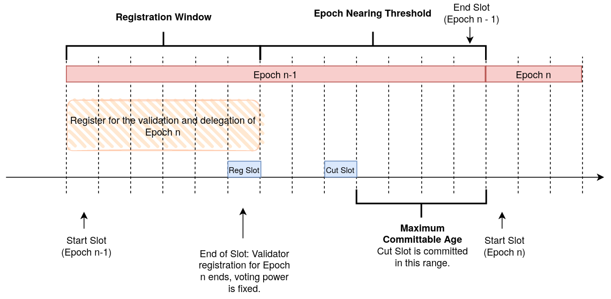

# Table of Contents

1. [Summary](#summary)
2. [Motivation](#motivation)
3. [Building Blocks](#building-blocks)
4. [Staking](#staking)
5. [Delegation](#delegation)
6. [Copyright](#copyright)

# Summary

Staking and Delegation are a mechanism by which users contribute to the security of the network for which they are rewarded.
Stakers lock IOTA tokens in order to become eligible to be selected into the validator committee. Delegators delegate IOTA tokens to a validator, forming a validator pool. Such a pool votes on conflicts and derives it voting weight from the locked tokens of the staker and the delegated tokens of all its delegators.
If the validator of a pool performs its task well, the pool is rewarded with Mana. Each participant of the pool can claim rewards roughly proportional to the amount of staked or delegated tokens.
This results in a mechanism that incentivizes users to contribute to the security and well-functioning of the network while receiving rewards for their contribution.

This TIP specifies the details of staking, delegation, committee selection, validation and Mana rewards.

# Motivation

TODO

# Building Blocks

## Data Types & Subschema Notation

Data types and subschemas used throughout this TIP are defined in [TIP-21](../TIP-0021/tip-0021.md).

## Global Protocol Parameters

Global protocol parameters used throughout this TIP are defined in [TIP-22 (IOTA)](../TIP-0022/tip-0022.md) and [TIP-32 (Shimmer)](../TIP-0032/tip-0032.md).

## Transaction Payload

[TIP-45](../TIP-0045/tip-0045.md) is the basis for output validation in this TIP.

# Staking

The IOTA protocol accepts blocks and transactions through voting. The voters are a selected validator committee. The following gives a high-level idea of the selection process, with the details specified in the rest of the section.

Stakers, or interchangeably also called _registered validators_, get voting weight by locking IOTA tokens. By locking the tokens, the stakers prove control over them so the protocol assigns them a proportional amount of voting weight in exchange. Additionally, other users - so-called delegators - can _delegate_ their IOTA tokens to a staker to increase its voting weight further. A staker and all its delegators are called a staking or validator pool. Such a pool is eligible to be selected into a committee for a certain duration. Only the _Witness Weight_, used for the acceptance of blocks, and _Approval Weight_, used for conflict resolution and transaction acceptance, of those selected into the committee is considered to determine the ledger state.

The IOTA protocol slices time into slots and epochs. An epoch is simply a number of slots, and a slot has a protocol-defined duration in seconds. A new validator committee is selected for each epoch. Shortly before an epoch ends, the current activity of all registered validators as well as the pool's stake is determined. Through a selection procedure, a committee is selected out of all the registered pools who have a large enough voting power and enough block issuance activity.
Once selected, it is each pool's responsibility to issue _Validation Blocks_ across the epoch through which they vote on conflicts. Depending on how many such blocks they issued for each slot in an epoch and how many they were expected to issue, a _performance factor_ is calculated. This factor determines the amount of _Mana rewards_ the validator's pool receives.

After an epoch ends, the delegators of the pool can claim their rewards. The validator may continue to stake or end its stake by going through an unbonding period of its locked tokens. After this period ends, the validator can unlock their IOTA tokens and claim their Mana rewards.

## Registration

Accounts are considered registered for validaton if they have a _Staking Feature_ in their _Features_. This feature and its transaction validation rules are specified in [TIP-42](../TIP-0042/tip-0042.md).

## Committee Selection

_This figures details the timing around committee selection in epochs._

To select a committee for an epoch with epoch index `n`, whose first slot index is denoted by `Epoch Start Slot`, the following steps must be taken.

- The slot with index `Epoch Start Slot - MCA - Activity Window Duration - 1` is the registration slot `Slot Reg`.
- The slot with index `Epoch Start Slot - MCA - 1` is the activity window slot `Slot Act`.
- The set of _registered validators_ are all account outputs satisfying all of the following conditions:
  - The account has a _Staking Feature_ at the end of the `Slot Reg`.
  - The account's Staking Feature's `end_epoch` is greater or equal to `n`.
- For any validator `i` in the set of _registered validators_ the voting power is equal to `Stake_i + DelegatedStake_i` at the end of the slot with index `Slot Reg`, where:
  - `Stake_i` is the `staked_amount` of IOTA tokens of the validator's _Staking Feature_.
  - `DelegatedStake_i` is the sum of all _Delegation Output's_ `Amount` field where the value of the `validator` field is equal to `i`.
- For any validator `i` in the set of _registered validators_ the activity is determined as a boolean value. The validator is active if the following condition holds, otherwise it is inactive:
  - The account with `Account ID` issues at least one block whose `Account ID` field is equal to that of the account, and the block's slot index `block_slot_index`, corresponding to its `Issuing Time` field, satisfies all of the following conditions:
    - `block_slot_index > Slot Reg`.
    - `block_slot_index <= Slot Act`.
- The set of _registered validators_ who are active constitute the set of _eligible validators_, which is sorted by voting power in descending order. The first `Committee Size` entries in the _eligible validators_ set is the selected committee.

**Open Questions**
- How exactly are we committing to the committee and its voting power?
- Do we have to keep track of the activity data in the slot committment? In other words, does this need to be specified on the protocol level or is this an implementation detail for the node software?

## Committee Selection

TODO: How do we go from the above list of registered validators with their corresponding voting power to the committee?

# Delegation

## Delegation Output

TODO

# Copyright

Copyright and related rights waived via [CC0](https://creativecommons.org/publicdomain/zero/1.0/).

