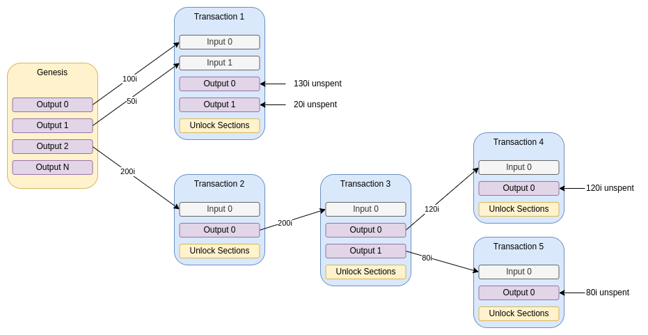

# Summary

This TIP proposes a new UTXO-based transaction structure consisting of all the inputs and outputs of a transfer. Specifically, this TIP defines a transaction payload for _blocks_ described in [TIP-46](../TIP-0046/tip-0046.md) and extends the transaction payload described in [TIP-20](../TIP-0007/tip-0020.md).

# Motivation

[TIP-20](../TIP-0020/tip-0020.md) introduced a new extended transaction model for the Stardust update. This TIP extends this model to be aligned with all new mana and account features:
- accommodate for the new output types introduced in [TIP-41](../TIP-0041/tip-0041.md), [TIP-42](../TIP-0042/tip-0042.md), [TIP-43](../TIP-0043/tip-0043.md), [TIP-44](../TIP-0044/tip-0044.md).
- include an _Allotments_ field in the transaction for mana allotment of Block Issuance Credits,
- updates the syntactic validation rules to ensure the correctness of input and output Mana balances according to IOTA 2.0 mana requirements, defined in [TIP-39](../TIP-0039/tip-0039.md).

The motivation of these changes is to adjust the transaction and its validation rules with the protocol upgrade to IOTA 2.0. 
Validation rules must now consider the mana decay factor and the possibility of mana allotment in the transaction to a Block Issuance Credits account.

# Detailed design

## UTXO

The *unspent transaction output* (UTXO) model defines a ledger state where balances are not directly associated to addresses but to the outputs of transactions. In this model, transactions reference outputs of previous transactions as inputs, which are consumed (removed) to create new outputs. A transaction must consume all the funds of the referenced inputs.

Using a UTXO-based model provides several benefits:
* Parallel validation of transactions.
* Easier double-spend detection, since conflicting transactions would reference the same UTXO.
* Replay-protection which is important when having reusable addresses. Replaying the same transaction would manifest itself as already being applied or existent and thus not have any impact.
* Balances are no longer strictly associated to addresses. This allows a higher level of abstraction and thus enables other types of outputs with particular unlock criteria.

Within a transaction using UTXOs, inputs and outputs make up the to-be-signed data of the transaction. The section unlocking the inputs is called the *unlock*. An unlock may contain a signature proving ownership of a given input's address and/or other unlock criteria.

The following image depicts the flow of funds using UTXO:



## Structure

### Serialized layout

A _Transaction Payload_ is made up of two parts:
1. The _Transaction Essence_ part which contains the inputs, outputs and an optional embedded payload.
2. The _Unlocks_ which unlock the inputs of the _Transaction Essence_.

The serialized form of the transaction is deterministic, meaning the same logical transaction always results in the same serialized byte sequence. The inputs and outputs are considered as lists. They can contain duplicates and their serialization order matches the order of the list; they do not need to be sorted.

The *Transaction Payload ID* is the [BLAKE2b-256](https://tools.ietf.org/html/rfc7693) hash of the entire serialized payload data including unlocks.

The following table describes the entirety of a _Transaction Payload_ in its serialized form following the notation from [TIP-21](../TIP-0021/tip-0021.md):

TODO what about inputs committments?

<table>
  <tr>
    <th>Name</th>
    <th>Type</th>
    <th>Description</th>
  </tr>
  <tr>
    <td>Payload Type</td>
    <td>uint32</td>
    <td>
        TODO value ??
      Set to <strong>value 6</strong> to denote a <i>TIP-45 Transaction Payload</i>.
    </td>
  </tr>
  <tr>
    <td>Essence <code>oneOf</code></td>
    <td colspan="2">
      <details open="true">
        <summary>Transaction Essence</summary>
        <blockquote>
          Describes the essence data making up a transaction by defining its inputs, outputs and an optional payload.
        </blockquote>
        <table>
          <tr>
            <td><b>Name</b></td>
            <td><b>Type</b></td>
            <td><b>Description</b></td>
          </tr>
          <tr>
            <td>Transaction Type</td>
            <td>uint8</td>
            <td>
              Set to <strong>value 1</strong> to denote a <i>TIP-20 Transaction Essence</i>.
            </td>
          </tr>
          <tr>
            <td>Network ID</td>
            <td>uint64</td>
            <td>
              The unique value denoting whether the block was meant for mainnet, shimmer, testnet, or a private network. It consists of the first 8 bytes of the BLAKE2b-256 hash of the network name.
            </td>
          </tr>
          <tr>
            <td>Inputs Count</td>
            <td>uint16</td>
            <td>The number of input entries.</td>
          </tr>
          <tr>
            <td>Inputs <code>anyOf</code></td>
            <td colspan="2">
              <details>
                <summary>UTXO Input</summary>
                <blockquote>
                  Describes an input which references an unspent transaction output to consume.
                </blockquote>
                <table>
                  <tr>
                    <td><b>Name</b></td>
                    <td><b>Type</b></td>
                    <td><b>Description</b></td>
                  </tr>
                  <tr>
                    <td>Input Type</td>
                    <td>uint8</td>
                    <td>
                      Set to <strong>value 0</strong> to denote an <i>TIP-20 UTXO Input</i>.
                    </td>
                  </tr>
                  <tr>
                    <td>Transaction ID</td>
                    <td>ByteArray[32]</td>
                    <td>The BLAKE2b-256 hash of the transaction payload containing the referenced output.</td>
                  </tr>
                  <tr>
                    <td>Transaction Output Index</td>
                    <td>uint16</td>
                    <td>The output index of the referenced output.</td>
                  </tr>
                </table>
              </details>
            </td>
          </tr>
          <tr>
            <td>Inputs Commitment</td>
            <td>ByteArray[32]</td>
            <td>
              BLAKE2b-256 hash serving as a commitment to the serialized outputs referenced by <code>Inputs</code>.
            </td>
          </tr>
          <tr>
            <td>Outputs Count</td>
            <td>uint16</td>
            <td>The number of output entries.</td>
          </tr>
          <tr>
            <td>Outputs <code>anyOf</code></td>
            <td colspan="2">
              <details>
                <summary>Basic Output</summary>
                <blockquote>
                  Describes a deposit to a single address. The output might contain optional features and native tokens.
                </blockquote>
              </details>
              <details>
                <summary>Account Output</summary>
                <blockquote>
                  Describes an account in the ledger.
                </blockquote>
              </details>
              <details>
                <summary>Foundry Output</summary>
                <blockquote>
                  Describes a foundry that controls supply of native tokens.
                </blockquote>
              </details>
              <details>
                <summary>NFT Output</summary>
                <blockquote>
                  Describes a unique, non-fungible token deposit to a single address.
                </blockquote>
              </details>
            </td>
          </tr>
          <tr>
            <td>Allotments Count</td>
            <td>uint16</td>
            <td>The number of account allotment entries.</td>
          </tr>
          <tr>
            <td>Allotments <code>optAnyOf</code></td>
            <td colspan="2">
              <details>
                <summary>Allotment</summary>
                <blockquote>
                  Allots mana value to indicated account.
                </blockquote>
                <table>
                  <tr>
                    <th>Name</th>
                    <th>Type</th>
                    <th>Description</th>
                  </tr>
                  <tr>
                    <td>Account ID</td>
                    <td>ByteArray[32]</td>
                    <td>The Account ID of the parent.</td>
                  </tr>
                  <tr>
                    <td>Mana</td>
                    <td>uint64 </td>
                    <td>The amount of mana to allot to this account.</td>
                  </tr>
                </table>
              </details>
            </td>
          </tr>
          <tr>
            <td>Payload Length</td>
            <td>uint32</td>
            <td>The length in bytes of the optional payload.</td>
          </tr>
          <tr>
            <td>Payload <code>optOneOf</code></td>
            <td colspan="2">
              <details>
                <summary>Tagged Data Payload</summary>
                <blockquote>
                  Describes data with optional tag, defined in TIP-23.
                </blockquote>
              </details>
            </td>
          </tr>
        </table>
      </details>
    </td>
  </tr>
  <tr>
    <td>Unlocks Count</td>
    <td>uint16</td>
    <td>The number of unlock entries. It must match the field <code>Inputs Count</code>.</td>
  </tr>
  <tr>
    <td valign="top">Unlocks <code>anyOf</code></td>
    <td colspan="2">
      <details>
        <summary>Signature Unlock</summary>
        <blockquote>
          Defines an unlock containing a signature.
        </blockquote>
      </details>
      <details>
        <summary>Reference Unlock</summary>
        <blockquote>
          References a previous unlock, where the same unlock can be used for multiple inputs.
        </blockquote>
      </details>
      <details>
        <summary>Account Unlock</summary>
        <blockquote>
          References a previous unlock of a consumed account output.
        </blockquote>
      </details>
      <details>
        <summary>NFT Unlock</summary>
        <blockquote>
          References a previous unlock of a consumed NFT output.
        </blockquote>
      </details>
    </td>
  </tr>
</table>

### Transaction Essence

The <i>Transaction Essence</i> of a <i>Transaction Payload</i> carries the inputs, outputs, and an optional payload. The <i>Transaction Essence</i> is an explicit type and therefore starts with its own <i>Transaction Essence Type</i> byte which is of value 1 for <i>TIP-20 Transaction Essence</i>.

#### Network ID

The `Network ID` field of the transaction essence serves as a [replay protection mechanism](https://github.com/iotaledger/tips/discussions/56).
It is a unique value denoting whether the transaction was meant for the IOTA mainnet, shimmer, testnet-1, or a private network. It consists of the first 8 bytes of the BLAKE2b-256 hash of the `Network Name` protocol parameter, interpreted as an unsigned integer number.

| Network Name        | Resulting `Network ID` | Network Name defined in                             |
|---------------------|------------------------|-----------------------------------------------------|
| `iota-mainnet`      | `9374574019616453254`  | [TIP-22](../TIP-0022/tip-0022.md#detailed-design)   |
| `shimmer`           | `14364762045254553490` | [TIP-32](../TIP-0032/tip-0032.md#global-parameters) |
| `testnet-1`         | `1856588631910923207`  | -                                                   |
| `example-mynetwork` | `1967754805504104511`  | -                                                   |

#### Inputs

The `Inputs` field holds the inputs to consume in order to fund the outputs of the <i>Transaction Payload</i>. Currently, there are three types of input:
 - _UTXO Input_
 - _Commitment Input_
 - _Block Issuance Credits Input_
 In the future, more types of inputs may be specified as part of protocol upgrades.

Each input must be accompanied by a corresponding <i>Unlock</i> at the same index in the <i>Unlocks</i> part of the <i>Transaction Payload</i>.

##### UTXO Input

A <i>UTXO Input</i> is an input which references an unspent output of a previous transaction. This UTXO is uniquely identified by its _Output ID_, defined by the _Transaction ID_ of the creating transaction together with corresponding output index. Each <i>UTXO Input</i> must be accompanied by an <i>Unlock</i> that is allowed to unlock the referenced output.

##### Commitment Input
A _Commitment Input_ is an input that allows to reference commitment to a certain slot. It is used to provide the VM with the necessary context information from the node. It is used to prove that the time at the transaction execution is past certain slot in the past, as it indicates that the slot has been already committed.


##### Block Issuance Credits Input
A _Block Issuance Credits Input_ is an input that allows to provide the VM with context for the value of the BIC vector for a specific slot. It is  necessary information needed for destroying an _Account Output_, as it can be allowed only if the BIC balance is not negative at specific point in time. 

#### Inputs Commitment

The `Inputs Commitment` field of the _Transaction Essence_ is a cryptographic commitment to the content of the consumed outputs (inputs). It consists of the BLAKE2b-256 hash of the concatenated output hashes.

In the `Inputs` field, they are only referenced by  _Output ID_. While the _Output ID_ technically depends on the content of the actual output, a client has no way of validating this without access to the original transaction. For the `Inputs Commitment`, the client has to be aware of the outputs’ content in order to produce a semantically valid transaction. This protects clients against [eclipse attacks that would result in loss of funds](https://github.com/iotaledger/tips/discussions/51).

#### Outputs

The `Outputs` field holds the outputs that are created by the <i>Transaction Payload</i>. There are different output types, but they must all have an `Amount` field denoting the number of IOTA coins to deposit.

The following table lists all the output types that are currently supported as well as links to the corresponding specification. The _SigLockedSingleOutput_ as well as the _SigLockedDustAllowanceOutput_ introduced in Chrysalis Phase 2 [TIP-7](../TIP-0007/tip-0007.md) have been removed and are no longer supported.

| Output Name | Type Value | TIP                                              |
|-------------|------------|--------------------------------------------------|
| Basic       | 3          | [TIP-41](../TIP-0041/tip-0041.md#basic-output)   |
| Account     | 4          | [TIP-42](../TIP-0042/tip-0042.md#account-output) |
| Foundry     | 5          | [TIP-44](../TIP-0044/tip-0044.md#foundry-output) |
| NFT         | 6          | [TIP-43](../TIP-0043/tip-0043.md#nft-output)     |

#### Payload

The  _Transaction Essence_ itself can contain another payload as described in general in  [TIP-46](../TIP-0024/tip-0046.md). The [semantic validity](#semantic-validation) of the encapsulating _Transaction Payload_ does not have any impact on the payload.

The following table lists all the payload types that can be nested inside a _Transaction Essence_ as well as links to the corresponding specification:

| Name        | Type Value | TIP                               |
|-------------|------------|-----------------------------------|
| Tagged Data | 5          | [TIP-23](../TIP-0023/tip-0023.md) |

### Unlocks

The `Unlocks` field holds the unlocks unlocking inputs within a _Transaction Essence_.

The following table lists all the output types that are currently supported as well as links to the corresponding specification. The _Signature Unlock_ and the _Reference Unlock_ are specified as part of this TIP.

| Unlock Name | Type Value | TIP                                                          |
|-------------|------------|--------------------------------------------------------------|
| Signature   | 0          | [TIP-38](#signature-unlock)                                  |
| Reference   | 1          | [TIP-38](#reference-unlock)                                  |
| Account     | 2          | [TIP-18](../TIP-0042/tip-0042.md#account-locking--unlocking) |
| NFT         | 3          | [TIP-43](../TIP-0043/tip-0043.md#nft-locking--unlocking)     |

#### Signature Unlock

The <i>Signature Unlock</i> defines an <i>Unlock</i> which holds a signature signing the BLAKE2b-256 hash of the <i>Transaction Essence</i> (including the optional payload). It is serialized as follows:

<table>
  <tr>
    <th>Name</th>
    <th>Type</th>
    <th>Description</th>
  </tr>
  <tr>
    <td>Unlock Type</td>
    <td>uint8</td>
    <td>
      Set to <strong>value 0</strong> to denote a <i>Signature Unlock</i>.
    </td>
  </tr>
  <tr>
    <td>Signature <code>oneOf</code></td>
    <td colspan="2">
      <details>
        <summary>Ed25519 Signature</summary>
        <table>
          <tr>
            <th>Name</th>
            <th>Type</th>
            <th>Description</th>
          </tr>
          <tr>
            <td>Signature Type</td>
            <td>uint8</td>
            <td>
              Set to <strong>value 0</strong> to denote an <i>Ed25519 Signature</i>.
            </td>
          </tr>
          <tr>
            <td>Public key</td>
            <td>ByteArray[32]</td>
            <td>The Ed25519 public key of the signature.</td>
          </tr>
          <tr>
            <td>Signature</td>
            <td>ByteArray[64]</td>
            <td>The Ed25519 signature signing the Blake2b-256 hash of the serialized <i>Transaction Essence</i>.</td>
          </tr>
        </table>
      </details>
    </td>
  </tr>
</table>

##### Unlock syntactic validation

* `Signature` must contain an _Ed25519 Signature_.
* The _Signature Unlock_ must be unique, i.e. there must not be any other _Signature Unlocks_ in the `Unlocks` field of the transaction payload with the same signature.

#### Reference Unlock

The <i>Reference Unlock</i> defines an <i>Unlock</i> which references a previous <i>Unlock</i> (which must not be another <i>Reference Unlock</i>). It **must** be used if multiple inputs can be unlocked via the same <i>Unlock</i>. It is serialized as follows:

<table>
  <tr>
    <th>Name</th>
    <th>Type</th>
    <th>Description</th>
  </tr>
  <tr>
    <td>Unlock Type</td>
    <td>uint8</td>
    <td>
      Set to <strong>value 1</strong> to denote a <i>Reference Unlock</i>.
    </td>
  </tr>
  <tr>
    <td>Reference</td>
    <td>uint16</td>
    <td>Represents the index of a previous unlock.</td>
  </tr>
</table>

##### Unlock syntactic validation

* The _Reference Unlock_ at index i must have `Reference` < i and the unlock at index `Reference` must be a _Signature Unlock_.

Example:
Consider a <i>Transaction Essence</i> containing the <i>UTXO Inputs</i> 0, 1 and 2, where 0 and 2 are both spending outputs belonging to the same Ed25519 address A and 1 is spending from a different address B. This results in the following structure of the <i>Unlocks</i> part:

| Index | Unlock                                                                             |
|-------|------------------------------------------------------------------------------------|
| 0     | A _Signature Unlock_ holding the Ed25519 signature for address A.                  |
| 1     | A _Signature Unlock_ holding the Ed25519 signature for address B.                  |
| 2     | A _Reference Unlock_ which references 0, as both require the same signature for A. |

## Validation

A <i>Transaction Payload</i> has different validation stages, since some validation steps can only be executed when certain information has (or has not) been received. We therefore distinguish between syntactic and semantic validation.

The different output types and optional output features introduced by [TIP-38](../TIP-0038/tip-0038.md), [TIP-1](../TIP-0042/tip-0041.md),[TIP-42](../TIP-0042/tip-0042.md), [TIP-43](../TIP-0043/tip-0043.md) and [TIP-44](../TIP-0044/tip-0044.md)
add additional constraints to the transaction validation rules, but since these are specific to the given outputs and features, they are discussed for each [output type](../TIP-0038/tip-0038.md#output-design) and [feature type](../TIP-0038/tip-0038.md#features) separately.

### Syntactic validation

Syntactic validation is checked as soon as the transaction has been received. It validates the structure but not the signatures of the transaction. If the transaction does not pass this stage, it must not be broadcast further and can be discarded right away.

The following criteria defines whether a payload passes the syntactical validation:

* Essence:
    * `Transaction Type` value must denote a _TIP-45 Transaction Essence_.
    * `Network ID` must match the value of the current network.
    * Inputs:
        * `Inputs Count` must be 0 < x ≤ `Max Inputs Count`.
        * For each input the following must be true:
            * `Input Type` must denote an allowed input type, listed in section [Inputs](#inputs).
            * `Transaction Output Index` must be 0 ≤ x < `Max Outputs Count`.
        * Each pair of `Transaction ID` and `Transaction Output Index` must be unique in the list of inputs.
    * Outputs:
        * `Outputs Count` must be 0 < x ≤ `Max Outputs Count`.
        * For each output the following must be true:
            * `Output Type` must match one of the values described under [Outputs](#outputs).
            * The output itself must pass syntactic validation.
        * The sum of all `Amount` fields must not exceed `Max IOTA Supply`.
        * The sum of all `Mana Amount` field must not exceed `Max Mana Supply`.
        * The count of all distinct native tokens present in outputs must not be larger than `Max Native Token Count`.
    * Payload (if present):
        * `Payload Type` must match one of the values described under [Payload](#payload).
        * Payload fields must be correctly parsable in the context of the `Payload Type`.
        * The payload itself must pass syntactic validation.
* Unlocks:
    * `Unlocks Count` must match `Inputs Count` of the _Transaction Essence_.
    * For each unlock the following must be true:
        * Each `Unlock Type` must match one of the values described under [Unlocks](#unlocks).
        * The unlock itself must pass syntactic validation.
* Given the type and length information, the _Transaction Payload_ must consume the entire byte array of the `Payload` field of the encapsulating object.

### Semantic validation

The Semantic validation of a _Transaction Payload_ is performed when its encapsulating block is confirmed. The semantic validity of transactions depends on the partial order in which they are processed. The solidification mechanism of the protocol ensures that all inputs  will be processed only when all inputs are known valid, and not conflicting.

Processing transactions according to its partial-ordering enables users to spend UTXOs which are created at similar point in time, but the input transaction has not yet been confirmed by the network, as they will be processed by preserving thei input-output order relations. In this case, it is recommended that users include the _Block ID_ of the funding transaction as a parent of the block containing the spending transaction.

#### Criteria defining whether a payload passes the semantic validation
* Each input must reference a valid UTXO, i.e. the output referenced by the input's `Transaction ID` and `Transaction Output Index` is known (booked) and unspent.
* `Inputs Commitment` must equal BLAKE2( BLAKE2(O<sub>1</sub>) || … || BLAKE2(O<sub>n</sub>) ), where O<sub>1</sub>, ..., O<sub>n</sub> are the complete serialized outputs referenced by the `Inputs` field in that order.
* The transaction must spend the entire coin balance, i.e. the sum of the `Amount` fields of all the UTXOs referenced by inputs must match the sum of the `Amount` fields of all outputs.
* The count of all distinct native tokens present in the UTXOs referenced by inputs and in the transaction outputs must not be larger than `Max Native Token Count`. A native token that occurs several times in both inputs and outputs is counted as one.
* The transaction is balanced in terms of native tokens, when the amount of native tokens present in all the UTXOs referenced by inputs equals to that of outputs. When the transaction is imbalanced, it must hold true that when there is a **surplus of native tokens** on the:
    * **output side of the transaction:** the foundry outputs controlling outstanding native token balances must be present in the transaction. The validation of the foundry output(s) determines if the minting operations are valid.
* **input side of the transaction:** the transaction destroys tokens. The presence and validation of the foundry outputs of the native tokens determines whether the tokens are burned (removed from the ledger) or melted within the foundry. When the foundry output is not present in the transaction, outstanding token balances must be burned.

**Mana specific semantic validation rules** (for description of mana dynamics and the mana decay, see [TIP-39](../TIP-0039/tip-0039.md)):
 * The transaction must not spend more mana than allowed, briefly it must  given following definitions:
- `potentialMana` sum of values for each UTXO in inputs based on their creation times, transaction timestamp, and decay function
- `allottedMana` as sum of all block issuance credits listed in `Allotments` transaction field. 
- `inputStoredMana` sum of stored mana from inputs decayed by `Decayfactor`
- `outputStoredMana` sum of stored mana from outputs
comply that:
`potentialMana` + `inputStoredMana` >= `allottedMana` + `outputStoredMana`
The less or equal sign in the formula above implies that it is possible for a user not to allot all the Mana he/she has rights to. This requirement is needed in the case, because of any particularity, a user does not want to own Mana att all. Then, the user must be able to refuse to allot or store their potential Mana.
FMore specifically, for a transaction consuming a set of unspent outputs $\mathcal{I}$, we have the following validation rule for Mana:

```math
\sum_{i \in \mathcal{I}}\Big[\text{IOTA}_i*f(t - t_i) + \text{Mana}_i * g(t - t_i)\Big] \geq \sum_{o\in \mathcal{O}}\text{Mana}_o + \sum_{a\in \mathcal{A}}\text{Mana}_a,
```
where:

- $\text{IOTA}_i*f(t - t_i)$ is the amount of potential Mana generated by consuming output `i` ($\text{IOTA}_i$ is the amount of tokens in output `i`, and $f$ is calculated with the aid of the Lookup Table: decays for Mana in [TIP-39](../TIP-0039/tip-0039.md)). More specifically, `f(n)` is an approximation of `Mana Generation * (1 - e^{-beta*SlotDuration*n})`, whereas the values stored in the lookup table are an approximation of `e^{-beta*SlotDuration*n}`. All the operations to calculate `f(n)` must be done using fixed point arithmetics. Example: if `Mana Generation = e^{-beta*SlotDuration*n}) = 0.1`, and `Amount = 1001`, the potential Mana must be calculated as `1001 * 1/10 * (1 - 1/10) = 1001 * 1/10 * 9/10 = (1001 * 1 * 9)/100 = 9009/100 = 90;
- $\text{Mana}_i * g(t - t_i)$ is the amount of stored Mana on the consuming output `i` with applied decay ($\text{Mana}_i$ is the amount of stored Mana in output `i`, and $g$ is given by the Lookup Table: decays for Mana in [TIP-39](../TIP-0039/tip-0039.md));
- $\text{Mana}_o$ is the amount of Mana transferred to output `o` as stored Mana;
- $\text{Mana}_a$ is the amount of Mana transferred to account `a` as block issuance credit;
- $\text{IOTA}_i$ is the amount of IOTA tokens held in output `i`;
- $n$ is the slot index of the transaction (consuming unspent outputs $i \in \mathcal{I}$) being validated;
- $n_i$ is the slot index of when output `i` was created;
- $\mathcal{O}$ is the set outputs to which Mana will be transferred as stored Mana;
- $\mathcal{A}$ is the set accounts to which Mana will be transferred as block issuance credit.

#### Semantic criteria for each output and all its output features in the context of the following input:
    1. The _Transaction Payload_,
    2. the list of UTXOs referenced by inputs and
    3. / TDOD how to change that?: the Unix timestamp of the confirming milestone.
* Each unlock must be valid with respect to the UTXO referenced by the input of the same index:
    * If it is a _Signature Unlock_:
        * The `Signature Type` must match the `Address Type` of the UTXO,
        * the BLAKE2b-256 hash of `Public Key` must match the `Address` of the UTXO and
        * the `Signature` field must contain a valid signature for `Public Key`.
    * If it is a _Reference Unlock_, the referenced _Signature Unlock_ must be valid with respect to the UTXO.
    * If it is an _Alias Unlock_:
        * The address unlocking the UTXO must be an _Alias Address_.
        * The referenced _Unlock_ unlocks the alias defined by the unlocking address of the UTXO.
    * If it is an _NFT Unlock_:
        * The address unlocking the UTXO must be a _NFT Address_.
        * The referenced _Unlock_ unlocks the NFT defined by the unlocking address of the UTXO.

If a _Transaction Payload_ passes the semantic validation, its referenced UTXOs must be marked as spent and its new outputs must be created/booked in the ledger. 

Transactions that do not pass semantic validation are ignored. Their UTXOs are not marked as spent and their outputs are not booked in the ledger.

## Miscellaneous

### Transaction timestamps

Since transaction timestamps – whether they are signed or not – do not provide accuracy guarantee, the time of the trnsaction is defined by the `slot index`, as no more detailed time granularity is needed.
The correctness of the timespams is indirectly restricted by the Fishing condition, which does not allowto reference blocks that are `Fishing threshold` older than latest confirmed block. This rule puts restrictions on the block timestamp. Which in turn, is used to validate the transaction creation slot:
* The transaction creation slot must be less than or equal to the current slot index, 
  * transaction slot must be less or equal to the encapsulation block timestamp.

### Address reuse
// todo is this valid?

While, in contrast to Winternitz one-time signatures (W-OTS), producing multiple Ed25519 signatures for the same private key and address does not decrease its security, it still drastically reduces the privacy of users. It is thus considered best practice that applications and services create a new address per deposit to circumvent these privacy issues.

In essence, Ed25519 support allows for smaller transaction sizes and to safely spend funds which were sent to an already used deposit address. Ed25519 addresses are not meant to be used like email addresses. See this [Bitcoin wiki article](https://en.bitcoin.it/wiki/Address_reuse) for further information.

# Drawbacks

* The new transaction format is the core data type within the IOTA ecosystem. Changing it means that all projects need to accommodate it, including wallets, web services, client libraries and applications using IOTA in general. It is not possible to keep these changes backwards compatible, meaning that all nodes must upgrade to further participate in the network.
* It is not possible to produce a valid transaction without having access to the content of the consumed outputs.

# Rationale and alternatives

* _Inputs Commitment_ and _Network ID_ are both explicit fields of the transaction, while they could be made configuration
  parameters for the signature generating process. In this scenario the signature would be invalid if the parameters on client
  and network side mismatch. While this would reduce the size of a transaction, it would make it impossible to debug the
  reason for having an invalid signature and transaction. With the current solution we intend to optimize for ease of development.
* Uniqueness of all inputs is kept as it prevents introducing double spends in the same transaction.

# Copyright

Copyright and related rights waived via [CC0](https://creativecommons.org/publicdomain/zero/1.0/).
